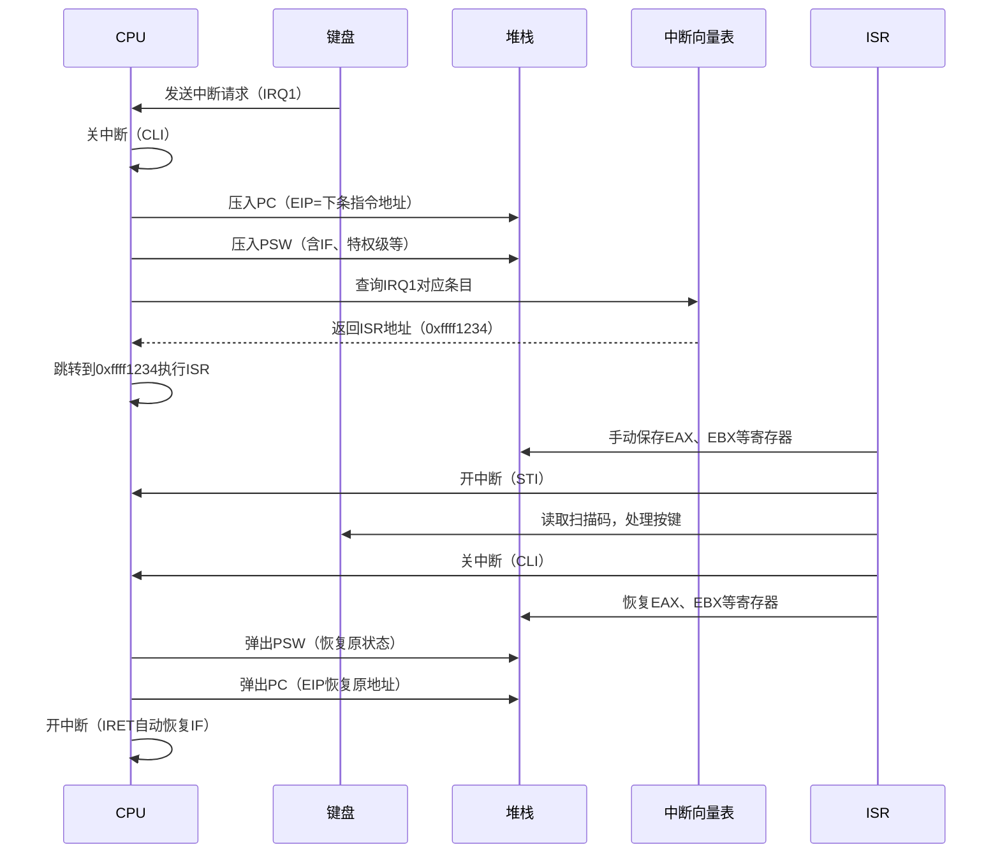
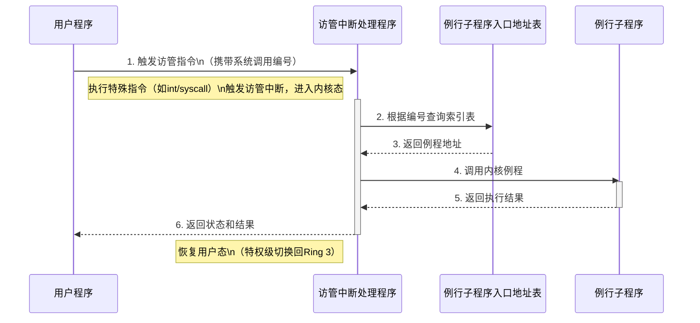
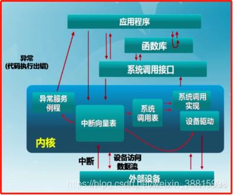
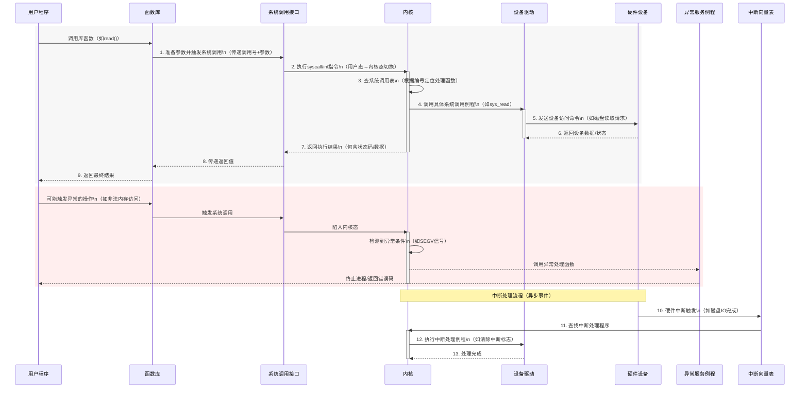

## CHAPTER2 操作系统的运行环境和运行机制

[TOC]

### CPU 状态

**CPU 的态**，又称为 **CPU 的特权级**，是 CPU 的工作状态。**当前 CPU 正在执行哪类程序，决定 CPU 的态。**

- 对于管理程序，要管理系统资源，控制程序运行
- 对于用户程序，要使用资源，提出申请，被管理程序控制

> [!important]
>
> **区分处理机状态的目的：保护操作系统。**
>
> 解读：
>
> > [!important]
> >
> > #### 区分用户态和内核态保护操作系统的原理
> >
> > **就像医院手术室的权限管理：**
> > - **用户态** 相当于普通访客，只能在走廊活动，不能触碰手术器械（对应硬件资源）。
> > - **内核态** 相当于持证医生，可以进入无菌室操作精密设备（直接控制硬件）。
> >
> > ##### 具体保护机制：
> >
> > 1. **指令防火墙**：用户态下 CPU 会屏蔽敏感指令（如直接操作硬盘、修改内存映射表），防止应用程序 "越权手术"。
> >
> > 2. **系统调用关卡**：应用程序需要特殊服务时（如读写文件），必须通过 "挂号窗口"（系统调用接口）进入内核态，就像患者必须通过分诊台才能见专家。
> >
> >    > - **屏蔽敏感指令**：禁止普通程序直接操作硬件或修改关键设置（比如直接关电源、删硬盘数据）。  
> >    > - **系统调用接口**：给程序开了一个“办事窗口”，只能通过这个窗口向操作系统申请服务（比如读写文件、开网络端口）。  
> >    >
> >    > **为什么分开**？就像普通人不能随便拆电路板，但可以按开关用电器——系统调用就是那个“安全开关”。
> >    >
> >    > ###### 敏感指令的典型场景
> >    >
> >    > - **硬件操作**：如 `IN/OUT` 指令直接控制外设端口。  
> >    > - **内存管理**：如 `MOV CR3` 修改页表寄存器（直接改内存映射）。  
> >    > - **特权模式切换**：如 `CLI` 关闭中断（导致系统无法响应外部事件）。  
> >    >
> >    > ##### 屏蔽方法
> >    > CPU 通过 **特权级（Ring 0~3）** 限制指令执行——用户程序运行在 **Ring 3**，若试图执行敏感指令，CPU 会触发异常，操作系统直接终止程序（比如 Linux 的 `SIGSEGV` 信号）。
> >    >
> >    > ##### 系统调用接口的实现
> >    >
> >    > - **入口**：程序调用 `open()` 这类 API → 触发 **软中断**（如 `int 0x80`）或专用指令（如 `syscall`）。  
> >    > - **切换特权级**：CPU 自动从用户态（Ring 3）切换到内核态（Ring 0）。  
> >    > - **安全检查**：操作系统验证参数合法性（比如检查文件路径是否允许访问）。  
> >    >
> >    > **结果**：用户程序像“隔着防弹玻璃办事”，全程受控，无法直接触碰底层硬件。
> >
> > 
> >
> > 3. **内存隔离护城河**：内核拥有独立的内存空间，用户程序试图 "翻墙" 访问时，MMU（内存管理单元）会立即触发异常警报。
> >
> > 4. **中断应急通道**：当硬件故障或程序异常时（如除零错误），CPU 自动切换到内核态启动应急响应，就像医院遇到突发状况自动启动应急电源。
> >
> > ##### 进阶知识：现代 CPU 使用特权环（Ring 0-3）实现多级防护：
> >
> > - Ring 0：操作系统内核（主刀医生）
> > - Ring 1-2：驱动/虚拟机（助理医师）
> > - Ring 3：应用程序（患者家属）
> >

> 从 3 个角度看待内核态与用户态的区别

- **内核态**：操作系统的 **管理程序** 执行时机器所处的状态，在此状态下处理机可使用 **全部指令包括一组特权指令**；使用全部系统资源包括 **整个存储区域**.
- **用户态**：**用户程序** 执行时 CPU 所处的状态，在此状态下 **禁止使用特权指令**，不能直接取用资源与改变机器状态，并且 **只允许用户程序访问自己的存储区域**。

**CPU 的特权指令集**：涉及外部设备的输入输出指令修改特殊寄存器的指令，改变机器状态的指令

### CPU 特权级切换的 3 个场景

- **应用程序调用操作系统提供的系统调用**，此时应用程序通过执行系统调用指令将 CPU 的特权级从用户态切换到内核态。

- 应用 **程序执行一条指令** 触发了 **异常**，导致 CPU 的特权级从用户态切换到内核态，比如访内存指令触发了 **缺页异常**

- 应用程序执行过程中，CPU 收到一条 **来自外设的中断** ，对中断的处理导致 CPU 的特权级从用户态切换到内核态。

#### 中断

- 中断一般通过中断向量将控制权转移到中断服务例程，中断向量包含所有服务例程的地址。

    1. **中断发生**：比如你按下键盘（**硬件中断**）或程序执行出错（异常）。
    2. **查表跳转**：CPU 根据中断类型编号（如键盘是 33 号），去 **中断向量表**（一个预设的地址数组）里找到第 33 项，该项存储着 **键盘中断处理函数的地址**。
    3. **执行处理**：CPU 跳转到这个地址，运行键盘中断处理代码（比如记录按键值、通知操作系统等）。

    **关键逻辑**：中断向量表是 CPU 和操作系统预先约定好的“应急手册”，保证任何中断都能快速找到对应的处理代码。

    > ##### 中断向量表的结构
    >
    > - **本质**：一个存储在内存中的数组，每个条目占 4/8 字节（取决于 CPU 模式）。
    > - **索引**：中断号（如 0~255）直接对应数组下标。在 x86 架构中：
    >   - **0 号中断**：除零错误
    >   - **13 号中断**：段错误（Segmentation Fault）
    >   - **80h 号中断**：Linux 系统调用入口
    >
    > ##### CPU 处理中断的硬核流程
    >
    > 1. **接收中断信号**：来自硬件（如定时器、网卡）或软件（如 `int 0x80` 指令）。
    > 2. **获取中断号**：硬件中断通过可编程中断控制器（PIC）传递编号，软件直接指定。
    > 3. **查表跳转：**
    >    - CPU 读取 **中断描述符表寄存器（IDTR）** 找到表的位置。
    >    - 用中断号 × 条目大小得到内存地址，取出目标地址（CS: IP）。
    > 4. **切换特权级**：从用户态（Ring 3）切换到内核态（Ring 0），保护现场（压栈保存寄存器）。
    > 5. **执行中断服务例程（ISR）**：运行实际的处理代码（如将键盘数据写入缓冲区）。
    
  - 中断架构必须保存被中断指令的地址
  
  - 陷阱或异常是由错误或用户请求引起的软件生成的中断
  
  - 操作系统是中断驱动的

##### 中断的分类

- 按功能

  - **输入输出中断：** I/O 传输结束或出错中断

  - **外中断：** 时钟中断、操作员控制台中断、通信中断等

  - **机器故障中断：** 电源故障、主存取指令错等

  - **程序性中断：** 定点溢出、用户态下用内核态指令

  - **访管中断：** 对操作系统提出某种需求时所发出的中断、非法操作有时也被称为系统调用、陷阱或者软件中断

- 按中断方式

  - **强迫性中断：** 不是正在运行的程序所期待的中断，如：输入输出中断、外中断、机器故障中断、程序性中断
  - **自愿中断：** 是运行程序所期待的事件。如：访管中断

##### 中断处理过程

| **步骤**                | **硬件/操作系统行为**                                        | **技术细节**                                                 |
| ----------------------- | ------------------------------------------------------------ | ------------------------------------------------------------ |
| **1. 关中断**           | CPU 自动关闭中断（`CLI` 指令效果），防止其他中断干扰。       | 通过清除 `EFLAGS.IF` 标志实现，防止处理当前中断时被新中断打断（避免“套娃中断”导致栈溢出或数据错乱）。 |
| **2. 保存断点**         | CPU 自动将 `CS:EIP`（当前程序计数器）和 `EFLAGS` 压入内核栈。 | 若发生特权级切换（用户态 → 内核态），还会压入用户态 `SS` 和 `ESP`。 |
| **3. 引出 ISR**         | CPU 根据中断号查 **中断描述符表（IDT）**，跳转到 ISR 入口地址。 | 在 Linux 中，ISR 入口统一为 `common_interrupt`，再通过 `do_IRQ()` 分发到具体驱动的中断处理函数。 |
| **4. 保存现场和屏蔽字** | 操作系统手动保存所有通用寄存器（`pusha`）、段寄存器，并保存当前中断屏蔽状态。 | 屏蔽字可能存储在 `local_irq_save(flags)` 的 `flags` 变量中（实际是栈上的一个内存位置）。 |
| **5. 开中断**           | 执行 `STI` 指令允许中断嵌套。                                | 此时高优先级中断（如时钟中断）可抢占当前 ISR。               |
| **6. 执行 ISR**         | 运行具体中断处理逻辑（如从键盘控制器读取扫描码）。           | ISR 通常分上下半部——上半部（快速处理）和下半部（延迟处理，如软中断 `tasklet`）。 |
| **7. 关中断**           | 再次关闭中断，确保恢复现场时原子性。                         | 对应 `CLI` 指令或 `local_irq_disable()`。                    |
| **8. 恢复现场和屏蔽字** | 从栈中弹出寄存器值，恢复中断屏蔽状态（如通过 `local_irq_restore(flags)`）。 | 必须严格逆序恢复，防止寄存器值错乱。                         |
| **9. 开中断**           | 执行 `IRET` 指令返回原程序，CPU 自动恢复 `EFLAGS`（包括中断标志位）。 | 若从内核态返回用户态，还会切换栈（从内核栈切回用户栈），恢复现场时需绝对原子操作，不能被干扰。 |

- **保存现场**：主程序的 CPU 寄存器值（如 `EAX`、`EBX`、`EIP` 等），保存在 **内核栈** 中。  
- **屏蔽字**：当前中断屏蔽寄存器（如 x86 的 `EFLAGS` 中的 `IF` 标志位），通常压入内核栈或专用存储区。  

**中断服务程序（ISR）和普通函数有何区别？**

1. **触发方式**：ISR 由硬件/异常触发，普通函数通过 `CALL` 指令调用。  
2. **执行环境**：ISR 运行在内核态，可直接操作硬件。  
3. **栈独立性**：ISR 使用内核栈，普通函数使用用户栈或线程栈。  

**产生中断后，CPU 如何知道回到哪里继续执行？**

中断发生时，CPU 自动将 `EIP`（下一条指令地址）和 `CS` 压入栈中。执行 `IRET` 指令时，CPU 从栈中弹出这些值，精确返回到中断点。

**为什么步骤 4 和 8 要单独保存/恢复屏蔽字？**

屏蔽字记录了哪些中断被允许/禁止。假设原程序屏蔽了硬盘中断，但在 `ISR` 中临时允许了它们，恢复时必须还原原状态，否则会导致原有屏蔽策略失效。


##### 中断响应

当中央处理机 CPU 发现已有中断请求时，中止现行程序执行，并自动引出中断处理程序的过程。

**硬件支持：**

- **PC（程序计数器）** ➔ **护士手中的病历本**
  记录当前正在处理的病人进度（比如“正在缝合伤口第 3 针”）。

  **作用**：记录当前程序执行到哪里（下一条指令地址）。

  - **保存断点**：中断发生时，CPU 自动将 PC 值压入堆栈，保证返回时能继续执行原程序。
  - **跳转目标**：通过中断向量表获取新 PC 值，指向中断服务程序（`ISR`）入口。

  > 原程序执行到 `0x08048510` 时发生中断 → PC 值 `0x08048514` 被保存 → ISR 入口地址 `0xffff0000` 载入 PC。

- **PSW（程序状态字）** ➔ **病人的生命体征监测仪**
  显示病人的血压、心率等关键状态（比如是否处于麻醉状态）。

  **作用**：存储 CPU 的实时状态，包括：

  - 标志位（如进位标志 `CF`、零标志 `ZF`）
  - 中断使能位（`IF`，控制是否允许中断）
  - 特权级（如 x86 的 `CPL`，决定当前权限）
  - **保存状态**：PSW 被压入堆栈，确保恢复时 CPU 状态与原程序一致。
  - **切换特权级**：进入内核态（如 x86 从 Ring 3→Ring 0），允许执行特权指令。

  > PSW 中的 `IF=1` 表示允许中断 → 中断处理时 `IF=0` 暂时关闭中断 → 恢复时 `IF=1` 重新打开。

- **系统堆栈** ➔ **急救推车的储物格**
  临时存放当前病人的病历本、手术工具（保存现场），腾出手处理新病人。

  - **作用**：内存中的专用区域，用于保存中断现场（PC、PSW、通用寄存器等）
  - **保存现场**：自动保存 PC 和 PSW，手动保存其他寄存器（如 `EAX`、`EBX`）。
  - **隔离保护**：用户态和内核态使用不同堆栈，防止用户程序破坏内核数据。

- **中断向量表** ➔ **急诊分诊台的应急预案手册**
  明确标注不同病情（如心脏骤停、骨折）对应的处理流程和负责人。

  - **作用**：存储在内存固定位置的表，每个条目对应一个中断号的处理程序地址。
  - **索引跳转**：根据中断号（如 `IRQ 33`）查表，获取 `ISR` 入口地址。
  - **权限校验**：在保护模式下，条目包含目标代码段的选择子和权限信息。



|      硬件      |                           缺失后果                           |
| :------------: | :----------------------------------------------------------: |
|     **PC**     | 无法记录程序断点，中断返回后不知道从哪继续执行，导致系统崩溃。 |
|    **PSW**     | 无法保存 CPU 状态（如中断使能位），恢复后可能错误关闭中断或权限混乱。 |
|  **系统堆栈**  |       无处保存寄存器现场，原程序状态被破坏，数据丢失。       |
| **中断向量表** | CPU 不知道跳转到哪里处理中断，系统无法响应任何硬件事件（如键盘、硬盘）。 |

##### 保存现场与恢复现场

现场：在中断的那一时刻能确保程序继续运行的有关信息

1. 后继指令所在主存的单元号
2. 程序运行所处的状态
3. 指令执行情况
4. 程序执行的中间结果等

- **保存现场：** 当中断发生时，必须立即把现场信息保存在 **主存** 中。
- **恢复现场：** 程序重新运行之前，把保留的该程序现场信息从主存中送至相应的指令计数器、通用寄存器或一些特殊的寄存器中。

|   **概念**   |       **本质**       |            **中断时的角色**            |            **存储位置**             |
| :----------: | :------------------: | :------------------------------------: | :---------------------------------: |
|   **主存**   | 计算机的主要存储介质 | 存储所有中断现场数据（堆栈、向量表等） |           物理内存（RAM）           |
| **系统堆栈** |   主存中的专用区域   |   临时保存 PC 值、寄存器值等现场信息   |              主存内部               |
|  **PC 值**   |   CPU 寄存器的内容   |      被保存到主存堆栈，中断后恢复      | 中断前：CPU 寄存器 中断时：主存堆栈 |

1. **程序运行中**：
   - PC 寄存器指向 `0x08048510`（下一条指令地址）。
   - 系统堆栈地址为 `0x7ffff000`（主存中的某个位置）。
2. **中断发生**：
   - CPU 自动将 PC 值（`0x08048510`）压入堆栈（主存地址 `0x7ffff000-4`）。
   - 同时压入 PSW（程序状态字）到 `0x7ffff000-8`。
3. **处理中断**：
   - CPU 从主存的中断向量表获取 ISR 入口地址（如 `0xffff0000`）。
   - 执行中断服务程序（ISR）。
4. **恢复现场**：
   - 从堆栈弹出 PSW 到 CPU 寄存器（恢复状态）。
   - 弹出 PC 值（`0x08048510`）到 PC 寄存器，程序继续执行。

##### 程序状态字(PSW)

当前程序执行时机器所处的 **状态信息**，通常存储在 **CPU 的一个特殊寄存器中**，不同的 CPU 架构有不同的定义，通常包含以下信息：

- **条件码：** 记录最近一次算术或逻辑操作的结果，比如：结果是否为零、是否有进位或借位、是否溢出等
- **中断使能、禁止位**：决定是否允许响应中断
- **用户、内核模式位：** 标识当前 CPU 处于用户模式还是内核模式
- 其他特定于 **具体处理器架构的标志位**

#### 原语

一种不可再分的原子操作，执行过程中不会被中断。

- 由若干条指令组成
- 用来完成某个功能
- 执行过程不能被中断
- **运行在内核空间**

#### 系统调用

是操作系统提供的服务的编程接口

- 通常用高级语言（如 C 或 C++）编写
- 大多数程序通过 **高级应用程序编程接口 API** 而不是直接使用系统调用
- 最常见的三个 API **Windows 的 Win32 API** **基于 POSIX 的系统**（包括几乎所有版本的 UNIX 、 Linux 和 Mac OS X 的 **POSIX API** 以及 Java 虚拟机 **（JVM）的 Java API**

##### 系统调用的实现

**每个系统调用都与一个编号相关联**，系统调用接口根据这些编号维护一个 **索引表**。

系统调用接口在操作系统内核中调用所需的系统调用，并返回系统调用的状态和任何返回值。

当处理机执行到 **访管指令时发生中断**，该中断称为 **访管中断**，它表示 **正在运行的程序对操作系统的某种需求**。操作系统提供实现各种功能的例行子程序，其中的每一个功能对应访管指令功能号。



##### 系统调用的参数传递

有三种常见的方法用于将参数传递给操作系统：

- 将参数传递到 **寄存器** 中：在某些情况下，可能会有多个参数超过寄存器数量
- 将参数存储在 **内存中的块或表** 中，并将 **块的地址作为参数传递到寄存器** 中
- 程序将 **参数放置或推送到堆栈** 中，并由 **操作系统** 从堆栈中弹出
  - **块和堆栈方法** 不限制传递的参数数量或长度

|    **方法**    |       寄存器传递       |        内存块传递        |           堆栈传递           |
| :------------: | :--------------------: | :----------------------: | :--------------------------: |
|    **速度**    |    极快（CPU 内部）    |     慢（需内存拷贝）     |       中（栈内存操作）       |
|  **参数容量**  | 固定（受限于寄存器数） |           无限           |     无限（受栈大小限制）     |
|   **安全性**   |  高（无内存访问风险）  |     低（需地址验证）     |      中（需栈溢出防护）      |
| **硬件兼容性** |     依赖寄存器数量     |           通用           |             通用             |
|  **典型场景**  | 高频简单调用（Linux）  | 复杂参数调用（`execve`） | 变长参数（传统 Windows API） |

##### 系统调用的类型

1. 文件管理
2. 设备管理
3. 信息维护
4. 通信
5. 保护

操作系统需要管理计算机的四大核心资源：

1. **存储资源**（文件系统）
2. **硬件设备**（CPU、内存、外设）
3. **进程与系统状态**（运行中的程序、时间、配置）
4. **安全边界**（用户权限、数据隔离）

系统调用的五大分类正是为了 **控制对这些资源的访问** 而存在，具体映射如下：

| 系统调用分类 |        管理的核心资源        |         设计目标         |
| :----------: | :--------------------------: | :----------------------: |
| **文件管理** |       磁盘、持久化存储       | 提供统一、安全的文件抽象 |
| **设备管理** | 外设（打印机、键盘、GPU 等） | 标准化硬件接口，避免冲突 |
| **信息维护** | 系统状态（时间、进程、用户） |    监控和调试系统运行    |
|   **通信**   |        进程间数据交互        |     支持协作式多任务     |
|   **保护**   |        权限与安全策略        | 防止未授权访问和资源滥用 |

操作系统需要为以下硬件功能提供 **安全封装**，而五大分类恰好覆盖了这些需求：

1. **存储介质** → 文件管理
2. **I/O 设备** → 设备管理
3. **CPU 与内存状态** → 信息维护
4. **总线与网络** → 通信
5. **硬件特权级** → 保护

##### 系统调用的特点解读

系统调用的两个特点（用高级语言编写、通过 API 调用）是操作系统设计的核心权衡结果，我们可以从 **开发效率**、**硬件抽象**、**安全性** 三个维度深入解析：

###### 为什么系统调用通常用高级语言（C/C++）编写？

1. **开发效率与可维护性**

- **对比汇编**：用汇编直接编写系统调用需要处理寄存器分配、栈帧管理、硬件细节（如中断门），**开发效率极低且难以调试**。  
- **高级语言优势**：C/C++提供变量、结构体、函数抽象，极大简化代码（如 Linux 内核的 `open()` 系统调用仅需数行 C 代码）。

2. **硬件抽象与可移植性**

- **跨架构支持**：同一段 C 代码可通过不同编译器生成 x86、ARM、RISC-V 的机器码。例如，Linux 的 `read()` 系统调用在 x86 上使用 `int 0x80`，在 ARM 上使用 `SWI` 指令，但 **上层 C 代码无需修改**。  
- **隐藏底层差异**：内存管理（分页/段式）、中断控制器（APIC vs GIC）等硬件差异被操作系统内核封装，C 语言 **只需调用统一接口**。

3. 安全性与稳定性

- **内存安全**：C 语言虽不如 Rust 安全，但相比汇编更易 **避免缓冲区溢出**（如使用标准库函数 `strncpy()` 而非手动操作指针）。  
- **类型检查**：编译器可捕获参数类型错误（如误传字符串指针给整型参数），减少运行时崩溃风险。

**示例**：Linux 系统调用 `write()` 的 C 实现（简写）：

```c
ssize_t write(int fd, const void *buf, size_t count) {
    return syscall(SYS_write, fd, buf, count);  // 内联汇编被封装在syscall()中
}
```

开发者无需关注 `syscall` 指令的具体机器码，只需用 C 传递参数。

###### 为什么程序通过 API 而非直接调用系统调用？

1. **抽象复杂度**

- **参数传递的封装**：系统调用要求参数通过特定寄存器或内存布局传递。例如，x86-64 的 `syscall` 指令要求参数依次放入 `rdi`, `rsi`, `rdx` 等寄存器，而 API（如 glibc 的 `open()`）自动处理此转换。  
- **错误处理统一化**：系统调用返回错误码（如 Linux 的 `-errno`），API 将其转换为易处理的异常或返回值（如 C 的 `perror()`）。

2. **跨平台兼容性**

- **操作系统差异**：Windows 使用 `NtCreateFile`，Linux 使用 `open`，但 C 标准库的 `fopen()` 可在两者编译，内部映射到不同系统调用。  
- **版本兼容**：Linux 的 `sys_open` 可能随内核版本变化，但 glibc 保持 `open()` 接口稳定，旧程序无需重写。

3. **性能优化**

- **缓冲与批处理**：标准 I/O 库（如 `stdio`）在用户空间实现缓冲区，减少频繁系统调用开销。例如，多次 `fwrite()` 可能合并为一次 `write()`。  
- **虚拟系统调用**：某些“系统调用”（如 Linux 的 `gettimeofday()`）通过 vsyscall 机制在用户态执行，避免陷入内核。

**示例**：直接调用系统调用 vs 通过 API 调用  

```c
// 直接调用Linux的write系统调用（x86-64汇编）
long sys_write(int fd, const void *buf, size_t count) {
    long ret;
    asm volatile (
        "syscall"
        : "=a"(ret)
        : "a"(SYS_write), "D"(fd), "S"(buf), "d"(count)
        : "rcx", "r11", "memory"
    );
    return ret;
}

// 使用glibc的write API（封装系统调用）
#include <unistd.h>
write(fd, buf, count);  // 无需处理寄存器、错误码转换
```

###### 底层到高层的调用链

以 Linux 的 **文件读取** 为例，展示从应用层到内核的完整路径：

```tex
应用程序调用fread()  
→ 调用C标准库的fread()  
  → 调用glibc的read()  
    → 触发int 0x80/syscall指令进入内核  
      → 内核系统调用处理函数sys_read()  
        → 访问VFS（虚拟文件系统）层  
          → 调用具体文件系统（如ext4）的read方法  
            → 硬件驱动读取磁盘数据
```

每一层都在增加抽象：  

- **应用层**：`fread(buffer, sizeof(int), 100, file)`（按数据类型读取）。  
- **标准库**：管理缓冲区、处理系统调用错误（如 EINTR 重试）。  
- **内核**：处理权限检查、页缓存、磁盘调度。

###### 例外场景：何时需要直接调用系统调用？

1. **极致性能需求**：绕过标准库缓冲（如高频小数据写入直接调用 `write()`）。  
2. **特殊功能**：调用非标准系统调用（如 Linux 的 `memfd_create()`）。  
3. **嵌入式开发**：资源受限环境可能直接使用 syscall 减少二进制体积。

###### 总结对比表

| **维度**       | 直接使用系统调用               | 通过 API 调用系统调用              |
| -------------- | ------------------------------ | ---------------------------------- |
| **开发难度**   | 需处理寄存器、汇编指令，易出错 | 高级语言接口直观，易调试           |
| **可移植性**   | 绑定特定操作系统和硬件架构     | 同一 API 可在不同平台编译运行      |
| **维护成本**   | 需随内核版本更新调整调用方式   | 标准库保持接口稳定，底层变化透明化 |
| **功能完整性** | 仅提供基础操作，无缓冲等优化   | 集成缓存、错误重试等高级功能       |

##### Linux 系统调用的实现机制

- **系统调用的进入**
  1. 执行指令触发系统调用
  2. OS 查看 **寄存器中的值** 来决定具体执行哪个系统调用
  3. 处理机的状态由用户态陷入内核态
  4. 执行系统调用处理程序
  5. 当系统调用处理完毕后，通过 **特定的指令返回用户态**

- **系统调用号**

  1. linux 中，每个系统调用被赋予一个 **唯一的系统调用号**

  2. 系统调用号定义在 `include/asm-i386/unistd.h` 头文件中

  3. 系统调用号格式为

     ```c
     #define __NR_restart_syscall	0
     #define __NR_exit			   1
     ...
     #define __NR_mq_getsetarr	    282
     ```

- **系统调用表**

  1. **系统调用表** 记录了内核中所有已注册过的系统调用，他是系统调用的跳转表。

  2. 系统调用表是一个 **函数指针数组**，表中依次保存 **所有系统调用的函数指针**

  3. Linux 系统调用表保存在 `arch/i386/kernel/` 下的 `entry.S` 中

  4. 系统调用表格式如下：

     ```c
     ENTRY(sys_call_table)
         .long sys_restart_syscall 	/* 0 */
         .long sys_exit 			   /* 1 */
         .long sys_fork			   /* 2 */
         ...
         .long sys_mq_getsetattr	    /* 282 */
     ```

- 系统调用处理程序

  - 保存和恢复用户空间的上下文（寄存器的状态）
  - 从寄存器中获取系统调用的编号和参数
  - 根据系统调用的编号在系统调用表中查找对应的处理函数并执行
  - 将系统调用的结果返回给用户空间
  
  
  
  系统调用表采用 **函数指针数组** 的设计，核心目的是为了在 **安全性**、**效率** 和 **可维护性** 之间达到最佳平衡。以下是这种设计的关键优势及其原理：
  
  1. **极速定位：O(1)时间复杂度**
  
  - **直接索引**：系统调用号（如 `1` 对应 `sys_exit`）直接作为数组下标，CPU 通过 `sys_call_table[call_num]` 一步获取处理函数地址。  
  
    ```c
    // 示例：系统调用号为1时，直接取数组第二个元素（索引从0开始）
    void *sys_call_table[] = {sys_restart, sys_exit, sys_fork, ...};
    void (*handler)() = sys_call_table[1]; // 立即得到sys_exit地址
    ```
  
  - **性能优势**：无需哈希计算或链表遍历，避免分支预测错误（Branch Misprediction），适合高频调用的系统调用场景。
  
  2. **强制隔离：内核与用户空间的权限屏障**
  
  - **集中管控**：所有系统调用入口统一注册到数组中，内核可严格校验调用合法性（如检查参数、权限）。  
  - **安全示例**：  
    - 用户程序尝试调用 `sys_kill()`（结束其他进程）时，内核通过数组定位到函数后，先检查当前进程是否有权限发送信号。  
    - 非法调用（如越界访问 `sys_call_table[999]`）直接触发异常，避免执行未知代码。
  
  3. **动态扩展：灵活支持新功能**
  
  - **热修补（Hotpatch）**：通过替换数组中的函数指针，可动态更新系统调用逻辑，无需重启内核。  
  
    ```c
    // 动态替换sys_open的处理函数（如调试或安全监控）
    sys_call_table[__NR_open] = my_debug_open;
    ```
  
  - **模块化支持**：内核模块可向系统调用表注册新服务（需权限），实现功能扩展（如自定义文件系统操作）
  
  
  
  4. **跨架构兼容：统一接口，差异实现**
  
  - **架构抽象**：不同 CPU 架构（x86、ARM、RISC-V）可定义各自的系统调用表，但上层接口保持一致。  
  
    ```c
    // ARM架构的系统调用表（通过swi指令触发）
    void *sys_call_table_arm[] = {arm_sys_restart, arm_sys_exit, ...};
    
    // x86架构的系统调用表（通过int 0x80触发）
    void *sys_call_table_x86[] = {x86_sys_restart, x86_sys_exit, ...};
    ```
  
  - **执行差异**：同一系统调用（如 `sys_read`）在不同架构下的实现可能不同，但对用户程序透明。
  
  5. **简化调试与追踪**
  
  - **集中观测点**：通过 Hook 系统调用表，可轻松监控所有系统调用事件（如安全审计、性能分析）。  
  
    ```c
    // 记录所有系统调用的调用次数
    for (int i = 0; i < NR_syscalls; i++) {
        original_handlers[i] = sys_call_table[i];
        sys_call_table[i] = logging_wrapper; // 包装函数记录日志
    }
    ```
  
  - **故障排查**：当某个系统调用导致崩溃时，通过调用号可快速定位问题函数。
  
  6. **总结：为什么必须是指针数组？**
  
  1. **快**：一次内存访问即可定位处理函数，满足操作系统对极致性能的需求。  
  2. **稳**：所有调用入口集中管理，避免散落代码导致的安全风险。  
  3. **活**：支持动态修改和跨平台适配，适应不断演进的系统需求。  
  
  这种设计是操作系统在数十年演进中形成的 **黄金范式**，平衡了计算机科学中经典的“时间-空间-复杂度”三角矛盾。
  
  
  
  



