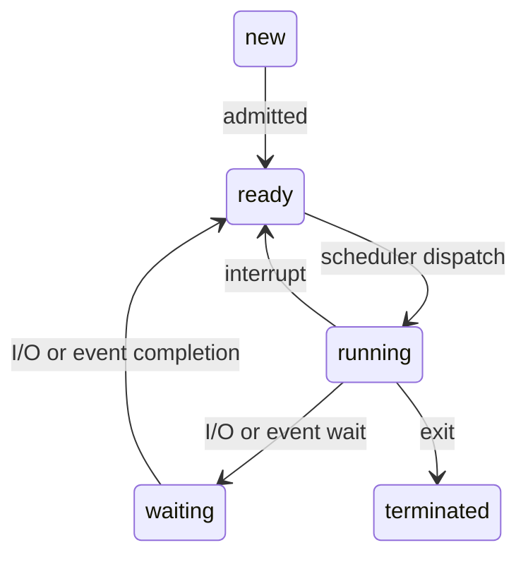
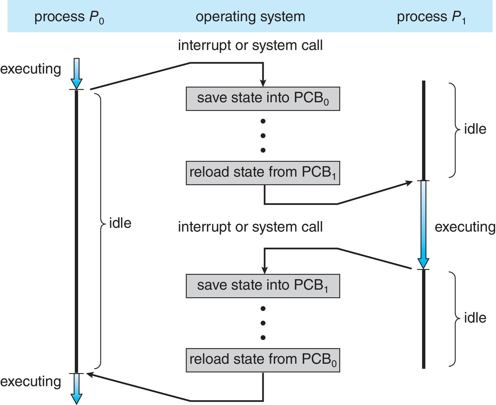
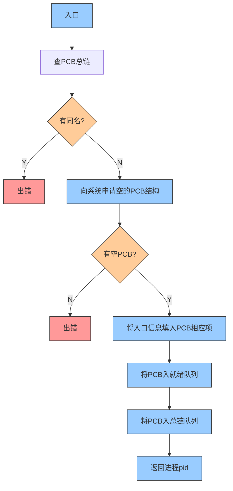
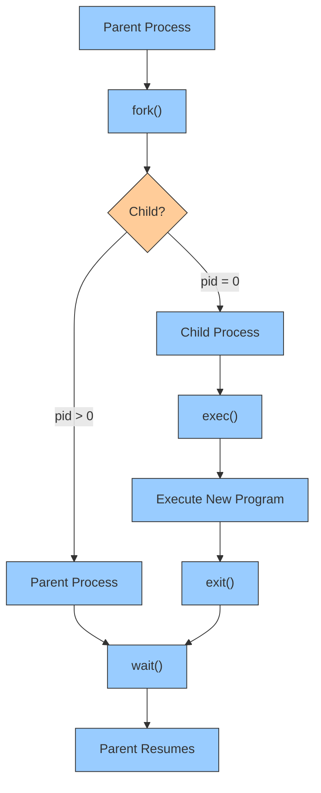
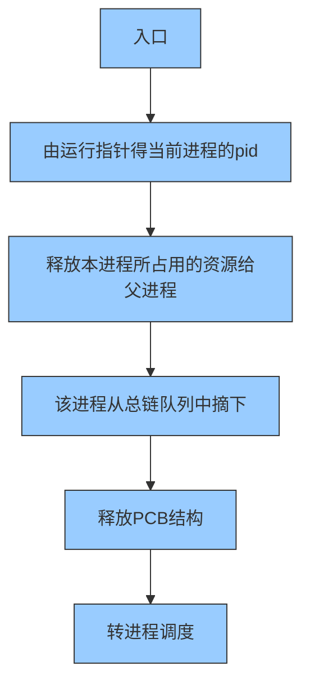
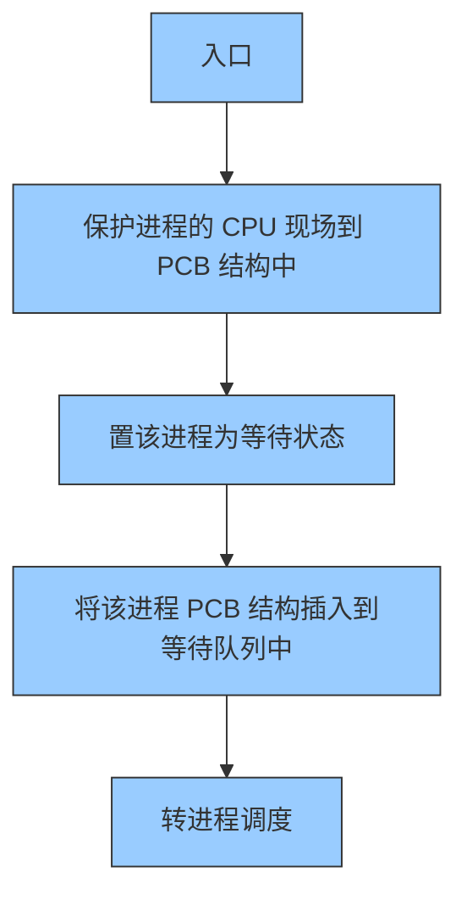
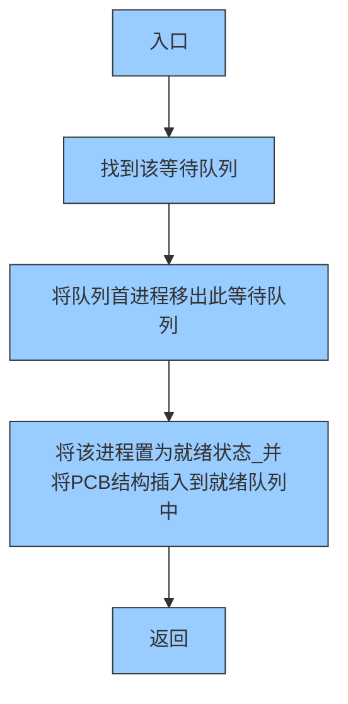
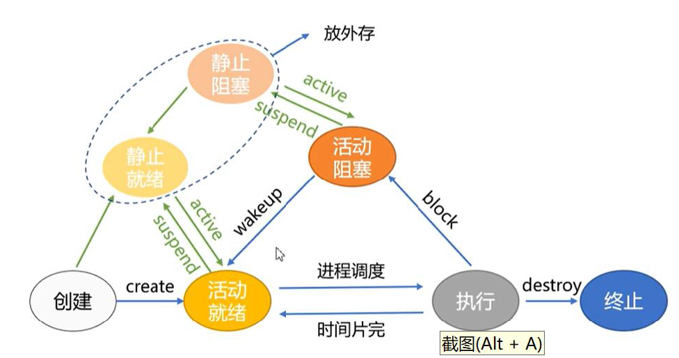
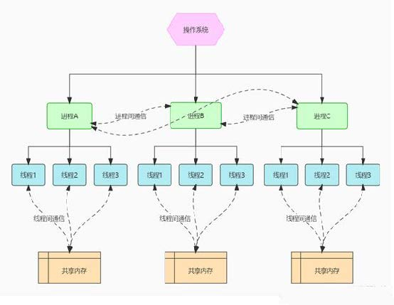

## CHAPTER3 进程线程模型

[TOC]

### 进程

#### 进程基本概念

操作系统 **执行应用程序** 是 **以进程的方式** 运行的

**进程（ Process ）**：一个具有一定独立功能的程序 **在一个数据集合上** 的一次动态执行过程 ，也称为任务（ Task ）

- 进程是程序的一次执行
- 进程是一个程序及其数据在处理机上顺序执行时所发生的活动
- 进程是程序在一个 **数据集合** 上运行的过程
- 进程是系统进行 **资源分配和调度** 的一个 **独立单位** 或者说基本单位


#### 进程的构成

- 进程控制块( PCB, Process Control Block )

  管理程序运行的数据结构

  | Part                       | Function                                         |
  | -------------------------- | ------------------------------------------------ |
  | 进程状态 process state     | 运行、等待、就绪等                               |
  | 进程编号 process number    | 区分不同进程                                     |
  | 程序计数器 program counter | 下一条指令的位置                                 |
  | 进程优先级                 | 反映进程获得 CPU 的优先级别                      |
  | CPU 寄存器 registers       | 所有进程相关寄存器的内容                         |
  | CPU 调度信息               | 优先级、调度队列指针                             |
  | 内存管理信息 memory limits | 分配给进程的内存                                 |
  | 记账信息                   | CPU 使用情况、自启动以来经过的时钟时间、时间限制 |
  | I/O 状态信息               | 分配给进程的 I/O 设备、打开文件列表              |

- 程序段，也称为文本段，可以被 **多个进程共享**

- 数据端，存放原始数据和中间数据

#### 进程的特征

进程是对正在运行程序的抽象

- **动态性：** 进程有生命周期，可以创建、运行、暂停、消亡。
- **并发性：** 进程可以并发执行。
- **独立性：** 每个进程有独立的地址空间，不需要了解其它进程的实现细节，一个进程的错误不会影响其它进程的执行；进程间可以通过通信机制共享资源。
- **异步性：** 每个进程有独立的执行环境，互不干扰。

进程是在内存中的。

#### 程序转化为进程

1. 将代码和静态数据从磁盘加载到内存
2. 为程序的运行时栈(run-time stack)分配内存
3. 为程序的堆(heap)分配内存
4. 执行与 I/O 相关的设置
5. 启动程序的运行

- 程序是存储在磁盘上的被动实体（可执行文件），进程是活动的。
- 当可执行文件被加载到内存中时，程序变成进程
- 通过 GUI 鼠标点击或命令行输入其名称等，启动程序的执行
- 一个程序可以有多个进程

进程的内存映像自上而下依次是

1. stack: 栈，用于存储函数调用的上下文信息
2. heap: 堆，用于动态内存分配的区域（与栈是相向增长的）
3. data: 数据区，存放全局变量和静态变量
4. text: 文本区/代码区，存放程序的机器代码，通常只读，以防止恶意或意外修改

#### 进程状态



- **新建 New: ** 进程被创建
- **运行 Running: ** 指令执行时的状态
- **等待（阻塞）Waiting: ** 进程等待某个事件发生时的状态
-  **就绪 Ready: ** 进程等待获得 CPU
-  **终止 Terminated: ** 进程正常或异常结束时的状态

> 状态转换大多为被动进行，但 **Running to Waiting** 是主动的



- **为何必须保存 PCB1？**

1. **状态完整性**：中断处理可能修改进程状态（如寄存器、内存），必须记录最新状态。
2. **透明性保证**：进程 B 感知不到自己被挂起，必须从“被中断的瞬间”继续执行。
3. **调度灵活性**：内核可随时挂起或恢复进程，依赖 PCB 保存/恢复机制实现正确性。

- **进程的上下文保存在 PCB 中**

- 上下文切换时间是 **纯开销**，系统在切换时不执行任何有用的工作
- 时间开销取决于硬件支持，某些硬件为每个 CPU 提供多组寄存器，一次要加载多个上下文。

> #### 传统上下文切换的瓶颈
>
> 在大多数通用处理器中，**所有进程共享同一组物理寄存器**。当发生进程切换时，操作系统必须执行以下操作：
>
> 1. **保存旧进程的寄存器状态**：将当前所有寄存器的值写入内存中的进程控制块（PCB）。
> 2. **加载新进程的寄存器状态**：从新进程的 PCB 中读取所有寄存器的值，载入物理寄存器。
>
> 时间开销来源：
>
> - **内存访问延迟**：寄存器数据需频繁读写内存（通常比寄存器操作慢 100 倍以上）。
> - **寄存器数量**：寄存器越多（如 x86 的 16 个通用寄存器+浮点/向量寄存器），保存/恢复的数据量越大。
>
> #### 硬件优化：多组寄存器设计
>
> 某些专用处理器（如实时系统或嵌入式芯片）提供 **多组物理寄存器**（Multiple Register Banks），每个寄存器组可独立分配给不同进程。例如：
>
> - 硬件提供 **4 组通用寄存器**（每组 16 个寄存器）。
> - 每组寄存器可绑定到一个进程的上下文。
>
> #### **切换流程优化**
>
> 1. **保存旧进程**：只需标记旧进程使用的寄存器组为“未激活”，无需将数据刷到内存。
> 2. **加载新进程**：直接切换到新进程绑定的寄存器组，无需从内存加载数据。

```c++
#include<stdio.h>
#define LEN 10
int main(int argc, char *argv[]){
    char name[LEN] = {0};
    fget(name, LEN, stdin);
    printf("Hello %s\n", name);
    return 0;
}
```

```powershell
./hello_name
xiaoming
Hello xiaoming
```

1. 执行 `./hello_name`，内核创建新进程，且还未完成初始化时，处于 **创建状态**

2. 内核对进程需要的数据结构进行初始化，并将其交给调度器，加入就绪队列，使其处于 **就绪状态**

3. 若调度器选择该进程执行，则变为 **运行状态**，开始执行 ` main ` 函数

4. 进程执行到 `fget`，需接受用户的输入，此时进程变为 **阻塞状态**
5. 用户在屏幕上输入 xiaoming 并回车，则进程会重新回到就绪队列，并在 CPU 空闲的时候重新回到 **运行状态** ，并输出 Hello Xiaoming
6. 进程执行完 main 函数，回到内核中，进程变为 **终止状态** ，内核回收该进程的资源


#### 进程控制

 **OS 对进程实现有效的管理**，包括创建新进程、撤销已有进程、挂起、阻塞和唤醒、进程切换等多种操作。

OS 通过 **原语( Primitive )操作** 实现进程控制。

- 原子操作，要么不做，要么全做，执行过程不会被中断
- 在 **内核态执行，常驻内存**
- 是内核三大支撑功能之一（**中断处理，时钟管理，原语操作**）

##### 进程创建

进程创建原语流程图



- 地址空间
  - 子进程是父进程的副本
  - 子进程中加载了一个程序

1. **父进程调用 `fork()`**  
   - **功能**：`fork()` 系统调用会创建一个与父进程 **几乎完全相同** 的子进程（复制父进程的代码段、数据段、堆栈等）。  
   - **返回值**：  
     - **父进程**：返回子进程的 PID（PID > 0）。  
     - **子进程**：返回 0（PID = 0）。  
   - **关键行为**：  
     - 子进程与父进程 **并发执行**，操作系统通过 **写时复制（Copy-on-Write）** 优化内存复制效率。

2. **子进程调用 `exec()`**  
   - **功能**：`exec()` 系统调用将子进程的内存空间 **替换为新程序**（如执行 `/bin/ls`）。  
   - **常见用法**：  
     ```c
     if (pid == 0) {  // 子进程
         execlp("/bin/ls", "ls", NULL);
         exit(1);  // 若exec失败则退出
     }
     ```
   - **注意**：  
     - `exec()` 成功后，子进程的代码、数据、堆栈等 **完全被新程序覆盖**。  
     - 若 `exec()` 失败，子进程应主动调用 `exit()` 终止。

3. **子进程调用 `exit()`**  
   - **功能**：子进程执行完新程序后，调用 `exit()` **终止自身**，释放资源（如内存、文件描述符）。  
   - **状态传递**：`exit()` 可传递退出状态码（如 `exit(0)` 表示成功），父进程通过 `wait()` 获取该状态。

4. **父进程调用 `wait()`**  
   - **功能**：父进程调用 `wait()` **阻塞等待子进程终止**，并回收子进程资源（避免僵尸进程）。  
   - **返回值**：若子进程已终止，`wait()` 返回子进程 PID，并恢复父进程执行。  
   - **非阻塞选项**：可使用 `waitpid()` 或 `WNOHANG` 标志实现异步等待。



1. **父进程启动**：  
   - 父进程调用 `fork()`，操作系统创建子进程副本。

2. **分支判断**：  
   - **子进程（pid = 0）**：执行 `exec()` 替换程序，完成后调用 `exit()`。  
   - **父进程（pid > 0）**：调用 `wait()` 等待子进程终止。

3. **资源回收**：  
   - 子进程终止后，父进程通过 `wait()` 回收资源并继续执行后续逻辑。

- **写时复制（Copy-on-Write）**：  
  - `fork()` 后父子进程共享内存，仅在修改时复制，减少内存开销。

- **僵尸进程避免**：  
  - 父进程必须调用 `wait()` 或 `waitpid()` 回收子进程资源，否则子进程将变为僵尸进程（Zombie）。

    > `wait(&status);`
    > `waitpid(pid , &status, options);`
    >
    > `wait()`: 该函数暂停调用进程，直至其子进程结束。如果子进程已经结束（成为僵尸进程），则该函数立即返回。子进程的结束状态会被返回并存储在 `status` 所指向的位置。
    >
    > 
    >
    > `waitpid()`: 与 ` wait()` 类似，但它添加了更多的控制选项。你可以使用它来等待一个特定的子进程，或者是满足特定条件的任何子进程。
  
- **错误处理**：  
  
  - `fork()` 失败时返回-1（如系统进程数达到上限）。  
  - `exec()` 失败时应调用 `exit()` 终止子进程。
  
- **并发执行**：  
  - 父子进程执行顺序由调度器决定，可能交替运行（除非父进程主动调用 `wait()` 阻塞等待）。

```c
#include<sys/types.h> // Defining the Process ID Type (pid_t)
#include<stdio.h>
#include<unistd.h>

int main(){
    pid_t pid;
    // fork a child process 
    pid = fork();
    
    // error occurred
    if(pid < 0){
        fprinf(stderr, "Fork Failed"); // Output error messages to the standard error stream
        return 1;
    }
    // child process
    else if(pid == 0){
        execlp("/bin/ls", "ls", NULL); // Key Operation: Replace the process image with /bin/ls
    }
    // parent process
    else{
        // parent will wait for the child to complete
        wait(NULL); // Blocking and waiting for child processes to finish (releasing resources)
        printf("Child Complete");
    }
    return 0;
}
```

1. **`fork()` 的作用**：
   - 复制父进程的内存空间，创建 **完全相同的子进程**。
   - 父子进程 **并发执行**，通过返回值区分逻辑（父进程获知子进程 PID，子进程获知自身 PID 为 0）。
2. **`execlp()` 的作用**：
   - 将子进程的代码段、数据段等替换为 `/bin/ls` 程序，**直接执行 `ls` 命令**。
   - 参数说明：
     - `"/bin/ls"`：新程序的路径。
     - `"ls"`：传递给新程序的名称（argv [0]）。
     - `NULL`：参数列表结束标志。
3. **`wait(NULL)` 的作用**：
   - 父进程 **阻塞等待子进程终止**，避免子进程成为僵尸进程（Zombie）。
   - `NULL` 表示不关心子进程的退出状态，若需获取状态可使用 `waitpid()`

> #### 导致进程创建的原因
>
> 1. **用户登录：** 用户登录后，若合法则为用户创建一个进程。
> 2. **作业调度：** 为调度到的作业分配资源并创建进程。
> 3. **OS 服务：** 创建服务进程。
> 4. **应用需要：** 应用程序根据需要创建子进程。
>
> #### 作业与进程
>
> 1. **作业（Job）的定义与调度**：
>    - **定义**：作业是用户提交给系统的完整任务单元，通常包含程序、数据及执行所需的资源请求。
>    - **调度层级**：属于 **长期调度（Long-term Scheduling）**，负责从外存的作业队列中选择作业加载到内存。
>    - **资源分配**：主要涉及 **内存分配**，确保作业获得足够的主存空间及其他资源（如文件句柄、I/O 设备等）。
>    - **创建进程**：作业被调入内存后，操作系统为其创建对应的 **进程**，使其进入就绪队列，等待 CPU 调度。
>
> 2. **进程（Process）与任务（Task）的定义及调度**：
>    - **进程**：操作系统资源分配的基本单位，包含代码、数据、堆栈及运行上下文（如寄存器值、程序计数器）。进程的存在依赖于内存分配。
>    - **任务**：通常指需要 CPU 执行的单元，可能与进程或线程（Thread）等同，尤其在多任务操作系统中，任务调度即 CPU 时间片的分配。
>    - **调度层级**：属于 **短期调度（Short-term Scheduling）**，决定就绪队列中哪个进程/任务获得 CPU 使用权，以实现并发执行。
>    - **核心关注点**：CPU 时间的高效分配、上下文切换、优先级处理等，直接影响系统的响应速度和吞吐量。
>
> 3. **关键区别总结**：
>    - **作业 vs. 进程/任务**：
>      - **作业**：关注 **内存资源的分配**，涉及从外存到内存的加载过程（长期调度）。
>      - **进程/任务**：关注 **CPU 时间的分配**，涉及进程状态转换（就绪、运行、阻塞等）及执行（短期调度）。
>    - **示例场景**：
>      - **作业调度**：用户提交一个编译任务，系统将其加载到内存，分配内存空间后创建编译进程。
>      - **进程调度**：编译进程与其他进程（如浏览器、文本编辑器）竞争 CPU 时间片，操作系统通过时间片轮转或优先级策略分配 CPU 资源。
>
> 4. **操作系统的调度层次**：
>    - **长期调度（作业调度）**：控制内存中并发进程的数量，避免内存过载。
>    - **中期调度**：通过交换（Swapping）技术将部分进程暂时移出内存，平衡系统负载。
>    - **短期调度（进程调度）**：高频选择就绪进程分配 CPU，通常发生在毫秒级时间片结束时。
>
> 5. **实际系统中的应用**：
>    - **批处理系统**：作业调度占主导，如大型科学计算任务按队列加载到内存执行。
>    - **交互式系统**：进程调度更为关键，确保用户界面快速响应（如 Windows、Linux 的桌面环境）。
>    - **实时系统**：任务调度需严格满足截止时间，如自动驾驶中的传感器数据处理。
>
> ### 总结：
> - **“作业是对主存而言”**：作业调度负责将外存中的作业加载到内存并分配资源，使其成为可执行的进程。
> - **“进程和任务是对 CPU 而言”**：进程/任务调度决定哪些已加载到内存的进程获得 CPU 执行时间，实现多任务并发。
> - 这种分层调度机制（长期、中期、短期）使操作系统能高效管理内存和 CPU 资源，平衡系统负载与用户响应速度。


##### 进程终止

功能：终止当前运行的进程。将该进程的 PCB 结构归还到 PCB 资源池，所占用的资源归还给父进程，从总链队列中摘除它，然后转进程调度程序。



- 进程执行最后一条语句，然后通过 `exit()` 系统调用请求操作系统删除它

  - 通过 `wait()` 将状态数据从子进程返回给父进程
  - 进程的资源由操作系统释放

- 父进程可以使用 `abort()` 系统调用终止子进程的执行。一些终止子进程的原因包括：

  - 子进程超过了分配的资源
  - 分配给子进程的任务不再需要
  - 父进程正在退出，如果父进程终止，操作系统不允许子进程继续执行

- 父进程可以使用 `wait()` 系统调用等待子进程的终止。该调用返回状态信息和已终止进程的 `pid` 。

  ```c
  pid = wait(&status);
  ```

  > - 如果没有父进程等待（未调用 `wait()`），则该进程是 **僵尸进程**
  >
  > - 如果父进程终止而没有调用 `wait()`，则该进程是 **孤儿进程**
  >
  > 
  >
  > #### 流程图核心步骤回顾
  >
  > 根据您提供的进程终止原语流程图，进程终止的关键步骤如下：
  >
  > 1.**入口** → 2. **获取当前进程 PID** → 3. **释放资源给父进程** → 4. **从总链队列移除** → 5. **释放 PCB** → 6. **转进程调度**。
  >
  > 
  >
  > ####  僵尸进程（Zombie Process）的产生与流程中断
  >
  > - **定义**：子进程已终止，但父进程 **未调用 `wait()` 回收其退出状态**，导致子进程的 PCB 仍残留在系统中。
  > - **流程图中的表现**：
  >   - **步骤 3**：子进程的资源已释放给父进程（如内存、文件句柄）。  
  >   - **步骤 5**：**PCB 未被释放**！父进程未调用 `wait()` 时，操作系统无法回收子进程的 PCB。  
  >   - **结果**：子进程的 PCB 成为“僵尸”（占用内核资源），停留在进程表中，直到父进程回收。
  > - **危害**：僵尸进程过多会耗尽系统 PID 资源，导致新进程无法创建。
  > - **示例**：
  >   ```c
  >   // 父进程未调用wait()
  >   if (fork() == 0) {  // 子进程
  >       exit(0);        // 子进程终止，但父进程未回收
  >   } else {            // 父进程
  >       sleep(100);     // 父进程不调用wait()，子进程成为僵尸
  >   }
  >   ```
  >
  > 
  >
  > #### 孤儿进程（Orphan Process）的产生与系统接管
  >
  > - **定义**：父进程 **先于子进程终止**，导致子进程失去父进程，成为“孤儿”。
  > - **流程图中的表现**：
  >   - **步骤 3**：父进程已终止，无法接收子进程释放的资源。  
  >   - **系统自动处理**：操作系统将孤儿进程的父进程 **重置为 `init`（PID = 1）**，由 `init` 进程接管后续回收工作。  
  >   - **步骤 5**：`init` 进程会定期调用 `wait()` 回收孤儿进程的 PCB。
  > - **无害性**：孤儿进程是临时状态，最终会被 `init` 进程回收，不会长期占用资源。
  > - **示例**：
  >   ```c
  >   if (fork() == 0) {  // 子进程
  >       sleep(10);      // 子进程休眠10秒
  >       exit(0);        // 此时父进程已终止，子进程成为孤儿
  >   } else {            // 父进程
  >       exit(0);        // 父进程立即终止
  >   }
  >   ```
  >
  > 
  >
  > #### **4. 关键对比**
  > | 类型         | 触发条件              | 流程图中的中断点         | 回收责任        | 危害性             |
  > | ------------ | --------------------- | ------------------------ | --------------- | ------------------ |
  > | **僵尸进程** | 父进程未调用 `wait()` | 步骤 5（PCB 未被释放）   | 父进程          | 高（资源泄漏）     |
  > | **孤儿进程** | 父进程先终止          | 步骤 3（父进程已不存在） | `init` 进程接管 | 低（系统自动回收） |
  >
  > 
  >
  > #### 如何避免僵尸进程？
  >
  > - **父进程显式调用 `wait()` 或 `waitpid()`**：
  >  ```c
  >   pid_t pid = fork();
  >   if (pid == 0) {
  >       // 子进程逻辑
  >   } else {
  >       wait(NULL);  // 阻塞等待子进程终止
  >   }
  >  ```
  > - **信号处理**：父进程捕获 `SIGCHLD` 信号异步回收子进程：
  >
  >   ```c
  >   signal(SIGCHLD, [](int) { wait(NULL); });
  >   ```
  >
  > #### 总结
  >
  > - **僵尸进程**：因父进程未回收子进程的 PCB，导致流程终止在 **释放 PCB 之前**（步骤 5 未完成）。需父进程主动调用 `wait()` 解决。  
  > - **孤儿进程**：因父进程提前终止，流程中 **资源释放目标变为 `init` 进程**，系统自动完成后续回收。  
  > - **流程图的核心价值**：展示了进程终止时资源的释放路径，并揭示了未正确回收时的资源残留问题。
  


##### 进程阻塞（等待）

功能：暂停进程的执行，并将其加入到等待某事件的等待队列中；将控制转向进程调度



> #### 引发进程阻塞的事件
>
> 1. **I/O 请求：** 进程发出 I/O 请求并等待其完成时，例如读写磁盘文件或网络数据。
> 2. **等待子进程：** 父进程使用如 `wait() ` 这样的系统调用等待一个或多个子进程终止。
> 3. **信号或消息：** 进程等待接收特定的信号或消息。
> 4. **资源争用：** 进程等待获取互斥锁、信号量或其他同步原语。
> 5. **内存页错误：** 进程访问的内存页不在物理内存中，需要从磁盘中调入。

##### 进程唤醒

功能：当进程等待的事件发生时，由事件发现者唤醒等待该事件的进程。



> #### 引发进程唤醒的事件
>
> 1. **I/O 完成：** 进程发出的 I/O 请求已完成
> 2. **子进程终止：** 进程等待的子进程已终止。
> 3. **接收到信号或消息：** 进程接收到了它正在等待的信号或消息。
> 4. **获取资源：** 进程等待的资源（如互斥锁、信号量）已经可用。
> 5. **内存页调入完成：** 进程等待的内存页已经被调入物理内存。

##### 进程挂起

进程的挂起指的是进程因为某种原因暂时不能继续执行，需要等待某个事件的发生或者满足某种条件后才能恢复执行。

在挂起状态下，进程会 **被保存在磁盘上，不占用内存资源，也不占用 CPU 时间**。而阻塞是在 **内存中** 的。




#### 练习

```c
#include<sys/types.h>
#include<stdio.h>
#include<unistd.h>

int value = 5;
int main(){
    pid_t pid;
    pid = fork();

    if(pid == 0){
        value += 15;
    }
    else if(pid > 0){
        wait(NULL);
        printf("PARENT: value = %d\n", value);
    }
    return 0;
}
```

> 输出结果是：`PARENT: value = 5`
>
> #### 进程创建与状态转换
>
> 1. **父进程调用 `fork()`**： 
>    - `fork()` 会创建一个子进程，子进程是父进程的 **完整副本**，包括代码段、数据段（如全局变量 `value`）、堆栈和寄存器状态。  
>    - 此时，**子进程进入创建（Create）状态**，随后根据调度策略转换为 **活动就绪（Active Ready）** 状态，等待被调度执行。  
>    - **父进程继续执行**，状态保持为 **执行（Running）**（除非调度器强制切换）。
>
> 2. **父子进程的状态分支**：  
>    - **子进程（`pid == 0`）**：  
>      - 从 **活动就绪** 被调度到 **执行** 状态。  
>      - 执行 `value += 15`，修改自己的数据段副本（全局变量 `value` 变为 `20`）。  
>      - 执行完成后，子进程 **终止（Destroy）**，释放资源。  
>    - **父进程（`pid > 0`）**：  
>      - 调用 `wait(NULL)`，进入 **活动阻塞（Active Blocked）** 状态，等待子进程终止。  
>      - 子进程终止后，父进程被唤醒，回到 **活动就绪** 状态，随后被调度为 **执行** 状态。  
>      - 执行 `printf("PARENT: value = %d\n", value)`，输出自己地址空间中的 `value`（仍为初始值 `5`）。
>
> #### 关键机制：进程地址空间隔离
>
> - **写时复制（Copy-on-Write）**：  
>   - `fork()` 创建子进程时，父子进程共享物理内存，但标记为只读。  
>   - **任何一方尝试修改数据（如 `value += 15`）**，内核会为该进程分配新物理页，实现地址空间隔离。  
>   - 因此，子进程修改 `value` **不影响父进程的副本**。  
>
> - **全局变量的独立性**：  
>   - 父子进程的全局变量 `value` 位于不同的物理内存页（子进程修改后触发写时复制）。  
>   - 父进程的 `value` 始终为初始值 `5`，子进程的修改仅作用于自身内存空间。
>
> #### 进程状态转换与输出结果的关联
>
> - **子进程的流程**：  
>   ```mermaid
>   graph LR
>       A[创建] --> B[活动就绪]
>       B -->|调度| C[执行]
>       C -->|修改value=20| D[终止]
>   ```
>   - 子进程的 `value` 修改在终止后无效，不影响父进程。
>
> - **父进程的流程**：  
>
>   ```mermaid
>   graph LR
>       A[执行] -->|fork| B[创建子进程]
>       B --> C[调用wait_NULL_]
>       C -->|阻塞| D[活动阻塞]
>       D -->|子进程终止| E[活动就绪]
>       E -->|调度| F[执行]
>       F -->|打印value=5| G[终止]
>   ```
>   - 父进程在阻塞期间不参与调度，恢复执行后仍访问原始数据。
>
> #### 与状态转换图的对应关系
>
> 1. **创建（Create）** → **活动就绪（Active Ready）**：子进程被 `fork()` 创建后进入就绪队列。  
> 2. **执行（Running）** → **活动阻塞（Active Blocked）**：父进程调用 `wait(NULL)` 主动阻塞。  
> 3. **活动阻塞** → **活动就绪**：子进程终止后，父进程被唤醒。  
> 4. **执行** → **终止（Destroy）**：子进程完成计算后退出。  
>
> #### 总结
>
> - **输出结果的根本原因**： 
>   父子进程的地址空间完全隔离，子进程对 `value` 的修改仅作用于自身内存副本，父进程的 `value` 保持初始值 `5`。  
> - **状态转换的核心逻辑**：  
>   - 父进程通过 `wait()` 实现同步，确保子进程终止后再继续执行。  
>   - 子进程的终止触发父进程从阻塞状态恢复，完成后续逻辑。  
>
> 这种机制是操作系统实现多进程并发和隔离的核心设计，确保了进程间的独立性和安全性。
>
> - 如果需要实现子进程对父进程的内容的修改，就要涉及到 **进程间通信（IPC）**
>
>   ```c
>   #include <sys/types.h>
>   #include <stdio.h>
>   #include <unistd.h>
>   #include <sys/ipc.h>
>   #include <sys/shm.h>  // 新增头文件
>
>   int main() {
>       // 创建共享内存段（大小为int）
>       int shmid = shmget(IPC_PRIVATE, sizeof(int), 0666 | IPC_CREAT);
>       int *value = (int*)shmat(shmid, NULL, 0);  // 附加到进程地址空间
>       *value = 5;  // 初始化共享内存的值
>
>       pid_t pid;
>       pid = fork();
>
>       if (pid == 0) {
>           *value += 15;  // 子进程修改共享内存
>           shmdt(value);  // 子进程分离共享内存
>       } else if (pid > 0) {
>           wait(NULL);
>           printf("PARENT: value = %d\n", *value);  // 输出 20
>           shmdt(value);   // 父进程分离共享内存
>           shmctl(shmid, IPC_RMID, NULL);  // 删除共享内存
>       }
>       return 0;
>   }
>   ```
>
> - 创建 50 个子进程并回收
>
>   ```c
>   ```
>
> 

```c
// count How Many processes are created.

#include<stdio.h>
#include<unistd.h>

int main(){
    // fork a child process
    fork();

    // fork another child process
    fork();

    // and fork another
    fork();

    return 0;
}
```

**每个子进程在创建后也会继续执行后续的 fork()调用，除非有明确的条件判断来控制。**

- **子进程数**：7（总进程数 8 - 初始父进程 1）。
- **总进程数**：8（包括初始父进程）。
- **设计特点**：无条件的连续 `fork()` 调用导致指数级进程增长，实际开发中需谨慎使用以避免资源耗尽。

### 线程

Thread ，进程的轻型实体，也叫“轻量级进程”，是一系列活动按事先设定好的顺序依次执行的过程，是一系列指令的集合，是一条执行路径，**不能单独存在，必须包含在进程中线程，** 是 OS 中 **运算调度的最小单位。**

轻型实体、独立调度和分派的基本单位、可并发执行、共享进程资源



#### 线程的组成

1. 线程控制块（TCB）: 它存储了操作系统需要管理和调度线程所需的所有信息。

   - 线程标识符

   - 线程状态

   - CPU 寄存器值（PC，PS 和通用寄存器）

     不像进程还要存代码、数据什么的，线程 **只需要存寄存器的值** 就可以，每个线程有自己的堆栈空间，但会共用进程的堆区内存。

   - 线程优先级

   - 所属进程的引用

   

#### 引入线程的作用

- 单线程应用的瓶颈
  - CPU 利用率低
  - 相应性能差
  - 无法充分利用多核 CPU
  - 不适合并发处理
- 应用程序中的多个任务可以通过多个线程来实现
  - 更新显示
  - 获取数据
  - 拼写检查
  - 响应网络请求
- 线程的创建是轻量级的，而进程的创建是重量级的（进程的切换是需要 **调度器** 来完成的。线程的切换则可以直接由 **用户程序** 来完成。）
- 使用多线程可以简化代码，提高效率
- 内核通常也是多线程的


#### 多线程的优势

- **响应性：** 进程在某个部分被阻塞的情况下被允许继续执行，对于用户界面尤其重要
- **资源共享：** 线程共享进程的资源，比共享内存或消息传递更容易
- **经济性：** 比进程创建的开销小，线程切换的开销比上下文切换低
- **可扩展性：** 进程可以利用多核架构的优势


#### 多线程进程的地址空间布局

- **分离的内核栈和用户栈**
  - 每个线程都有自己的栈，用于存放临时数据
  - 用户线程切换到内核中执行时，**栈指针则切换到对应的内核栈**
- **共享其他区域**
  - 除栈以外的其他区域，进程内的所有栈共享
  - **一个进程的多个线程需要动态分配内存时，将在同一个堆上完成**


#### 进程与线程的比较

- **进程是资源分配单位，线程是 CPU 调度单位**
- 进程拥有一个 **完整的资源平台**，而线程只独享 **指令流执行的必要资源**，如寄存器和栈。
- 线程具有 **就绪、等待和运行** 三种基本状态和状态间的转换关系。
- 线程能减少并发执行的时间和空间开销
  - 线程的创建，终止，切换时间比进程短
  - 同一进程的各线程间共享内存和文件资源，可不通过内核进行直接通信


#### 线程的实现方式

##### 用户级线程（User-Level Threads）

由 **一组用户级的线程库函数** 来完成线程的管理，包括线程的创建、终止、同步和调度等

- 线程完全在 **用户空间** 中实现，**不需要内核的支持**；
- 用户级线程的创建、销毁、同步和切换都是 **由相应的用户级线程库来完成的**，这些操作通常比内核级线程的对应操作要快得多；
- 操作系统只看到 **进程而不是用户级线程，所以它不能直接调度用户级线程**，也不能在多处理器系统上并行运行用户级线程；
- 如果一个用户级线程阻塞（例如等待 I/O 操作完成），**整个进程（包括所有其他用户级线程）都会被阻塞。**


##### 内核级线程（Kernel-Level Thread）

- 由内核通过系统调用实现的线程机制，由内核完成线程的创建、终止和管理
- 由内核维护线程控制块 TCB，在内核实现


- 线程由操作系统内核直接支持和管理；
- 每个内核级线程都有自己在内核中的数据结构（例如线程控制块），其中包含了如线程状态、优先级、调度信息等重要数据；
- 内核级线程可以直接由操作系统调度，因此它们可以在多处理器系统上并行运行
- 如果一个内核级线程阻塞（例如等待 I/O 操作完成），操作系统可以立即调度同一进程中的另一个线程运行；
- 内核级线程的创建、销毁、同步和切换都需要进行系统调用，因此这些操作的开销相对较大。


#### 线程的上下文切换

- 线程是调度的基本单位，而进程则是资源拥有的基本单位。
- 不同进程中的线程切换：**进程上下文切换**
- 相同进程中的线程切换：虚拟内存等进程资源保持不动，只需要切换线程的私有数据、寄存器等不共享的数据

#### 线程库

线程库为程序员提供了用于创建和管理线程的 API

- 两种主要的实现线程库的方式
  - 完全在用户空间运行的库
  - 由操作系统支持的内核级库

**pthreads**

1. 线程创建

   ```c
   pthread_create(thread, attr, start_routine, arg);
   ```

2. 线程退出

   ```c
   pthread_exit(retval);
   ```

3. 出让资源

   ```c
   pthread_yield();
   ```

4. 合并操作

   ```c
   pthread_join(thread, retval)
   ```

5. 挂起与唤醒

   ```c
   sleep(seconds);
   pthread_cond_wait(cond, mutex);
   ```


```c
#include<pthread.h>
#include<stdio.h>
#include<stdlib.h>

int sum; // this data is shared by the threads
void *runner(void *param); // threads call this function

int main(int argc, char *argv[]){
    pthread_t tid; // the thread identifier
    pthread_attr_t attr; // set of thread attributes

    // set the default attributes of the thread
    pthread_attr_init(&attr);
    // create the thread
    pthread_create(&tid, &attr, runner, argv[1]);
    // wait for the thread to exit
    pthread_join(tid, NULL);

    printf("sum = %d\n", sum);
}

// the thread will execute in this function
void *runner(void *param){
    int i, upper = atoi(param);
    sum = 0;

    for(i = 1; i <= upper; i++)
        sum += i;
    pthread_exit(0);
    return NULL;
}

```

> #### 线程创建与初始化
>
> - **函数**：`pthread_create(pthread_t *thread, const pthread_attr_t *attr, void *(*start_routine)(void *), void *arg)`  
>   - **功能**：创建新线程，将其置于 **创建（Create）** 状态。  
>   - **状态转换**：  
>     - 创建后，线程进入 **静止就绪**（若未立即调度）或 **活动就绪**（若系统允许直接执行）。  
>     - 图中对应箭头：**create → 静止就绪** 或 **create → 活动就绪**。  
>   - **实现原理**：  
>     - 内核分配独立堆栈和线程控制块（TCB），设置 `start_routine` 为入口函数。  
>     - 调用 Linux 的 `clone()` 系统调用创建轻量级进程（LWP）。
>
> #### 线程终止
>
> - **函数**：`pthread_exit(void *retval)`  
>   - **功能**：主动终止当前线程，进入 **终止（Destroy）** 状态。  
>   - **状态转换**：  
>     - 从 **执行** 直接跳转到 **终止**（图中标注 `destroy` 箭头）。  
>     - 若线程未被分离（detached），其 TCB 和退出状态需由其他线程通过 `pthread_join` 回收。  
>   - **实现原理**：  
>     - 释放线程堆栈，通过内核的 `exit()` 系统调用终止线程。  
>     - 若线程是主线程，进程将继续运行直到所有非分离线程终止。
>
> #### 线程等待与资源回收
>
> - **函数**：`pthread_join(pthread_t thread, void **retval)`  
>   - **功能**：阻塞调用线程（通常是主线程），直到目标线程终止，并回收其资源。  
>   - **状态转换**：  
>     - 主线程从 **执行** 进入 **活动阻塞**（图中 `block` 箭头）。  
>     - 目标线程终止后，主线程被唤醒（`wakeup` 箭头），返回 **活动就绪**。  
>   - **实现原理**：  
>     - 内核维护线程的终止状态队列，`pthread_join` 通过等待队列实现阻塞和唤醒。  
>     - 若目标线程已终止，直接读取其退出码；否则挂起当前线程，直到目标线程调用 `pthread_exit`。
>
> #### 线程属性控制
>
> - **函数**：`pthread_attr_init(pthread_attr_t *attr)` 和 `pthread_attr_setdetachstate(pthread_attr_t *attr, int detachstate)`  
>   - **功能**：设置线程属性（如分离状态）。  
>   - **状态转换**：  
>     - 若设置 `detachstate` 为 `PTHREAD_CREATE_DETACHED`，线程终止后直接释放资源，无需 `pthread_join`（图中 **终止 → 销毁** 无阻塞）。  
>   - **实现原理**：  
>     - `pthread_attr_t` 结构体保存栈大小、调度策略等属性。  
>     - 分离线程在终止时自动回收资源，避免僵尸线程。
>
> #### 线程同步与阻塞唤醒
>
> - **函数**：`pthread_mutex_lock(pthread_mutex_t *mutex)` 和 `pthread_cond_wait(pthread_cond_t *cond, pthread_mutex_t *mutex)`  
>   - **功能**：通过互斥锁和条件变量实现线程的 **活动阻塞** 与唤醒。  
>   - **状态转换**：  
>     - `pthread_cond_wait` 使线程从 **执行** 进入 **活动阻塞**（图中 `block` 箭头）。  
>     - `pthread_cond_signal` 或 `pthread_cond_broadcast` 触发 `wakeup`，线程回到 **活动就绪**。  
>   - **实现原理**：  
>     - 条件变量内部维护等待队列，`pthread_cond_wait` 释放锁并阻塞线程。  
>     - 唤醒时重新获取锁，继续执行临界区代码。
>
> #### 线程挂起与恢复（非 POSIX 标准）
>
> - **注**：POSIX 标准未定义线程挂起（suspend）和恢复（resume）函数，但可通过信号模拟。  
> - **函数**：`pthread_kill(pthread_t thread, int sig)` 配合信号处理  
>   - **功能**：向线程发送信号，模拟 **静止就绪** ↔ **活动就绪** 转换。  
>   - **状态转换**：  
>     - 线程收到 `SIGSTOP` 信号进入 **静止就绪**（图中 `suspend` 箭头）。  
>     - 收到 `SIGCONT` 信号恢复为 **活动就绪**（`active` 箭头）。  
>   - **实现原理**：  
>     - 内核暂停或恢复线程的执行流，保存/恢复寄存器状态。
>
> #### 函数与状态转换的完整映射
>
> | 函数/操作                | 图中对应状态转换          | 核心作用                       |
> | ------------------------ | ------------------------- | ------------------------------ |
> | `pthread_create`         | create → 静止/活动就绪    | 创建线程并初始化状态           |
> | `pthread_exit`           | 执行 → 终止               | 终止线程并释放部分资源         |
> | `pthread_join`           | 活动阻塞 ↔ 活动就绪       | 阻塞等待线程终止并回收资源     |
> | `pthread_attr_setdetach` | 终止 → 销毁（无阻塞）     | 控制线程终止后的资源回收方式   |
> | `pthread_mutex_lock`     | 执行 → 活动阻塞（锁冲突） | 保护共享资源，避免竞争条件     |
> | `pthread_cond_wait`      | 执行 → 活动阻塞           | 条件不满足时主动阻塞并等待唤醒 |
>
> #### 总结
>
> - **线程生命周期管理**：`pthread_create` 和 `pthread_exit` 控制线程的创建与终止。  
> - **资源回收**：`pthread_join` 和分离属性决定线程终止后的状态迁移（是否阻塞等待）。  
> - **同步与阻塞**：互斥锁和条件变量实现线程的 **活动阻塞** 与唤醒，对应图中 `block/wakeup` 转换。  
> - **挂起模拟**：通过信号机制间接实现 **静止就绪** 状态。  
>

```c
#include <stdio.h>
#include <pthread.h>

int value = 5;  // 共享变量（全局内存）

void* thread_function(void* arg) {
    value += 15;       // 子线程修改共享变量
    pthread_exit(NULL);
}

int main() {
    pthread_t tid;
    pthread_mutex_t mutex = PTHREAD_MUTEX_INITIALIZER; // 互斥锁

    // 创建线程
    if(pthread_create(&tid, NULL, thread_function, NULL) != 0) {
        perror("Thread creation failed");
        return 1;
    }

    // 等待子线程完成
    pthread_join(tid, NULL);

    // 同步访问共享变量
    pthread_mutex_lock(&mutex);
    printf("MAIN THREAD: value = %d\n", value);
    pthread_mutex_unlock(&mutex);

    pthread_mutex_destroy(&mutex);
    return 0;
}
```

输出的是 `MAIN THREAD: value = 20`


```c
#include <stdio.h>
#include <stdlib.h>
#include <pthread.h>

// 定义线程参数结构体
typedef struct {
    int *nums;      // 数字数组指针
    int count;      // 数组长度
    int result;     // 计算结果（用于平均值、最大值、最小值）
} ThreadData;

// 计算平均值线程函数
void *calc_avg(void *arg) {
    ThreadData *data = (ThreadData*)arg;
    int sum = 0;
    for (int i = 0; i < data->count; i++) {
        sum += data->nums[i];
    }
    data->result = sum / data->count;  // 整数除法截断小数
    return NULL;
}

// 计算最大值线程函数
void *calc_max(void *arg) {
    ThreadData *data = (ThreadData*)arg;
    int max = data->nums[0];
    for (int i = 1; i < data->count; i++) {
        if (data->nums[i] > max) max = data->nums[i];
    }
    data->result = max;
    return NULL;
}

// 计算最小值线程函数
void *calc_min(void *arg) {
    ThreadData *data = (ThreadData*)arg;
    int min = data->nums[0];
    for (int i = 1; i < data->count; i++) {
        if (data->nums[i] < min) min = data->nums[i];
    }
    data->result = min;
    return NULL;
}

int main(int argc, char *argv[]) {
    if (argc < 2) {
        fprintf(stderr, "Usage: %s <num1> <num2> ...\n", argv[0]);
        return 1;
    }

    // 解析命令行参数为整数数组
    int num_count = argc - 1;
    int *numbers = malloc(num_count * sizeof(int));
    for (int i = 0; i < num_count; i++) {
        numbers[i] = atoi(argv[i + 1]);
    }

    // 初始化线程数据
    ThreadData avg_data = {numbers, num_count, 0};
    ThreadData max_data = {numbers, num_count, 0};
    ThreadData min_data = {numbers, num_count, 0};

    // 创建线程
    pthread_t tid_avg, tid_max, tid_min;
    pthread_create(&tid_avg, NULL, calc_avg, &avg_data);
    pthread_create(&tid_max, NULL, calc_max, &max_data);
    pthread_create(&tid_min, NULL, calc_min, &min_data);

    // 等待所有线程完成
    pthread_join(tid_avg, NULL);
    pthread_join(tid_max, NULL);
    pthread_join(tid_min, NULL);

    // 输出结果
    printf("The average value is %d\n", avg_data.result);
    printf("The maximum value is %d\n", max_data.result);
    printf("The minimum value is %d\n", min_data.result);

    // 清理内存
    free(numbers);
    return 0;
}
```