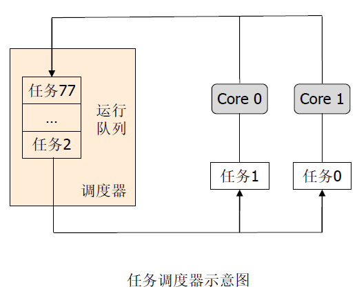
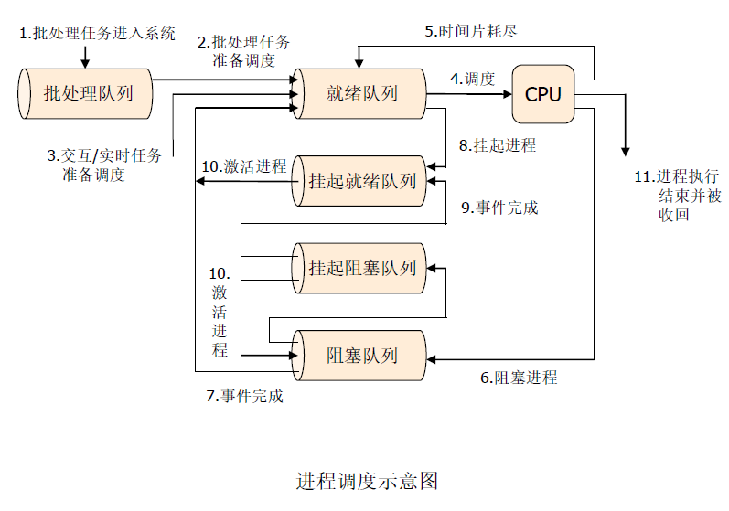
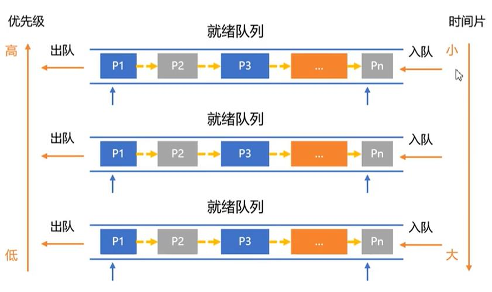

## CHAPTER4 进程线程调度

[TOC]

系统面临同时处理多个资源请求，但系统资源有限。调度就是来协调每个请求对资源的使用的方法。调度策略有：**排队、优先级、时间片轮转** 等

### 处理机调度

根据一定的算法和原则将处理机资源进行重新分配的过程。

- 前提：**作业/进程数量远远大于处理机数量**
- 目的：**提高资源利用率**，减少处理机空闲时间。
- 调度程序：一方面要满足特定系统用户的需求（快速响应），另一方面要考虑系统整体效率（系统平均周转时间）和调度算法本身的开销



调度器通过维护 **运行队列** 的方式来管理任务。

- 任务触发以下条件会停止执行
  - 执行了指定的时间片
  - 任务发起了 I/O 请求
  - 任务主动停止
  - 任务被系统中断打断
- 调度器的作用
  - 从队列中选择下一个执行的任务
  - 决定执行该任务的 CPU 核心
  - 决定该任务允许执行的时间片大小



- **长程调度：** 负责调控系统整体，为进程带来额外时延

- **中程调度：** 负责监控内存资源的使用
- **短程调度：** 决定进程是否可执行

#### 调度方式

1. 剥夺式（抢占式）调度
   - **立即暂停当前进程**
   - 分配处理机给另一个进程
   - 原则：**优先权，短进程优先，时间片原则**
2. 非剥夺（非抢占式）调度
   - 若有进程请求执行，等待当前进程完成或阻塞
   - 缺点：适用于批处理系统，不适用于分时（实时）系统

#### 调度时机

- 进程运行完毕
- 进程时间片用完
- 进程要求 I/O 操作
- 执行某种原语操作
- 高优先级进程申请运行（剥夺式调度）


#### 调度过程

1. 保存镜像：记录进程现场信息
2. 调度算法：确定分配处理机的原则
3. 进程切换：分配处理机给其他进程
4. 处理机回收：从进程收回处理机


#### 进程切换

调度程序将 CPU 的控制权交给 CPU 调度器选出来的进程

- 切换上下文

  > 为什么叫上下文，而不叫环境参数
  > 因为这里面 **有一个参数是有时间参数的，环境参数是随不时间变化的**。

- 切换用户模式

- 跳转到用户程序的适当位置来启动程序

**调度延迟**：调度程序停止一个进程并启动另一个进程运行所需的时间


#### 衡量调度算法的指标

1. **CPU 利用率：** 衡量 CPU 被有效利用的程度的指标。理想情况下，希望 CPU 能够一直被占用。$\frac{总时间-空闲时间}{总时间}$，特别注意，总时间是从第一个进程到达开始，到最后一个进程结束的时间。不要和 **周转时间** 弄混了，周转时间是对一个进程的概念，不是对整体的概念。
2. **吞吐量：** 衡量单位时间内，系统完成任务数量的指标。
3. **周转时间：** 从任务提交到任务完成所经过的时间，包括 **等待时间和执行时间**
4. **等待时间：** 衡量任务在就绪队列中等待的总时间。
5. **响应时间：** 从任务提交到首次开始执行所经过的时间


### 经典的单核进程调度算法

#### 先来先服务 First Come First Service (FCFS)

- 优点：简单

- 缺点：
  - 平均等待时间波动较大
  - 短作业/任务/进程可能排在长进程后面
  - I/O 资源和 CPU 资源的利用率较低（CPU 密集型进程会导致 I/O 设备闲置时，I/O 密集型进程也等待）

#### 最短作业优先 Shortest Job First (SJF)

将进程和后续进程的 CPU 执行时间进行比较，选择调度 CPU 执行时间最短的进程。对于相同的进程集，SJF 调度可以使得平均等待时间最短。

- 优点：**平均等待/周转时间最少**
- **可能导致饥饿**，连续的 **短作业/进程流** 会导致长作业/进程无法获得 CPU 资源
- 需要预知未来

#### 最短剩余时间优先 Shortest Remain Time (SRT)

SJF 的抢占式版本

**每当新进程到达就绪队列时，利用 SJF 算法重新决定下一个要调度的进程**

#### 最高响应比优先 Highest Response Ratio Next (HRRN)

$响应比=\frac{等待时间+服务时间}{服务时间}$

选择响应比高的进程先执行（每次调度都需要进行计算，导致计算非常复杂）

**非抢占式的调度**，旨在公平地处理各种长度的作业，同时尽量减少作业的平均等待时间和平均周转时间。

- 等待时间相同，短作业优先
- 运行时间相同，等待时间长的作业优先

特点：

1. 在短作业优先算法 SJF 的基础上改进
2. 关注进程的等待时间
3. 防止无限期推迟
4. 长作业等待越久响应比越高，更容易获得处理机

#### 时间片轮转调度 Round-Robin (RR)

- 每个进程获得一小段 CPU 时间（时间片 q 通常为 10 - 100 毫秒。此时间用完后，进程会被抢占并添加到就绪队列的末尾。（若时间没有用完，也会正常切换，时间重置计算）
- 若就绪队列中有 n 个进程且时间片为 q 则每个进程一次最多获得 CPU 时间的 1 / n ，进程等待不会超过 (n - 1)q 个时间片
- 时间片到，由计时器发出中断以调度下一个进程

对于性能：

- q 设置过大，则退化为 FIFO
- q 设置过小，则开销过大，因此 q 必须大于上下文切换时间


- 公平，响应快，适用于分时系统
- 时间片决定因素：系统响应时间，就绪队列进程数量，系统处理能力
- 时间片太大，相当于 FCFS；太小，处理机切换频繁，开销增大

#### 优先级调度

- 每个进程都与一个优先级数字（整数）相关联
- CPU 分配给具有最高优先级的进程（通常，最小整数 最高优先级）
- 两种方案：
  - 可抢占式
  - 不可抢占式
- 问题：**饥饿——低优先级进程可能永远不会执行**
- 解决方案：**老化——随着时间的推移，增加进程的优先级**
- 注意： SJF 可以看做是优先级调度，其中优先级是预测的下一个 CPU 执行时间的倒数


#### 结合 RR 的优先级调度

**调度最高优先级的进程 ，若进程优先级相同则按 RR 方式进行调度**

#### 多级队列

就绪队列由多个队列构成

- 不同的优先级都有各自独立的队列
- 调度从最高优先级的队列开始

#### 多级反馈队列 Multi-Feedback Queue (MFQ)



- 一个进程可以在各个队列之间移动
- 多级反馈队列的调度程序由以下参数定义：
  - 队列数量
  - 每个队列的调度算法
  - 何时升级进程的方法
  - 何时降级进程的方法
  - 进程将进入哪个队列的方法
- 可以通过 **多级反馈队列** 来实现 **老化机制**，**防止低优先级进程长时间得不到调度**

优缺点：

- 对各类型相对公平；快速响应；
- 终端型作业用户：短作业优先；
- 批处理作业用户：周转时间短；
- 长批处理作业用户：在前几个队列部分执行；

##### 核心思想：分级 + 动态调整

- **多级队列**：设置多个优先级不同的车道（队列），优先级越高，绿灯时间越短（时间片小）。
  - **高优先级队列**：快速处理短作业（如出租车）。
  - **低优先级队列**：用更长的绿灯处理长作业（如大卡车）。
- **反馈机制**：车辆（进程）若在当前绿灯时间没通过，就“降级”到下一级车道，避免堵死后续车辆。

##### 工作流程

1. **新进程到达**：一律进入 **最高优先级队列**，抢占式执行。
2. **时间片用完**：若未完成，降级到 **下一级队列**，时间片变长。
3. **低优先级队列执行**：若时间片用完仍没完成，继续降级，直到进入 **最低级队列**（通常按 FCFS 运行）。
4. **防饥饿机制**：长时间未执行的进程可被“重新插队”到较高优先级队列（类似让大卡车偶尔走应急车道）。


#### BSD 多级反馈队列调度

- 根据进程的行为和特征动态地调整进程的优先级和时间片
  - 系统维护多个就绪队列，每个队列有不同的优先级和时间片长度，一般来说，优先级越高的队列，时间片越短。
  - 新创建的进程被放入最高优先级的队列中，如果该队列为空，则调度该进程运行。
  - 如果一个进程在 **分配给它的时间片内完成** 或 **主动放弃 CPU** 则保持其优先级不变，重新放入原来的队列中等待下一次调度。
  - 如果一个进程在 **分配给它的时间片内没有完成或被抢占**，则降低其优先级，放入下一级队列中等待下一次调度。
  - 如果一个进程在最低优先级的队列中运行，且该队列中有其他进程，则采用 **轮转法** 进行调度。
- 调度效果
  - 对于短作业或交互式作业，给予较高的优先级和较快的响应时间，从而提高用户体验和系统吞吐量。
  - 对于长作业或计算密集型作业，给予较低的优先级和较长的时间片，从而避免过多的上下文切换开销和饥饿现象。
  - 对于不同类型或特征的作业，根据其历史行为进行动态调整，从而实现自适应和公平的调度。


#### Linux 抢占式调度算法

- Linux 的调度器维护一个就绪队列 (runqueue)，按照 **完全公平调度算法 CFS** 从就绪队列中选出一个进程，将其分配到 CPU 上 **执行一个时间片**。
- 当时间片用完时，则触发一个 **时钟中断**，调度器会强制暂停当前进程的执行将其重新放回就绪队列，然后选取另一个进程执行。
- CFS 算法根据 **进程的优先级和等待时间** 来计算每个进程的 vruntime 值 vruntime 越小，进程获得 CPU 时间片的机会就越大。
- CFS 维护一个红黑树，根据 vruntime 值将就绪进程排序，**树中序遍历最小** 的那个进程将 **被先调度**。
- 当一个进程用完时间片被抢占时 调度器会重新计算它的 vruntime 值并在红黑树中调整它的位置。
- 为避免线程长期占用 CPU，CFS 设置了 **抢占时间片的上限强制线程放弃 CPU 执行权**。
- Linux 也支持 **优先级抢占**，高优先级的进程可以抢占低优先级进程的执行。

> ### 红黑树在 Linux CFS 调度算法中的作用
>
> #### 核心功能
> - **动态维护进程队列** 
>   红黑树根据进程的 `vruntime`（虚拟运行时间）排序，树的最左节点始终是当前应调度的进程（`vruntime` 最小）。
> - **高效操作** 
>   插入、删除、查找最小值的时间复杂度均为 **O(log n)**，适合高并发场景（如数千个进程）。
> - **自平衡特性** 
>   通过颜色标记和旋转规则保持树的高度平衡，避免退化为链表，确保操作效率稳定。
>
> #### 为什么选择红黑树而非其他数据结构？
> - **对比链表** 
>   链表查找最小值需 O(n)，红黑树只需 O(log n)，性能更优。
> - **对比最小堆** 
>   最小堆取最小值快（O(1)），但插入/删除需 O(log n) 且无法动态调整键值。红黑树支持动态更新节点位置。
> - **对比普通二叉树** 
>   普通二叉树可能退化为链表（操作复杂度 O(n)），红黑树通过自平衡保证 O(log n) 操作。
>


> ### Linux 调度机制：CFS Run Queue 与 RT Run Queue
>
> #### 整体调度框架
> Linux 采用 **模块化调度器** 设计，通过 **调度类（sched_class）** 实现不同策略的调度器共存。核心机制如下：
> 1. **调度类优先级**：按优先级顺序调用（实时 > CFS > IDLE）。
> 2. **运行队列（runqueue）**：每个 CPU 核心维护独立的运行队列，包含 CFS 队列和 RT 队列。
> 3. **调度决策**：从高优先级队列开始选择任务，实时队列优先于 CFS 队列。
>
>
> ### 1. CFS Run Queue（完全公平调度队列）
> **目标**：公平分配 CPU 时间，优化交互体验，同时兼顾吞吐量。
>
> #### 核心机制
> - **数据结构**：红黑树（按 `vruntime` 排序）。
> - **虚拟时间（vruntime）**： 
>   公式：`vruntime = 实际运行时间 × (基准优先级权重 / 进程优先级权重)` 
>   高优先级进程 `vruntime` 增长更慢，低优先级更快。
> - **调度规则**：
>   - 每次选择红黑树最左节点（`vruntime` 最小的进程）。
>   - 进程运行时，`vruntime` 持续增加，运行结束后重新插入红黑树。
>   - **时间片动态计算**：基于系统负载和进程数自动调整（通常为几毫秒到几十毫秒）。
>
> #### 特点
> - **完全公平**：按优先级权重分配 CPU 时间，而非绝对均等。
> - **低延迟**：交互式任务（如浏览器）因高优先级获得更密集的短时间片。
> - **防饥饿**：长时间未运行的进程 `vruntime` 会相对变小，最终被调度。
>
> #### 示例
> - 进程 A（高优先级，权重 = 1024）运行 10ms → `vruntime` 增加 10ms。
> - 进程 B（低优先级，权重 = 256）运行 10ms → `vruntime` 增加 40ms。
> - 结果：进程 A 的 `vruntime` 增长更慢，更频繁被调度。
>
>
> ### 2. RT Run Queue（实时调度队列）
> **目标**：为实时任务（如音视频处理、工业控制）提供可预测的低延迟响应。
>
> #### 核心机制
> - **数据结构**：优先级数组（按优先级排序的链表）。
> - **调度策略**：
>   - **SCHED_FIFO**：先入先出，进程独占 CPU 直到主动退出或被更高优先级任务抢占。
>   - **SCHED_RR**：时间片轮转，相同优先级进程轮流运行，时间片固定（通常 100ms）。
> - **优先级范围**：0~99（数值越大优先级越高），高于 CFS 进程（优先级 100~139）。
>
> #### 特点
> - **抢占式调度**：高优先级实时任务可立即抢占低优先级任务（包括 CFS 进程）。
> - **确定性**：保证实时任务在限定时间内获得 CPU。
> - **无公平性**：低优先级实时任务可能被完全饿死（设计上允许）。
>
> #### 示例
> - 实时任务 X（优先级 = 99，SCHED_FIFO）运行时，除非主动让出 CPU，否则独占资源。
> - 实时任务 Y（优先级 = 90，SCHED_RR）与同优先级任务 Z 轮流运行，各执行 100ms。
>
>
> ### 3. CFS 与 RT 队列的协同
>
> #### 层级关系
> 1. **实时任务优先**：只要 RT 队列有任务，CFS 队列完全不被调度。
> 2. **优先级抢占**：新到达的高优先级 RT 任务可直接抢占正在运行的 CFS 任务。
> 3. **隔离性**：RT 任务的时间片独立于 CFS 的时间片计算规则。
>
> #### 运行队列结构（简化）
> ```c
> struct rq {
>     // 实时队列
>     struct rt_rq rt_rq;      // 优先级数组 [0]~[99]
>     // CFS 队列
>     struct cfs_rq cfs_rq;     // 红黑树根节点
>     // 其他队列（如 DL、IDLE）
>     ...
> };

### 多处理器架构

#### 缓存一致性问题

##### 问题本质
当多个处理器（CPU Core）共享同一块物理内存时，每个处理器都有自己的本地缓存（L1/L2/L3 Cache），若不同处理器的缓存中保存了同一内存地址的副本，且这些副本被异步修改，就会导致各缓存数据不一致，引发程序逻辑错误。

##### 问题产生场景
通过一个经典示例理解问题：

**场景描述**：
- CPU0 和 CPU1 均缓存了内存地址 `0x1000` 的数据（假设初始值为 `5`）。
- CPU0 修改了本地缓存中的 `0x1000` 值为 `10`，但未同步到主内存。
- CPU1 读取自己缓存的 `0x1000` 值仍为 `5`，导致程序逻辑错误。

``` c
// 伪代码示例
// 初始：内存地址 0x1000 的值 = 5
CPU0: *ptr = 10;      // 修改本地缓存，未刷回内存
CPU1: print(*ptr);    // 读取本地缓存，输出 5（实际应为 10）
```

##### 问题根源

###### 硬件架构特性

- **写缓冲（Write Buffer）**：CPU 写操作先存入本地缓冲区，异步刷回内存。
- **缓存层级隔离**：L1/L2 缓存为核私有，L3 缓存共享但存在同步延迟。
- **乱序执行优化**：CPU 可能打乱内存访问顺序以提高性能。

###### 并发操作的冲突
- **读后写（Read-Modify-Write）**：两个 CPU 同时读取、修改、回写同一数据。
- **写后读（Write-Read）**：一个 CPU 写入新值后，另一 CPU 仍读到旧值。

##### 缓存一致性问题类型
| **问题类型**                          | **表现**                            | **案例**                      |
| ------------------------------------- | ----------------------------------- | ----------------------------- |
| **脏读（Dirty Read）**                | CPU 读取到其他 CPU 未提交的中间数据 | 事务处理中的未提交依赖        |
| **丢失更新（Lost Update）**           | 两个 CPU 的写入操作相互覆盖         | 多线程计数器未加锁递增        |
| **不可重复读（Non-Repeatable Read）** | 同一 CPU 两次读取同一地址结果不同   | 缓存值被其他 CPU 修改后未同步 |

##### 硬件级解决方案：缓存一致性协议

###### MESI 协议（主流方案）
通过标记缓存行的状态实现一致性：
- **Modified（M）**：缓存行已被修改，与主内存不一致（唯一有效副本）。
- **Exclusive（E）**：缓存行与主内存一致，且未被其他 CPU 缓存。
- **Shared（S）**：缓存行与主内存一致，但被多个 CPU 共享。
- **Invalid（I）**：缓存行数据已失效，不可直接使用。

**状态转换示例**：
1. CPU0 读取数据 → 缓存行状态为 `Exclusive`。
2. CPU1 也读取相同数据 → 两 CPU 缓存行均变为 `Shared`。
3. CPU0 修改数据 → 向总线发送 `Invalidate` 信号，CPU1 缓存行变为 `Invalid`，CPU0 状态变为 `Modified`。
4. CPU1 再次读取时，需从 CPU0 或主内存获取最新值。

###### 总线嗅探（Bus Snooping）
- 所有 CPU 监听总线上的内存操作（如读/写请求）。
- 若某 CPU 修改了共享数据，其他 CPU 通过总线嗅探使本地缓存失效。


##### 对软件开发的影响
###### 需显式同步的场景
即使硬件保证缓存一致性，以下情况仍需程序员干预：
- **原子性操作**：如 `i++`（非原子）需用锁或原子指令。
- **内存可见性**：一个 CPU 的修改需对其他 CPU 立即可见（通过内存屏障或 `volatile` 关键字）。

###### 代码示例（无锁问题）
``` c
// 共享变量
int counter = 0;

// CPU0 执行
void increment() {
    counter++;  // 非原子操作，可能被其他 CPU 中断
}

// CPU1 同时执行
void decrement() {
    counter--;  // 最终结果可能非预期（如本应为 0，实际为 1 或-1）
}
```

###### 解决方案
- **锁机制**：互斥锁（Mutex）强制串行化访问。
- **原子指令**：如 x86 的 `LOCK XADD` 或 C11 的 `atomic_fetch_add()`。
- **内存屏障**：强制刷新缓存（如 `mfence` 指令）。


#### 缓存亲和度问题

处理器亲和性是指**进程或线程倾向于在特定的处理器或处理器集合**上运行的特性。

- **原因：**由于该进程或线程之前在这些处理器上运行过，因此可能有一些数据或状态仍然缓存在那里，如果再次在这些处理器上运行，则可以**利用这些缓存数据，从而提高性能**。

##### 静态亲和性 (Static Affinity)

静态亲和性是在任务分配时**事先确定哪些任务应该在特定的处理器上**运行。这种方法通常在系统初始化时就设置好，不会在运行时改变。

- 优点：
  - 减少了任务迁移的开销
  - 更易于预测系统性能
- 缺点
  - 可能出现负载不均衡的情况
  - 不能适应负载变化的情况

##### 动态亲和性 (Dynamic Affinity)

动态亲和性是在运行时根据当前负载情况调整任务和处理器之间的分配。这种方法可以灵活应对系统的变化和负载波动。

- 优点：
  - 能有效地平衡负载，提高系统资源的利用率
  - 更能适应动态变化的工作负载
- 缺点：
  - 可能导致更多的任务迁移开销
  - 增加系统的复杂性

#### 单队列多处理器调度（Single-Queue Multi-Processor Scheduling, SQMS）

- **负载分担 (load sharing) 策略**
  - 多处理器（核）共享一个全局运行队列
  - 当某个 CPU 核心空闲时，根据调度策略从全局运行队列中选择一个任务运行
- 优点
  - 设计简单
  - 不会出现 CPU 资源浪费的情况
- 缺点
  - 缺乏可扩展性 (scalability)
  - 缓存亲和性弱 (cache affinity)

### 一些题目

平均周转时间的计算，应该是`运行完成时间 - 到达时间`


> 在轮转调度（RR）策略中，若允许在任务队列中插入多个对同一任务的引用，这种设计将显著改变调度的行为和效果。
>
>
> #### 设计带来的影响
> 1. **破坏公平性**：
>    - 传统RR通过固定时间片和单一队列位置保证任务间的公平调度。插入多个引用会使得同一任务在单次轮转中获得更多调度机会，其CPU时间比例随引用次数线性增加。例如，若任务A插入3次引用，其获得的CPU时间将是普通任务的3倍。
>
> 2. **隐式优先级分配**：
>    - 引用次数成为隐式的“权重”，高引用任务获得更多资源，效果类似于**静态优先级调度**或**加权轮转调度**。但优先级并未显式声明，而是通过队列结构间接实现。
>
> 3. **减少上下文切换开销**：
>    - 若任务需要连续执行多个时间片（如计算密集型任务），通过插入多个引用可减少上下文切换次数，提升吞吐量。例如，任务A连续运行3个时间片，只需一次上下文保存/恢复。
>
> 4. **潜在饥饿风险**：
>    - 若某些任务被过度插入引用（如恶意或错误配置），其他任务可能长时间无法获得调度，导致饥饿问题。
>
> 5. **队列管理复杂度增加**：
>    - 队列长度可能因重复引用而膨胀，影响调度器效率。例如，插入N个引用时，调度器需遍历更多元素才能完成一轮调度。
>
>
> #### 与加权轮转调度（Weighted Round-Robin）的相似性
> 1. **核心机制**：
>    - **加权轮转**：为每个任务分配权重，权重决定其在单次轮转中被调度的次数或时间片长度。例如，权重为3的任务每次轮转获得3个时间片。
>    - **多引用RR**：通过插入多个引用实现类似效果。任务引用次数即为其权重，决定调度次数（如3次引用对应3个时间片）。
>
> 2. **效果等价性**：
>    - 两者均按权重分配CPU时间，实现比例公平（Proportional Fairness）。例如，任务A与B的引用次数比为2:1时，其CPU时间分配也近似2:1。
>
> 3. **实现差异**：
>    - 加权轮转通常通过显式权重值和时间片调整实现，而多引用RR通过队列结构隐式实现权重。后者可能更灵活（动态增减引用），但管理复杂度更高。
>
>
> #### 与其他调度策略的对比
> - **优先级调度**：
>   - 优先级调度允许高优先级任务抢占低优先级任务，而多引用RR仅在轮转中增加调度次数，不涉及抢占。但两者都通过某种机制（显式优先级/隐式引用次数）赋予任务不同优先级。
>
> - **多级反馈队列（MLFQ）**：
>   - MLFQ通过任务行为动态调整优先级和队列层级，而多引用RR的权重是静态或手动配置的，缺乏动态适应能力。
>
>
> #### 总结
> 1. **影响**：破坏公平性、引入隐式优先级、减少上下文切换、可能引发饥饿、增加队列复杂度。
> 2. **相似性**：与**加权轮转调度**或**比例份额调度**（如彩票调度）高度相似，均按权重分配CPU时间，但实现机制不同。
> 3. **适用场景**：适用于需要为特定任务分配更多资源的场景（如实时任务），但需谨慎避免饥饿问题，并权衡队列管理成本。