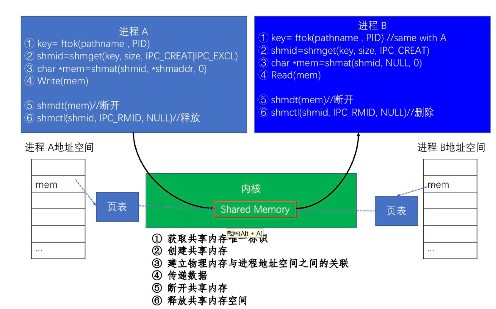
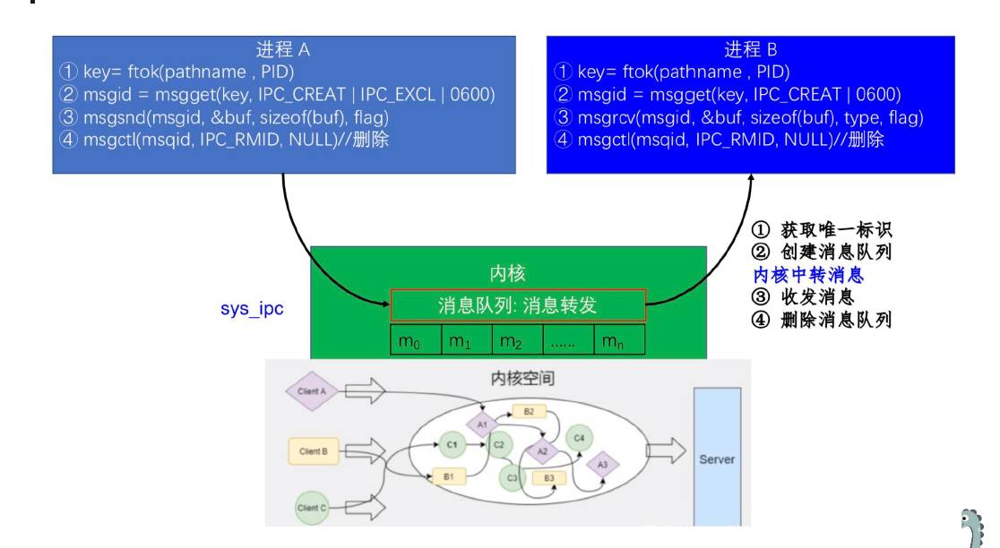

## CHAPTER5 进程同步机制

[TOC]

### 进程同步

进程同步协调进程间的相互制约关系，使它们按照预期的方式执行的过程。

- **前提**
  - 进程是**并发**执行的，进程间存在着相互制约关系
  - 并发的进程对**系统共享资源进行竞争**
  - 进程通信，过程中相互发送的信号称为消息或事件

- **两种相互制约形式**

  - **间接相互制约关系（互斥）：**进程排他性访问共享资源
  - **直接相互制约关系（同步）：**进程间的合作，比如管道通信

  

### 临界区问题

访问共享资源的一段代码，通常资源是一个变量或数据结构

假设系统有$n$个进程，$p_0,p_1,\cdots,p_{n-1}$，每个进程都有临界区代码段，进程可能会更改公共变量、更新表、写入文件等，当一个进程在临界区时，其他任何进程都不可能在其临界区中。**临界区问题需通过设计协议来解决**。每个进程必须在进入区中提出进入临界区的申请，在临界区之后有退出区，其余的是剩余区域。

> **竞态条件：**多个进程/线程同时进入临界区，执行结果与访问发生的特定顺序有关

解决这类问题要满足的条件：

- **互斥：**如果进程$P_1$正在其临界区，则其他进程不能同时在其临界区
- **进步（进展性）：**如果没有进程正在其临界区，且存在希望进入临界区的进程，则必须允许其中一个进程进入临界区，保证程序执行的进展
- **有限等待（有界等待）：**一个进程发出进入临界区的请求后，其他进程被允许进入其临界区的次数必须是有限的

（假设每个进程以非零的速度执行，对$n$个进程的相对速度没有任何限制）

1. **空闲则入：**没有线程在临界区时，任何线程可进入
2. **忙则等待：**有线程在临界区时，其他线程均**不能**进入临界区
3. **有限等待：**等待进入临界区的线程不能无限期等待
4. **让权等待（可选）：**不能进入临界区的线程，应释放 CPU （如转换到阻塞状态）

### 解决方案

#### 标志变量法

用一个变量来标记是哪个进程能访问。

``` c
int turn;

// Process: P0
while(turn != 0); // empty circle for waiting
// critical section
turn = 1;
// remainder section

// Process: P1
while(turn != 1); // empty circle for waiting
// critical section
turn = 0;
// remainder section

```

#### Peterson 算法

``` c
bool flag [2];
int turn = 0;

// P0
flag [0] = true;
turn = 1;
while(flag [1] && turn == 1);
// critical section
flag [0] = false;
// remainder section

// P1
flag [1] = true;
turn = 0;
while(flag [0] && turn == 0);
// critical section
flag [1] = false;
// remainder section
```

- 只能为**两个进程**提供解决方案
- 如果要支持10个进程的话
  - Eisenberg & McGuire 算法
  - Beakery 算法
- 该方案需要**忙等**，进程不断浪费 CPU 周期来询问是否能够进入临界区

但是要注意，为了提高性能，处理器或编译器可能会重新排序没有依赖关系的操作。而为了确保 Peaterson 方案能够在现代计算机架构上运行，必须使用**内存屏障**

#### 同步的硬件支持

- 对于单处理器，会采用禁用中断的方式；而这种方式在多处理器系统上禁中断通常效率太低。
- 有3种形式的硬件支持：**内存屏障、硬件指令、原子变量**

##### 内存屏障指令

内存屏障指令用于确保在执行任何后续的加载或存储操作之前，**前面所有的加载和存储指令都已经完成**。因此，即使指令被重新排序，内存屏障也确保存储操作**在内存中完成并对其他处理器可见**，然后才执行后来的加载或存储操作。

``` c
// two threads share these two data
bool flag = false;
int x = 0;

// t1
while(! flag);
memory_barrier();
print(x);

// t2
x = 100;
memory_barrier();
flag = true;
```

- 确保`flag`的值在`x`之前被加载
- 确保`x`的赋值在`flag`的赋值之前完成


- 指令类型
  - `Load Barrier`（读屏障）：确保屏障之前的读操作，在屏障之前完成
  - `Store Barrier`（写屏障）：确保屏障之前的写操作，在屏障之前完成
  - `Full Barrier`（全屏障）：同时包含读写屏障
- 不同语言的系统下的内存屏障指令
  - c++11: `std::atomic_thread_fence`
  - Java: `synchronized`关键字或者`java.util.concurrent.locks.Lock`接口
  - Linux 内核: 使用`mb()`, `rmb()`,`wmb()`等函数

##### 硬件指令

- 特殊的硬件指令允许我们**原子地测试并修改单词的内容，**或者原子地交换两个单词的内容（不被中断）。

  - `test-and-set`指令

    ``` c
    bool test_and_set(bool *target){
        bool rv = *target;
        *target = true;
        return rv;
    }
    ```

    - 以原子方式执行
    - 返回参数的原始值
    - 将参数的值设置为`true`

    ``` c
    lock = false;
    
    do{
        while(test_and_set(&lock));
        
        // critical section
        
        lock = false;
        
        // remainder section
    }while(true);
    ```

    > 不满足有限等待

  - `compare-and-swap`比较并交换指令

    ``` c
    int compare_and_swap(int *value, int expected, int new_value){
        int temp = *value;
        if(*value == expected)
            *value = new_value;
        return temp;
    }
    ```

    - 以原子方式执行
    - 返回参数值的原始值
    - 仅在`*value == expected`为真时，将变量值设置为参数`new_value`的值，交换仅在此条件下进行

    ``` c
    lock = 0;
    
    while(true){
        while(compare_and_swap(&lock, 0, 1) != 0);
        
        // critical section
        
        lock = 0;
        
        // remainder section
    }
    ```

    > #### **优点：满足互斥性和进展性**
    >
    > - **互斥性**：
    >   `compare_and_swap` 是原子操作，确保只有一个进程能将 `lock` 从 `0` 置为 `1`。若进程成功获取锁（`lock=1`），其他进程会因 `compare_and_swap` 失败而自旋等待，直到锁被释放。
    >   **结论**：互斥性成立。
    > - **进展性**：
    >   若锁已被释放（`lock=0`），至少有一个等待进程能通过 `compare_and_swap` 获取锁。
    >   **结论**：进展性成立。
    >
    > #### **缺点：不满足有限等待**
    >
    > - 问题根源：代码是简单的自旋锁（Spin Lock），未引入公平性机制（如排队或优先级控制）。
    > - 反例：
    >   - 进程A和进程B交替获取锁，进程C可能因竞争时序问题始终无法获得锁。
    >   - 极端情况下，某个进程可能因竞争激烈而无限等待（饥饿）。
    
    ``` c
    while(true){
        waiting [i] = true;
        while(waiting [i] && compare_and_swap(&lock, 0, 1));
        waiting [i] = false;
        
        // critical section
        
        j = (i + 1) % n;
        while((j != i) && ! waiting [j])
            j = (j + 1) % n;
        if(j == i)
            lock = 0;
        else
            waiting [j] = false;
        
        // remainder section
    }
    ```


##### 原子变量


原子变量：是一种特殊的变量，**它的任何单个操作**如读取、写入等**都是原子的**，这些操作在执行过程中不会被其它进程打断。

``` c
void increment(atomic_int *v){
    int temp;
    do{
        temp = *v;
    }while(temp != (compare_and_swap(v, temp, temp + 1));
}
```

- **并发竞争**：若多个线程同时修改 `v`，CAS可能因值已被修改而失败。
- **重试解决冲突**：循环确保在失败后重新读取最新值并再次尝试，直到成功。

在c++ 11中，可以使用`std::atomic`模板来定义原子变量，保证对该变量的访问是原子的。

``` c++
#include <atomic>
std:: atomic <int> counter(0); // define an atomic integer

void increment(){
    counter.fecth_add(1);
}

void decrement(){
    counter.fetch_sub(1);
}
```

`std::atomic`还提供了`load`, `store`, `exchange`等原子操作，可以原子地读写变量


#### 锁机制

硬件指令解决临界区问题逻辑复杂，且不易移植

- 互斥锁

  - **布尔变量表示锁是否可用**
  - 互斥锁是在硬件指令上进行的封装，提供了更高级的互斥语义

- 提供的两个操作

  - 获取锁 `acquire()`
  - 释放锁 `release()`

- `acquire()`和`release()`是原子执行的

  - 通常通过硬件原子指令（例如`compare_and_swap`）实现

  - POSIX 库将锁称为互斥量（mutex），它被用来提供线程之间的互斥

    ``` c
    pthread_mutex_t lock = PTHREAD_MUTEX_INITIALIZER;
    
    Pthread_mutex_lock(&lock);
    balance = balance + 1;
    Pthread_mutex_unlock(&lock);
    ```

- 锁的效果的评判

  - 提供互斥——基本任务
  - 公平——是否有公平机会抢到锁，没有饥饿
  - 性能——时间开销


##### TS 指令实现自旋锁

``` c
typedef struct lock_t{
    int flag;
} lock_t;

void init(lock_t *lock){
    // 0: lock is available, 1: lock is held
    lock -> flag = 0;
}

void lock(lock_t *lock){
    while(test_and_set(&lock -> flag, 1) == 1);
}

void unlock(lock_t *lock){
    lock -> flag = 0;
}
```

- **互斥性：**设置和测试**合并为一个原子操作**后，确保了只有一个线程可以获得锁.
- **公平性：**在**单 CPU 上**，需要**抢占式调度器**，否则自旋锁无法使用，因为自旋线程永远不会放弃 CPU
- **性能：**
  - 单 CPU 下开销巨大，当一个线程获得锁之后，其他线程在竞争锁，都会在放弃 CPU 之前自旋一个时间片
  - 多 CPU 上性能不错，因为临界区一般很多，只需要自旋很短的时间


##### CAS 指令实现自旋锁

``` c
void lock(lock_t *lock){
    while(compare_and_swap(&lock -> flag, 0, 1) == 1);
}
```

##### fetch-and-add 实现 ticket 锁

``` c
int FetchAndAdd(int *ptr){
    int old = *ptr;
    *ptr = old + 1;
    return old;
}

typedef struct lock_t{
    int ticket;
    int turn;
} lock_t;

void lock_init(lock_t *lock){
    lock -> ticket = 0;
    lock -> turn = 0;
}

void lock(lock_t *lock){
    int myturn = FecthAndAdd(&lock -> ticket);
    while(lock -> turn != myturn);
}

void unlock(lock_t *lock){
    FetchAndAdd(&lock -> turn);
}
```


##### 怎样避免多自旋

当一个线程获得锁，则其余线程自旋等待，线程自旋检查一个不会改变的值，知道浪费整个时间片

- plan A: 当要自旋时，放弃 CPU，进程从运行态变成就绪态；但是可能会出现饥饿的情况。

  > #### 根源：无公平调度
  >
  > - **场景**：多个线程竞争同一自旋锁时，锁的释放与获取完全依赖 CPU 调度时序。
  >
  > - **问题**：若某个线程因调度延迟（如时间片耗尽、优先级低等）**始终无法及时检测到锁的释放**，可能永远无法获得锁。
  >
  > - 示例：
  >
  >   线程 A 释放锁 → 线程 B 和线程 C 同时竞争：
  >
  >   - 若线程 B 的调度更频繁，可能多次“抢先”获取锁，导致线程 C 饥饿。
  >
  > 
  >
  > #### 公平调度算法：票据队列锁
  >
  > ``` c
  > atomic_int next_ticket = 0;  // 下一个票据号
  > atomic_int serving = 0;      // 当前服务号
  > 
  > void lock() {
  >     int my_ticket = atomic_fetch_add(&next_ticket, 1);  // 领取票据
  >     while (serving != my_ticket);  // 自旋等待叫号
  > }
  > 
  > void unlock() {
  >     atomic_fetch_add(&serving, 1);  // 叫下一个号
  > }
  > ```

  

- plan B: Solaris

  - 通过维护一个队列来保存等待锁的线程，从而确定谁能抢到线程。

  - `park()`让调用线程休眠

  - `unpark(threadID)`唤醒`threadID`标识的线程

  - 不能完全避免自旋等待，但等待时间有限

    ``` c
    typedef struct __lock_t{
        int flag;
        int guard;
        queue_t *q;
    } lock_t;
    
    void lock_init(lock_t *m){
        m -> flag = 0;
        m -> guard = 0;
        queue_init(m -> q);
    }
    void lock(lock_t *m){
        while(test_and_set(&m -> guard, 1) == 1);
        
        if(m -> flag == 0){
            m -> flag = 1; // lock is acquired
            m -> guard = 0;
        }else{
            queue_add(m -> q, gettid());
            m -> guard = 0;
            park();
        }
    }
    
    void unlock(lock_t *m){
        while(test_and_set(&m -> guard, 1) == 1);
        
        if(queue_empty(m -> q))
            m -> flag = 0; // let go of lock, no one wants it
        else
            unpark(queue_remove(m -> q)); // hold lock (flag = 0)
        m -> guard = 0;
    }
    ```

    > 这个想法实在天才。
    >
    > 和之前利用自旋来实现锁的方式不同，这里的 TS 操作的对象是 `guard`，但其实作为变量锁的是`flag`，采取的不再是自旋的方式，而是`park()`的方式。

    ``` c
    void lock(lock_t *m){
        if(m -> flag == 0){
            m -> flag = 1;
        }else{
            queue_add(m -> q, gettid());
            park();
        }
    }
    // ...
    ```

    > 如果是这样的做法，就是不满足**原子操作**了，存在**竞态条件**
    >
    > （例如现在进程$p_0$持有锁，$p_1$视图获取锁）
    >
    > 只有像一开始前面有`while(test_and_set(&m -> guard, 1) == 1);`守住，才能够保证$p_1$访问`if(m -> flag == 0)`的时候，访问的一定是被$p_0$中`m -> flag = 1`改写后的`flag`。
    >
    > 另外，这里`unlock()`函数中的`while(test_and_set(&m -> guard, 1) == 1);`是为了在并发的时候，保证一个线程`unlock()`的时候，不会存在其他线程的干扰，导致等待队列出现错误。

#### 条件变量

- 多线程程序中，如何等待一个条件

  - 自旋等待，直到条件满足
  - 使用条件变量，来等待一个条件变为真

- 条件变量

  - 是一个显示队列，当条件不满足时，线程可以将自己加入队列；当有其他线程改变了条件状态时，则可以唤醒等待线程
  - `wait()`操作使调用该操作的线程睡眠
  - `signal()`操作唤醒条件变量上睡眠的线程

  

#### 如何让父线程等待子线程

##### 基于自旋的解决方案

``` c
volatile int done = 0;

void *child(void * arg){
    printf("child\n");
    done = 1;
    return NULL;
}

int main(int argc, char *argv []){
    printf("parent: begin\n");
    pthread_t c;
    Pthread_create(&c, NULL, child, NULL);
    while(done == 0);
    printf("parent: end\n");
    return 0;
}
```


##### 使用条件变量实现父线程等待子线程

``` c
int done = 0; // 共享状态变量，表示子线程是否完成
pthread_mutex_t m = PTHREAD_MUTEX_INITIALIZER; // 互斥锁，保护对 done 的访问
pthread_cond_t c = PTHREAD_COND_INITIALIZER; // 条件变量，用于同步线程

void thr_exit(){
    Pthread_mutex_lock(&m); // 获取互斥锁
    done = 1; // 标记任务完成
    Pthread_cond_signal(&c); // 发送条件变量信号，唤醒等待线程
    Pthread_mutex_unlock(&m); // 释放互斥锁
}

void *child(void * arg){
    printf("child\n");
    thr_exit(); // 标记任务完成并唤醒父线程
    return NULL;
}

void thr_join(){
    Pthread_mutex_lock(&m); // 获取互斥锁
    while(done == 0) // 循环检查条件，防止虚假唤醒
        Pthread_cond_wait(&c, &m); // 等待条件变量，释放锁并阻塞
    Pthread_mutex_unlock(&m); // 释放互斥锁
}

int main(int argc, char *argv []){
    printf("parent: begin\n");
    pthread_t p;
    Pthread_create(&p, NULL, child, NULL); // 创建子线程
    thr_join();  // 等待子线程完成
    printf("parent: end\n");
    return 0;
}
```

 **为什么用 `while (done == 0)` 而不是 `if`？**

- **防止虚假唤醒**：操作系统可能因某些原因（如信号中断）意外唤醒线程，需重新检查条件。
- **确保条件成立**：即使被唤醒，也可能有其他线程修改了 `done`，必须再次验证。


#### 信号量 Semaphore

信号量是另一种临界区的保护机制，它是操作系统提供的一种协调共享资源访问的方法。

信号量 S 是包含一个整数值的对象，只能通过两个原子操作 `wait()` 和 `signal()` 访问，有时也称为 `P()` 和 `V()` 操作

- 信号量的初始化

  ``` c
  #include <semaphore.h>
  sem_t s;
  sem_init(&s, 0, 1); // 将信号量初始化为第 3 个参数
  ```

- 对信号量进行操作的函数的定义

  ``` c
  int sem_wait(sem_t *s){
      // decrement the value of semaphore s by one wait if value of semaphore s is negative
  }
  
  int sem_post(sem_t *s){
      // increment the value of semaphore s by one if there are one or more threads waiting, wake one
  }
  ```

- 信号量的实现——不忙等待

  - 每个信号量都有一个相关的等待队列

  - 每个信号量都有一个整数`value`

    ``` c
    #define SEM_NAME_LEN 20
    
    typedef struct semaphore{
        char name [SEM_NAME_LEN];
        int value;
        struct task_struct *queue;
    } sem_t;
    ```

- `wait()`的实现

  ``` c
  int sys_sem_wait(sem_t *sem){
      cli(); // Clear Interrupt Flag 禁用中断
      while(sem -> value <= 0)
          sleep_on(&(sem -> queue));
      sem -> value--;
      sti(); // Set Interrupt Flag 启用中断
      return 0;
  }
  ```

  确保对信号量 `sem->value` 和等待队列 `sem->queue` 的操作是**原子**的。

- `sleep_on()`的实现
  
  ``` c
  void sleep_on(struct task_struct **p){
      struct task_struct *tmp;
      
      if(! p) return;
      if(current == &(init_task.task))
          panic("task [0] trying to sleep");
      tmp = *p;
      *p = current;
      current -> state = TASK_UNINTERRUPTIBLE;
      schedule();
      if(tmp)
          tmp -> state = 0; // 将前一个队列头进程状态设为就绪态（TASK_RUNNING）
  }
  ```
  
  - **防止初始进程睡眠**：`init_task`（通常是进程0，即内核的初始进程）不允许睡眠，触发内核崩溃（panic）。
  - **队列结构**：使用**栈式队列**（后进先出，LIFO），新加入的进程插入到队列头部。
  - **`tmp`的作用**：记录当前进程加入前的队列头，用于后续唤醒操作。
  - **不可中断睡眠**：进程不会响应信号，必须等待资源可用后被显式唤醒。
  - **主动让出CPU**：`schedule()`触发进程调度，当前进程暂停执行。
  
- `signal()`的实现
  
  ``` c
  int sys_sem_post(sem_t *sem){
      cli();
      sem -> value++;
      if((sem -> value) <= 1) wake_up(&(sem -> queue));
      sti();
      return 0;
  }
  ```
  
- `wake_up()`的实现

  ``` c
  void wake_up(struct task_struct **p){
      if(p && *p){ // 检查队列头指针有效性
          (**p).state = 0; // 唤醒队列头的进程
          *p = NULL; // 清空队列头指针
      }
  }
  ```

  **`*p = NULL` 的作用**

  **防止重复唤醒**

  - **问题场景**：
    若不清空队列头指针，后续再次调用 `wake_up` 时，可能重复唤醒同一个进程（即使它已被唤醒）。
  - 示例：
    1. 进程 A 在队列中等待（`*p = A`）。
    2. `wake_up` 唤醒 A 后未置空 `*p`。
    3. 其他代码误调用 `wake_up`，再次触发 `A.state = 0`，导致逻辑错误。

##### 二值信号量（锁）

值只能是0或1，也称为互斥锁

``` c
sem_t m;
sem_init(&m, 0, x); // what should x be?

sem_wait(&m);

// critical section

sem_post(&m);
```

在给定的代码中，信号量 `m` 用于保护临界区，确保同一时间只有一个线程可以进入。根据信号量的用途和初始化规则：

1. **信号量的初始值 `x` 应为 `1`**。  
   - 初始化为 `1` 表示资源可用，第一个线程调用 `sem_wait(&m)` 会将信号量减到 `0`，成功进入临界区。
   - 其他线程调用 `sem_wait(&m)` 时，信号量已为 `0`，会阻塞直到当前线程调用 `sem_post(&m)` 将其恢复为 `1`。

2. **若初始值设为 `0`**：所有线程都会在 `sem_wait` 处阻塞，导致死锁。  
3. **若初始值设为其他值（如 `>1`）**：允许多个线程同时进入临界区，失去互斥性。

**答案：**  
``` c
sem_init(&m, 0, 1); // x 应为 1
```

##### 信号量用作条件变量

- 一个线程等待条件成立，另一个线程修改条件并发信号给等待线程，从而唤醒等待线程

``` c
sem_t s;
void *child(void * arg){
    printf("child\n");
    sem_post(&s);
    return NULL;
}

int main(int argc, char *argv []){
    sem_init(&s, 0, 0);
    printf("parent: begin\n");
    pthread_t c;
    Pthread_create(c, NULL, child, NULL);
    sem_wait(&s);
    printf("parent: end\n");
    return 0;
}
```

##### 计数（记录）信号量

- 信号量中的` value `表示资源的可用数目 。具体来说：

  - `value > 0`表示有`value`个资源可用，其值即为当前可用资源的数量
  - `value = 0`表示没有资源可用
  - `value < 0`表示有`|value|`个进程正在等待该资源

  


### 生产者和消费者问题

1. **互斥锁：**用于保证同一时间只有一个进程/线程访问共享资源
2. **条件变量：**用于进程/线程间的等待和通知
   - 消费者条件：当缓冲区为空时，消费者等待这个条件
   - 生产者条件：当缓冲区为满时，生产者等待这个条件
3. 使用3个信号量
   1. `Mutex`表示互斥锁
   2. `empty`表示缓冲区空余空间的数量
   3. `full`表示缓冲区中已占用空间的数量

``` c
int buffer [MAX];
int fill = 0;
int use = 0;

void put(int value){
    buffer [fill] = value;
    fill = (fill + 1) % MAX;
}

int get(){
    int tmp = buffer [use];
    use = (use + 1) % MAX;
    return tmp;
}

sem_t empty;
sem_t full;

void *producer(void * arg){
    int i;
    for(i = 0; i < loops; i++){
        sem_wait(&empty);
        put(i);
        sem_post(&full);
    }
}

void *consumer(void * arg){
    int tmp = 0;
    while(tmp != -1){
        sem_wait(&full);
        tmp = get();
        sem_post(&empty);
        printf("%d\n", tmp);
    }
}

int main(int argc, char *argv []){
    // ...
    sem_init(&empty, 0, MAX); // MAX are empty
    sem_init(&full, 0, 0); // 0 are full
    // ...
}
```

尽管通过信号量 `empty` 和 `full` 控制了缓冲区的槽位数量，但 **对共享变量 `fill` 和 `use` 的修改缺乏互斥保护**

``` c

void *producer(void * arg){
    int i;
    for(i = 0; i < loops; i++){
        sem_wait(&empty);
        sem_wait(&mutex); // new line
        put(i);
        sem_post(&mutex); // new line
        sem_post(&full);
    }
}

void *consumer(void * arg){
    int tmp = 0;
    while(tmp != -1){
        sem_wait(&full);
        sem_wait(&mutex); // new line
        tmp = get();
        sem_post(&mutex); // new line
        sem_post(&empty);
        printf("%d\n", tmp);
    }
}
```

> 　　`mutex`必须要被包在里面，这样才能避免死锁
>
> 　若交换顺序
>
> 　- 若缓冲区已满（`empty=0`），生产者会阻塞在 `sem_wait(&empty)`。
> 　- 但生产者仍持有互斥锁，消费者无法进入临界区消费数据并释放空位。
> 　- **结果**：所有线程永久阻塞。


### 读者和写者问题

- 一个数据集在多个并发进程之间共享
  - 读者——仅读取数据集，他们不执行任何更新
  - 写者——可以读写
  - 允许多个读者同时阅读
  - 只有一个写者可以访问共享数据
- 读者和写者的几种变体都涉及某种形式的**优先级**
  - **读者优先：**当写者提出存取共享数据集的要求后，仍允许新读者进入。（**更好的并行性**）
  - **写者优先：**当写者提出存取共享数据集的要求后，不允许新读者进入，且等待的写者可以跳过等待的读者进行写操作。 **更加公平**
  - 使用2个信号量和计数值：
    - 写互斥锁
    - 读者计数
    - 互斥锁

#### 读者-写者问题（读者优先）

``` c
typedef struct _rwlock_t{
    sem_t lock; // binary semaphore (basic lock)
    sem_t writelock; // used to allow ONE writer or MANY readers
    int readers; // count of readers reading in critical section
} rwlock_t;

void rwlock_init(rwlock_t *rw){
    rw -> readers = 0;
    sem_init(&rw -> lock, 0, 1);
    sem_init(&rw -> writelock, 0, 1);
}
```

- `lock`: 互斥锁，用于互斥访问`readers`
- `writelock`: 写互斥锁，确保只有一个写者能进入临界区
- `readers`: 临界区读者的数量

**注意读写互斥**

``` c
void rwlock_acquire_readlock(rwlock_t *rw){
    sem_wait(&rw -> lock);
    rw -> readers++;
    if(rw -> readers == 1) // first reader gets writelock
        sem_wait(&rw -> writelock);
    sem_post(&rw -> lock);
}

void rwlock_release_readlock(rwlock_t *rw){
    sem_wait(&rw -> lock);
    rw -> reader--;
    if(rw -> readers == 0) // last reader lets it go
        sem_post(&rw -> writelock);
    sem_post(&rw -> lock);
}
void rwlock_release_readlock(rwlock_t *rw){
    sem_wait(&rw -> lock);
    rw -> readers--;
    if(rw -> readers == 0) // last reader lets it go
        sem_post(&rw -> writelock);
    sem_post(&rw -> lock);
}

void rwlock_acquire_writelock(rwlock_t *rw){
    sem_wait(&rw -> writelock);
}

void rwlock_release_writelock(rwlock_t *rw){
    sem_post(&rw -> writelock);
}
```


#### 读者和写者问题（写者优先）

``` c
typedef struct {
    sem_t lock;          // 保护 readers 和 writers_waiting 的互斥锁
    sem_t writelock;     // 写锁，确保写者互斥
    sem_t readers_queue; // 阻止新读者在有写者等待时进入
    int readers;         // 当前活跃的读者数量
    int writers_waiting; // 等待中的写者数量
} rwlock_t;

// 初始化函数
void rwlock_init(rwlock_t *rw) {
    sem_init(&rw-> lock, 0, 1);
    sem_init(&rw-> writelock, 0, 1);
    sem_init(&rw-> readers_queue, 0, 1);
    rw-> readers = 0;
    rw-> writers_waiting = 0;
}

// 读者获取读锁
void rwlock_acquire_readlock(rwlock_t *rw) {
    // 检查是否有写者在等待，若有则等待
    sem_wait(&rw-> readers_queue);   // 尝试进入读者队列
    sem_post(&rw-> readers_queue);    // 立即释放，仅作为检查

    sem_wait(&rw-> lock);
    rw-> readers++;
    if (rw-> readers == 1) {
        sem_wait(&rw-> writelock);   // 第一个读者占用写锁
    }
    sem_post(&rw-> lock);
}

// 读者释放读锁
void rwlock_release_readlock(rwlock_t *rw) {
    sem_wait(&rw-> lock);
    rw-> readers--;
    if (rw-> readers == 0) {
        sem_post(&rw-> writelock);   // 最后一个读者释放写锁
    }
    sem_post(&rw-> lock);
}

// 写者获取写锁
void rwlock_acquire_writelock(rwlock_t *rw) {
    sem_wait(&rw-> lock);
    rw-> writers_waiting++;          // 标记有写者等待
    if (rw-> writers_waiting == 1) {
        sem_wait(&rw-> readers_queue); // 第一个写者到来，阻止新读者
    }
    sem_post(&rw-> lock);

    sem_wait(&rw-> writelock);       // 等待写锁可用
}

// 写者释放写锁
void rwlock_release_writelock(rwlock_t *rw) {
    sem_wait(&rw-> lock);
    rw-> writers_waiting--;
    if (rw-> writers_waiting == 0) {
        sem_post(&rw-> readers_queue); // 无写者等待，允许新读者进入
    }
    sem_post(&rw-> lock);
    sem_post(&rw-> writelock);       // 释放写锁
}typedef struct {
    sem_t lock;          // 保护 readers 和 writers_waiting 的互斥锁
    sem_t writelock;     // 写锁，确保写者互斥
    sem_t readers_queue; // 阻止新读者在有写者等待时进入
    int readers;         // 当前活跃的读者数量
    int writers_waiting; // 等待中的写者数量
} rwlock_t;

// 初始化函数
void rwlock_init(rwlock_t *rw) {
    sem_init(&rw-> lock, 0, 1);
    sem_init(&rw-> writelock, 0, 1);
    sem_init(&rw-> readers_queue, 0, 1);
    rw-> readers = 0;
    rw-> writers_waiting = 0;
}

// 读者获取读锁
void rwlock_acquire_readlock(rwlock_t *rw) {
    // 检查是否有写者在等待，若有则等待
    sem_wait(&rw-> readers_queue);   // 尝试进入读者队列
    sem_post(&rw-> readers_queue);    // 立即释放，仅作为检查

    sem_wait(&rw-> lock);
    rw-> readers++;
    if (rw-> readers == 1) {
        sem_wait(&rw-> writelock);   // 第一个读者占用写锁
    }
    sem_post(&rw-> lock);
}

// 读者释放读锁
void rwlock_release_readlock(rwlock_t *rw) {
    sem_wait(&rw-> lock);
    rw-> readers--;
    if (rw-> readers == 0) {
        sem_post(&rw-> writelock);   // 最后一个读者释放写锁
    }
    sem_post(&rw-> lock);
}

// 写者获取写锁
void rwlock_acquire_writelock(rwlock_t *rw) {
    sem_wait(&rw-> lock);
    rw-> writers_waiting++;          // 标记有写者等待
    if (rw-> writers_waiting == 1) {
        sem_wait(&rw-> readers_queue); // 第一个写者到来，阻止新读者
    }
    sem_post(&rw-> lock);

    sem_wait(&rw-> writelock);       // 等待写锁可用
}

// 写者释放写锁
void rwlock_release_writelock(rwlock_t *rw) {
    sem_wait(&rw-> lock);
    rw-> writers_waiting--;
    if (rw-> writers_waiting == 0) {
        sem_post(&rw-> readers_queue); // 无写者等待，允许新读者进入
    }
    sem_post(&rw-> lock);
    sem_post(&rw-> writelock);       // 释放写锁
}
```

|        **特性**        |        **读者优先**        |            **写者优先**            |
| :--------------------: | :------------------------: | :--------------------------------: |
| **新读者能否打断写者** |    是（新读者立即加入）    |  否（有写者等待时，新读者被阻塞）  |
| **新写者能否打断读者** | 否（必须等待所有读者完成） | 是（后续读者必须等待当前写者完成） |
|      **饥饿风险**      |        写者可能饥饿        |            读者可能延迟            |
|       **吞吐量**       |         高读吞吐量         |       平衡读写，写操作更及时       |
|     **实现复杂度**     | 简单（仅需读者计数和写锁） |  复杂（需写者计数和读者队列控制）  |

#### 哲学家进餐问题

1. 破除依赖，修改最后一个哲学家取筷子的顺序，则不会出现死锁情况

   ```c
   int left(int p) {return p;}
   int right(int p) {return (p + 1) % 5;}
   
   void get_fork(int p){
       if(p == 4){
           sem_wait(&forks[right(p)]);
           sem_wait(&forks[left(p)]);
       }else{
           sem_wait(&forks[left(p)]);
           sem_wait(&forks[right(p)]);
       }
   }
   ```

2. 每根筷子设置为互斥量，互斥完成同时取两侧的筷子

   ```c
   semaphore cs[5] = {1, 1, 1, 1, 1};
   semaphore mutex = 1;
   Pi(){
       while(true){
           wait(mutex);
           wait(cs[i]); // 互斥取左筷子
           wait(cs[(i + 1) % 5]); // 互斥取右筷子
           signal(mutex);
           // eating
           signal(cs[i]);
           signal(cs[(i + 1) % 5]);
           // thinking
       }
   }
   ```

   

#### 睡眠的理发师问题


- 理发店里有一位理发师，一把理发椅和 N 把供等候理发顾客坐的椅子。
- 如果没有顾客，理发师睡眠，当一个顾客到来时叫醒理发师；
- 若理发师正在理发时又有顾客来，那么有空椅子就坐下，否则离开理发店。

定义 3 个信号量

- `customers` 记录等候理发的顾客数（不包括正在理发的顾客），初始值为 0
- `barbers` 用于表示理发师是否可用，初始值为 0
- `mutex` 用于互斥，初始值为 1
- `count` 记录等候的顾客数，他是 `customers` 的一份拷贝，之所以使用 `count` 是因为无法读取信号量的当前值

```c
barber() {
    while (true) {
        p(customers);   // 等待顾客（若 customers=0，阻塞）
        p(mutex);       // 进入临界区，保护 count
        count = count - 1;  // 减少等待顾客数
        v(barbers);     // 通知顾客理发师可用
        v(mutex);       // 退出临界区
        // 理发（临界区外，允许并发服务）
    }
}
```

1. **等待顾客**：通过 `p(customers)` 阻塞，直到有顾客到来（`customers > 0`）。
2. **减少等待顾客数**：在 `mutex` 保护下修改 `count`。
3. **通知顾客**：通过 `v(barbers)` 释放一个理发师资源。
4. **释放锁**：允许其他顾客修改 `count`。

```c
customer() {
    p(mutex);           // 进入临界区，保护 count
    if (count < N) {    // 检查是否有空位
        count = count + 1;  // 增加等待顾客数
        v(customers);   // 通知理发师有顾客
        v(mutex);       // 退出临界区
        p(barbers);     // 等待理发师服务
        // 理发（由理发师线程处理）
    } else {
        v(mutex);       // 无空位，直接离开
    }
}
```

1. **检查空位**：在 `mutex` 保护下检查 `count` 是否小于 N（椅子数量）。
2. **加入等待队列**：若有空位，增加 `count` 并通过 `v(customers)` 唤醒理发师。
3. **等待服务**：通过 `p(barbers)` 阻塞，直到理发师空闲。
4. **处理无空位**：若无空位，直接释放锁并离开。

> #### 为什么需要 `count`？
>
> #### **(1) 信号量的局限性**
>
> - **信号量无法直接检查条件**：`customers` 仅记录等待顾客数，但无法直接判断是否超过椅子数 `N`。
> - **需要显式共享状态**：必须通过 `count` 在互斥锁保护下跟踪实际等待人数，避免超限。
>
> #### **(2) `count` 的作用**
>
> - **条件判断**：顾客通过 `count < N` 检查是否有空位。
> - **精确控制**：确保等待队列长度不超过椅子数 `N`，避免资源耗尽。
>
> #### **(3) 信号量与 `count` 的配合**
>
> - **`customers` 信号量**：仅用于唤醒理发师，其值表示需要服务的顾客数。
> - **`count` 变量**：记录实际等待人数，用于条件检查，受 `mutex` 保护。


### 利用信号量实现进程间的同步

《水水的，回头整理》

### 进程间通信

- 多进程协作的优势
  - 将功能模块化，避免重复造轮子
  - 增强模块间的隔离，提供更强的安全保障
  - 提高应用的容错能力
- 进程间通信 **(Iner-Process Communication, IPC)** 是多进程协作的基础
- 进程通信机制：**共享内存、消息传递、管道**

#### 共享内存机制

共享内存（ Shared Memory 是一种最快捷的进程间通信方法，它允许多个进程访问同一块物理内存空间。这种通信方式非常高效，因为数据不需要在进程之间复制。

基本原理：

- 内核为需要通信的进程建立共享区域
- 参与通信的多方进程将共享区域附加到它们自己的地址空间。所有进程都可以访问共享内存中的地址，就像访问自己的私有内存一样。

Linux 中，主要有以下系统调用：

- `shmget` 创建一个新的共享内存段或者获取已存在的共享内存段。此函数需要指定一个键值和共享内存的大小。
- `shmat` 将共享内存段附加到当前进程的地址空间。此函数需要指定 shmget 返回的共享内存标识符。
- `shmdt` 将共享内存段从当前进程的地址空间中分离。
- `shmctl` 允许你对共享内存进行各种控制操作，如设置权限、删除共享内存等。
- 当多个进程同时访问和修改共享内存时，需要 **利用信号量或互斥锁确保数据的一致性**。



#### 消息传递机制

消息传递（ Message Passing 是一种基本的进程间通信（ IPC 机制，它允许 **进程之间通过发送和接收消息来交换信息**。这种机制通常由 **操作系统内核** 提供支持，并通过系统调用或库函数向应用程序提供服务。

- **直接通信方式**：发送进程将消息发送到接收进程，并将其挂在接收进程的消息队列上；接收进程从消息队列上取消息。
- **间接通信方式**：发送进程将消息发送到信箱，接收进程从信箱中取消息。


##### 消息缓冲通信

消息缓冲通信是直接通信方式的一种实现

```c
struct message{
    sender; // 发送进程标识符
    size; // 消息长度
    text; // 消息正文
    next; // 指向下一条消息缓冲区的指针
}
```

PCB 中需要增加的内容

- `mq` 消息队列首指针
- `mutex` 消息队列互斥信号量
- `sm` 消息队列资源信号量

```c
void send(receiver, a){
    // receiver: 接受者标识号，a: 发送区首地址
    // 向系统申请一个消息缓冲区 i
    // 将发送区 a 中的消息复制到 i 中
    // 获得接受进程的内部标志 j
    P(mutex);
    // 把消息插入 j 的消息队列上
    V(mutex);
    V(sm);
    
}

void receive(b){
    // b: 接收区首地址
    // 获得接收区内部标识 j
    P(sm);
    P(mutex);
    // 将消息队列中的第一个消息移出
    V(mutex);
    // 将消息复制到接收区 b
}
```

Linux 的消息队列

```c
// 消息队列的系统调用
msgget(key, flags); // 获取消息队列标识
msgsnd(QID, buf, size, flags); // 发送消息
msgrcv(QID, buf, size, type, flags); // 接收消息
msgctl(...); // 消息队列控制

struct msgbuf{
    long mtype; // 消息类型
    char mtext[1]; // 消息正文
}
```



##### 信箱通信

信箱通信方式中，进程之间通信需要通过共享数据结构实体信箱来进行。

信箱是一种数据结构，其中存放信件。

信箱逻辑上分成 **信箱头和信箱体** 两部分。

- 信箱头中存放有关信箱的描述。
- 信箱体由若干格子组成，每格存放一个信件，格子的数目和大小在创建信箱时确定。

信箱通信原语包括：

- 信箱的创建和撤消
- 消息的发送和接收
  - `Send(mailbox, message);`
  - `Receive(mailbox, message);`

进程间的消息通信存在同步关系

- 对于发送进程来说，它在执行发送原语后有两种可能选择：

  - 发送进程阻塞，直到这个消息被接收进程接收到，这种发送称为 **阻塞发送**。

  - 发送进程不阻塞，继续执行，这种发送称为 **非阻塞发送**。

- 对于一个接收进程来说，在执行接收原语后也有两种可能选择：

  - 如果一个消息在接收原语执行之前已经发送，则该消息被接收进程接收，接收进程继续执行。
  - 如果没有正在等待的消息，则该进程阻塞直到有消息到达；或者该进程继续执行，放弃接收的努力。前者称为阻塞接收，后者称为非阻塞接收。

- 根据发送进程和接收进程采取方式的不同，通常有三种常用的组合方式：

  - 非阻塞发送、阻塞接收。
  - 非阻塞发送、非阻塞接收。
  - 阻塞发送，阻塞接收。


#### 管道通信机制

管道（ pipe ）在 Unix 系列的系统中会被当作一个文件，**内核会为用户态提供代表管道的文件描述符**，让其可以通过文件相关系统调用来使用。

- 管道 **不会使用存储设备**，而是使用 **内存** 作为 **数据的缓冲区**。
- 主要用于父子进程间或者兄弟进程间的通信。它允许一个进程向另一个进程传递数据。
- 管道有两种类型：**无名管道 pipe** 和 **有名管道（ named pipe 也叫 FIFO ）**
  - **无名（匿名）管道** 主要用于 **父子进程间** 的通信，其基本原理是：在创建管道时，系统 **返回两个文件描述符**，分别代表 **管道的读端和写端**。**父进程** 可以通过 **写端** 向管道中写入数据，**子进程** 则可以通过 **读端** 从管道中读取数据。
  - **有名（命名）管道**（ FIFO 则可以用于 **任何两个进程间** 的通信。它是一种特殊的文件，可以像普通文件一样用 `open` 、 `read` 、 `write` 等系统调用进行操作。一个进程向 FIFO 中写入的数据可以被另一个进程读取出来。
- 管道机制应提供以下三方面的协调能力：
  - **互斥：** 诸进程互斥读写管道
  - **同步：** 管道空、满情况处理
  - **存在：** 确定对方是否存在

```c
// 无名管道
#include<stdio.h>
#include<unistd.h>
#include<string.h>
#include<sys/wait.h>

int main(){
    __pid_t pid;
    int fd[2];
    char str[20];
    pipe(fd); // 创建管道，fd[0]为读端，fd[1]为写端
    if(((pid = fork()) == 0)){
        printf("children\n");
        close(fd[1]);
        int num;
        while((num = read(fd[0], str, sizeof(str)) != 0)){
            printf("read: %s", str);
        }
    }else {
        printf("parent\n");
        close(fd[0]);
        for(int i = 0; i < 10; i++){
            sprintf(str, "the %d message.\n", i);
            printf("write: %s", str);
            write(fd[1], str, sizeof(str));
        }
        close(fd[1]);
        wait(NULL); // 等待子进程，防止其成为孤儿进程
    }
}
```

- **父进程**：关闭读端 `fd[0]`，仅保留写端 `fd[1]`，负责发送数据。
- **子进程**：关闭写端 `fd[1]`，仅保留读端 `fd[0]`，负责接收数据。
- 父进程写入数据后未关闭写端，子进程的 `read` 会一直等待新数据，无法退出循环。
- `fd` 选择了 `int` 类型
  - **统一抽象**：Unix 系统将 **一切资源抽象为文件**（包括管道、设备、网络套接字），文件描述符（`int` 类型）是访问这些资源的统一接口。
  - **高效性**：整数操作（如 `read(fd[0], ...)` 和 `write(fd[1], ...)`）在系统调用中处理效率极高。
  - **兼容性**：所有文件操作函数（如 `read`、`write`、`close`）均直接使用 `int` 类型的文件描述符。

> 以下是使用两个无名管道实现进程间双向通信的代码，父进程发送字符串给子进程，子进程转换字符大小写后返回：
>
> ```c
> #include <stdio.h>
> #include <unistd.h>
> #include <string.h>
> #include <ctype.h>
> #include <sys/wait.h>
> 
> int main() {
> // 创建两个管道：parent_to_child 和 child_to_parent
> int parent_to_child[2], child_to_parent[2];
> pipe(parent_to_child);
> pipe(child_to_parent);
> 
> pid_t pid = fork();
> if (pid == 0) {  // 子进程
>   // 关闭不需要的管道端
>   close(parent_to_child[1]);  // 关闭父->子的写端
>   close(child_to_parent[0]);  // 关闭子->父的读端
> 
>   char buffer[256];
>   ssize_t bytes_read;
> 
>   // 从父进程读取数据
>   bytes_read = read(parent_to_child[0], buffer, sizeof(buffer));
>   if (bytes_read > 0) {
>       // 转换每个字符的大小写
>       for (int i = 0; i < bytes_read; i++) {
>           if (isupper(buffer[i])) {
>               buffer[i] = tolower(buffer[i]);
>           } else {
>               buffer[i] = toupper(buffer[i]);
>           }
>       }
> 
>       // 将处理后的数据写回父进程
>       write(child_to_parent[1], buffer, bytes_read);
>   }
> 
>   // 关闭剩余管道端
>   close(parent_to_child[0]);
>   close(child_to_parent[1]);
>   _exit(0);
> } else {  // 父进程
>   // 关闭不需要的管道端
>   close(parent_to_child[0]);  // 关闭父->子的读端
>   close(child_to_parent[1]);  // 关闭子->父的写端
> 
>   const char* message = "Hi There";
>   printf("Sending: %s\n", message);
> 
>   // 发送原始消息给子进程
>   write(parent_to_child[1], message, strlen(message));
> 
>   // 接收处理后的消息
>   char modified[256];
>   ssize_t bytes_read = read(child_to_parent[0], modified, sizeof(modified));
>   if (bytes_read > 0) {
>       modified[bytes_read] = '\0';  // 添加字符串终止符
>       printf("Received: %s\n", modified);
>   }
> 
>   // 关闭剩余管道端
>   close(parent_to_child[1]);
>   close(child_to_parent[0]);
>   wait(NULL);
> }
> return 0;
> }
> ```
>
> #### 代码执行流程
>
> 1. **管道创建**：
>    - `parent_to_child`：父进程写，子进程读
>    - `child_to_parent`：子进程写，父进程读
>
> 2. **子进程逻辑**：
>    ```c
>    // 子进程关闭不需要的管道端
>    // 从父进程读取数据
>    // 转换字符大小写（大写转小写，小写转大写）
>    // 将结果写回父进程
>    ```
>
> 3. **父进程逻辑**：
>
>    ```c
>    // 父进程关闭不需要的管道端
>    // 发送原始字符串 "Hi There"
>    // 等待并打印处理后的结果
>    ```
>
> #### 关键设计点
>
> 1. **双向通信管道**：
>    | 管道方向        | 写端进程 | 读端进程 |
>    | --------------- | -------- | -------- |
>    | parent_to_child | 父进程   | 子进程   |
>    | child_to_parent | 子进程   | 父进程   |
>
> 2. **管道端管理**：
>    ```c
>    // 子进程关闭 parent_to_child[1] 和 child_to_parent[0]
>    // 父进程关闭 parent_to_child[0] 和 child_to_parent[1]
>    ```
>
> 3. **字符转换逻辑**：
>    ```c
>    if (isupper(buffer[i])) 
>        buffer[i] = tolower(buffer[i]);  // 大写转小写
>    else 
>        buffer[i] = toupper(buffer[i]);  // 小写转大写
>    ```
>
> #### 执行结果
>
> ```bash
> Sending: Hi There
> Received: hI tHERE
> ```
>
> #### 扩展性说明
>
> 1. **错误处理**：可添加 `pipe`、`fork`、`read`/`write` 的错误检查。
> 2. **动态数据**：可改为循环处理多个消息。
> 3. **二进制安全**：通过增加长度字段处理包含 `\0` 的二进制数据。