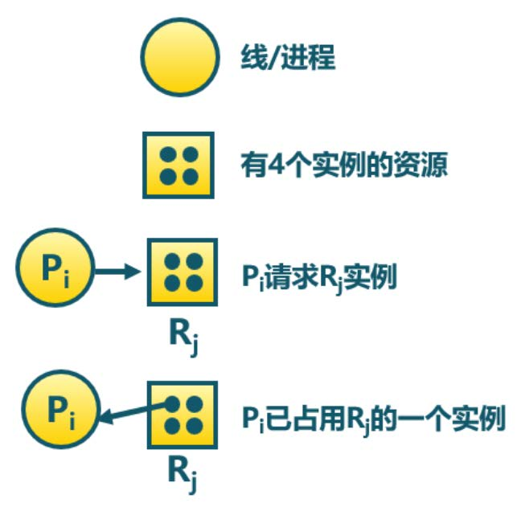
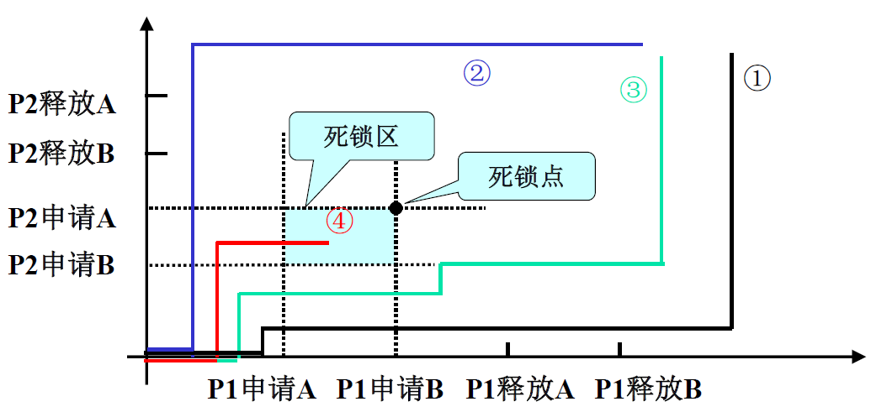

## CHAPTER6 死锁

[TOC]

- 线程 A 和线程 B 共享两把全局互斥锁 A 和 B

  ```c
  void proc_A(){
      lock(A);
      // t0
      lock(B);
      
      // 临界区
      unlock(B);
      unlock(A);
  }
  
  void proc_B(){
      lock(B);
      // t0
      lock(A);
      // 临界区
      unlock(A);
      unlock(B);
  }
  ```

- 假设在 `t0` 时刻，线程 A 获得了锁 A，将要尝试获得锁 B。线程 B 获得了锁 B，正等待获取锁 A

- 两个线程都无法获得对方持有的锁，无法进入临界区，此时的状态我们称之为 **死锁**

当有多个（两个及以上）线程为有限资源竞争时，有的线程就会因为在某一时刻没有可用的空闲资源而陷入等待。 死锁 ( 就是指这一组中的每个线程都在等待组内其他线程释放资源从而造成的无限等待。若无外力作用，这些进程将永远都不能向前推进。

- 死锁是因为 **资源竞争** 造成的僵局
- 通常死锁 **至少涉及两个进程**
- 死锁与部分进程及资源相关

系统有 $m$ 类资源 $R_1,R_2,...,R_m$(CPU 周期，内存空间，I/O 设备)，每一类资源 $R_i$ 有 $W_i$ 个实例，进程按照 **申请、使用、释放** 的方式利用资源、

### 资源分配图

- 资源分配图由一个节点集合 V 和一个边集合 E 组成

  - V 被分为两部分
    - 系统中全部进程集合 $P=\{P_1,P_2,...,P_n\}$
    - 系统中全部资源集合 $R=\{R_1,R_2,...,R_m\}$
  - 请求边：有向边 $P_i\to R_j$
  - 分配边：有向边 $R_j\to P_i$

  



- 可重用资源 (Reusable Resource)
  - 任何时刻只能有一个线程/进程使用资源
  - 资源被释放后，其他线程/进程可重用
  - 可重用资源示例
    - 硬件：处理器、内存、设备等
    - 软件：文件、数据库和信号量等
  - 可能出现死锁：**每个进程占用一部分资源并请求其他资源**
- 可消耗资源 (Consumable Resource)
  - 资源可被销毁
  - 可消耗资源示例
    - 在 I/O 缓冲区的中断、信号、消息等
  - 可能出现死锁：进程间相互等待接收对方的消息
- 可以证明：如果资源分配图没有环，那么系统就没有进程死锁。如果分配图有环，每类资源仅有一个实例，则存在死锁，若每类资源有多个实例，则可能存在死锁。

### 死锁产生的原因

- 死锁产生的原因与资源的使用情况相关

  - **竞争资源：** 多个进程竞争资源，而资源又不能同时满足其需求
    - **可剥夺资源：** 某进程获得这类资源后，该资源可以被其他进程或系统剥夺。如 CPU, 存储器。**竞争可剥夺资源不会产生死锁** 。
    - **不可剥夺资源：** 系统将这类资源分配给进程后，再不能强行收回，只能在进程使用完后主动释放。如打印机、读卡机。
  - **进程推进顺序不当：** 进程申请资源和释放资源的顺序不当

- 产生的必要条件
  - **互斥访问：** 在一段时间内某资源仅为一个进程所占有
  - **持有并等待：** 又称部分分配条件。当进程因请求资源被阻塞时，已分配资源保持不放。
  - **资源非抢占：** 进程所获得的资源在非使用完毕之前，不能被其他进程强行夺走。
  - **循环等待：** 死锁发生时，存在一个进程资源的循环


#### 进程推进顺序不当引起的死锁

- 当进程 $P_1,P_2$ 共享资源 A, B 时，若推进顺序合法则不会产生死锁，否则会产生死锁
- 1,2,3 均为合法路线，4 是不合法路线



> 跟随着线路从原点向外延伸，每触碰到 $x=t_1,y=t_2$ 这样的线就代表事件发生。这样之所以线路 4 会出现死锁现象，是因为先 **P2 申请 B**，再 P1 申请 A，再出去就要么 P2 申请 A 或者 P1 申请 B，这都会锁住。
>
> 对于横纵轴，就是不同的进程的行为事件，按照进程进行分类

### 处理死锁的方法

|   **策略**   |                         **核心思想**                         |                **目标**                |
| :----------: | :----------------------------------------------------------: | :------------------------------------: |
| **死锁预防** | **静态策略**：在系统设计阶段破坏死锁的四个必要条件之一，使死锁无法发生。 |         彻底消除死锁的可能性。         |
| **死锁避免** | **动态策略**：在资源分配过程中实时检查系统的安全性，避免进入可能导致死锁的状态（不安全状态）。 | 允许进程灵活申请资源，但动态规避风险。 |

#### 死锁的预防

**破坏产生死锁的四个必要条件之一来防止发生死锁**

- 互斥条件：是资源本身的特性，无法破坏
- 占有并等待：必须保证进程申请资源的时候没有占有其他资源
  - 要求进程在执行前 **一次性申请全部资源——静态资源分配法**
  - 或只有没有占有资源时才可以分配资源
  - **资源利用率低，可能出现饥饿**

> 以下每个子标题都是死锁发生的一个条件，下面对应的是其解决措施

##### 破坏非抢占

- 如果一个进程占有资源并申请另一个不能立即分配的资源，那么其现已分配的资源都可以被抢占
- 抢占的资源被添加到该进程正在等待的资源列表中
- 只有当进程能够重新获得其旧资源以及其请求的新资源时，才会重新启动该进程

##### 破坏循环等待

- 对所有资源类型进行完全排序，且要求进程按照递增顺序来申请资源（相当于 **占用了 $Pn$ 就不可以再申请 $P_{n-1}$ 了**）
- 采用有序资源分配法，系统中的进程 **必须按照资源编号的升序申请资源**。
- 因此在任一时刻，系统中总会存在一个进程，它占有已申请资源中编号最高的资源，且它继续请求的资源必定是空闲的，因而它可以一直向前推进直至完成。
- 当该进程运行完成后，即会释放它所占有的全部资源。这样剩余进程集合中又会存在一个进程，它占有已申请资源中编号最高的资源，且它继续请求的资源必定是空闲的，因而它也可以一直向前推进直至完成。
- 以此类推，最终所有进程均可运行完成，故不会发生死锁。


#### 死锁的避免

- 死锁的避免是在资源的动态分配过程中，用某种方法防止系统进入不安全状态，从而避免死锁的发生。
- 以较弱的限制获得较高的利用率，但实现有一定难度


##### 安全状态

- 安全状态是指系统能按某种顺序如 $<P_1,P_2,...,P_n>$ 来为每个进程分配其所需的资源，直至最大需求，使每个进程都可以顺利完成，则称 **此时的系统状态为安全状态**，称序列 $<P_1,P_2,...,P_n>$ 为 **安全序列**
- 若 **不存在一个安全序列**，则称系统状态为 **不安全状态**
- 安全状态不是 **死锁状态**，**死锁状态是不安全状态**

> 这里的几个进程是顺序执行安全，而不是有一定的并行的要求

##### 银行家算法

- 最具代表性的死锁避免算法是 **Dijkstra 的银行家算法**
- 每一个进程必须事先声明资源最大使用量
- 当用户申请一组资源时，**系统必须确定这些资源的分配是否仍会使系统处于安全状态**，如果是就可分配资源，否则等待。

> 本质上就是暴力算法，尤其对于 `isSafe()` 最外层有 `while(count < PROCESSES)` 来进行保护，为了避免死循环有 `found` 进行检测。同时，利用这个 `while` 循环，可以枚举到各种情况，因为这里判断可行的逻辑是，**如果发现这个进程是可行的，会假装立刻他运行完了并释放他占用的资源**，所以不会存在 **因为考虑进程的顺序而导致判断出错的情况**。反之，如果改成（类似 DFS ）**发现这个进程是可行的，就把资源分配给他并进行占用**，这样顺序就会有影响，同时也就变成了 **并行安全检验**。

```c
#include <stdio.h>
#include <stdbool.h>

#define PROCESSES 5    // 进程数量
#define RESOURCES 3    // 资源类型数量

// 全局变量定义
int Available[RESOURCES];                  // 系统可用资源
int Max[PROCESSES][RESOURCES];             // 进程最大需求资源
int Allocation[PROCESSES][RESOURCES];      // 已分配资源
int Need[PROCESSES][RESOURCES];            // 进程还需资源
bool Finish[PROCESSES];                    // 标记进程是否完成

/* 初始化系统数据 */
void initSystem() {
    // 可用资源实例 (可自行修改测试)
    int available_init[RESOURCES] = {3, 3, 2};
    for(int i=0; i<RESOURCES; i++) 
        Available[i] = available_init[i];

    // 最大需求矩阵实例
    int max_init[PROCESSES][RESOURCES] = {
        {7, 5, 3}, 
        {3, 2, 2}, 
        {9, 0, 2}, 
        {2, 2, 2}, 
        {4, 3, 3}
    };
    
    // 已分配矩阵实例
    int alloc_init[PROCESSES][RESOURCES] = {
        {0, 1, 0}, 
        {2, 0, 0}, 
        {3, 0, 2}, 
        {2, 1, 1}, 
        {0, 0, 2}
    };

    // 初始化矩阵
    for(int i=0; i<PROCESSES; i++) {
        for(int j=0; j<RESOURCES; j++) {
            Max[i][j] = max_init[i][j];
            Allocation[i][j] = alloc_init[i][j];
            Need[i][j] = Max[i][j] - Allocation[i][j];
        }
        Finish[i] = false;
    }
}

/* 打印当前系统状态 */
void printState() {
    printf("\n当前系统状态:\n");
    printf("进程\tMax\tAlloc\tNeed\tFinish\n");
    for(int i=0; i<PROCESSES; i++) {
        printf("P%d\t", i);
        for(int j=0; j<RESOURCES; j++) printf("%d ", Max[i][j]);
        printf("\t");
        for(int j=0; j<RESOURCES; j++) printf("%d ", Allocation[i][j]);
        printf("\t");
        for(int j=0; j<RESOURCES; j++) printf("%d ", Need[i][j]);
        printf("\t%s\n", Finish[i] ? "完成" : "未完成");
    }
    printf("可用资源: ");
    for(int j=0; j<RESOURCES; j++) printf("%d ", Available[j]);
    printf("\n");
}

/* 检查是否存在安全序列 */
bool isSafe() {
    int work[RESOURCES];                   // 工作副本
    bool finish_copy[PROCESSES];           // 完成状态副本
    int safeSeq[PROCESSES];                // 安全序列存储
    int count = 0;                         // 完成进程计数器

    // 初始化工作副本
    for(int i=0; i<RESOURCES; i++) 
        work[i] = Available[i];
    for(int i=0; i<PROCESSES; i++) 
        finish_copy[i] = Finish[i];

    // 查找可完成的进程
    while(count < PROCESSES) {
        bool found = false;
        for(int i=0; i<PROCESSES; i++) {
            if(!finish_copy[i]) {
                bool canAlloc = true;
                // 检查资源是否足够
                for(int j=0; j<RESOURCES; j++) {
                    if(Need[i][j] > work[j]) {
                        canAlloc = false;
                        break;
                    }
                }
                // 如果可分配则模拟完成，然后把这个进程已经占用的资源释放掉
                if(canAlloc) {
                    for(int j=0; j<RESOURCES; j++) 
                        work[j] += Allocation[i][j];
                    safeSeq[count++] = i;
                    finish_copy[i] = true;
                    found = true;
                }
            }
        }
        if(!found) break; // 无法找到更多进程
    }

    // 打印安全序列
    if(count == PROCESSES) {
        printf("安全序列存在: ");
        for(int i=0; i<PROC; i++) 
            printf("P%d ", safeSeq[i]);
        printf("\n");
        return true;
    } else {
        printf("系统处于不安全状态！\n");
        return false;
    }
}

/* 处理资源请求 */
bool requestResources(int pid, int request[RESOURCES]) {
    printf("\n处理 P%d 的资源请求: ", pid);
    for(int i=0; i<RESOURCES; i++) printf("%d ", request[i]);
    printf("\n");

    // 步骤1：检查请求是否超过声明需求
    for(int i=0; i<RESOURCES; i++) {
        if(request[i] > Need[pid][i]) {
            printf("错误：请求超过声明的最大需求\n");
            return false;
        }
    }

    // 步骤2：检查系统是否有足够资源
    for(int i=0; i<RESOURCES; i++) {
        if(request[i] > Available[i]) {
            printf("资源不足，请求被暂缓\n");
            return false;
        }
    }

    // 步骤3：尝试分配资源（临时修改状态）
    for(int i=0; i<RESOURCES; i++) {
        Available[i] -= request[i];
        Allocation[pid][i] += request[i];
        Need[pid][i] -= request[i];
    }

    // 步骤4：检查安全性
    if(isSafe()) {
        printf("请求被批准\n");
        return true;
    } else {
        // 撤销分配
        printf("请求被拒绝，系统将回滚状态\n");
        for(int i=0; i<RESOURCES; i++) {
            Available[i] += request[i];
            Allocation[pid][i] -= request[i];
            Need[pid][i] += request[i];
        }
        return false;
    }
}

int main() {
    initSystem();
    printState();
    isSafe(); // 初始安全检查

    // 测试用例1：合法请求
    int req1[RES = {1, 0, 2};
    requestResources(1, req1);

    // 测试用例2：非法请求（超过可用资源）
    int req2[RESOURCES] = {3, 3, 0};
    requestResources(4, req2);

    return 0;
}
```


#### 死锁检测

- 通过系统的检测机构及时地检测出死锁的发生，然后采取某种措施接触死锁。
- **特点：** 死锁检测和解除可使系统获得更高的利用率，但是实现难度最大。

##### 死锁判定法则

- 将资源分配图简化为可以检测系统状态 S 是否为死锁状态，方法如下：
  - 在资源分配图中，找出一个 **既不阻塞又非孤立的进程结点** $p_i$，进程 $p_i$ 获得了它所需要的全部资源，能运行完成然后释放所有资源。相当于消去 $p_i$ 的 **所有请求边和分配边**，使之成为孤立结点。
  - 进程 $p_i$ 释放资源后，可以唤醒因等待这些资源而阻塞的进程，从而可能使原来阻塞的进程变为非阻塞进程。
  - 在进行一系列化简后，若能消去图中所有的边，使 **所有进程都成为孤立结点**，则称该图是 **可完全简化的**；若不能使该图完全化简，则称该图是不可完全化简的。

##### 死锁定理

可以证明，**所有的简化顺序将得到相同的不可化简图**。

> **S 为死锁状态** 的条件是当且仅当 **S 状态的资源分配图是不可完全简化的**，该条件称为 **死锁定理**

##### 死锁检测算法的数据结构

```c
#include <stdio.h>
#include <stdbool.h>

#define MAX_PROCESSES 5  // 最大进程数
#define MAX_RESOURCES 3  // 资源类型数

// 进程资源状态
typedef struct {
    int allocation[MAX_RESOURCES];  // 已分配资源
    int request[MAX_RESOURCES];     // 当前请求资源
    bool in_L;                      // 是否已加入安全队列L
} Process;

// 全局系统状态
Process processes[MAX_PROCESSES] = {0};  // 进程列表
int available[MAX_RESOURCES];            // 当前可用资源
```


##### 死锁检测算法的算法实现


```c
bool detect_deadlock() {
    int work[MAX_RESOURCES];        // 模拟可用资源的副本
    bool L[MAX_PROCESSES] = {false};// 安全队列标记
    bool progress;                  // 标记是否在循环中有进展
    int i, j;

    // 初始化 work 为当前可用资源
    for (j = 0; j < MAX_RESOURCES; j++) {
        work[j] = available[j];
    }

    // 步骤1: 初始安全队列 L（请求为 0且已分配资源不为 0的进程）
    for (i = 0; i < MAX_PROCESSES; i++) {
        bool is_zero_request = true;
        bool has_allocation = false;
        for (j = 0; j < MAX_RESOURCES; j++) {
            if (processes[i].request[j] != 0) {
                is_zero_request = false;
                break;
            }
            if (processes[i].allocation[j] != 0) {
                has_allocation = true;
            }
        }
        if (is_zero_request && has_allocation) {
            L[i] = true;
            processes[i].in_L = true;
        }
    }

    // 步骤2: 循环处理安全队列，直到无法继续
    do {
        progress = false;
        for (i = 0; i < MAX_PROCESSES; i++) {
            if (!L[i]) {  // 检查尚未加入L的进程
                bool can_fulfill = true;
                // 检查当前请求是否 <= work
                for (j = 0; j < MAX_RESOURCES; j++) {
                    if (processes[i].request[j] > work[j]) {
                        can_fulfill = false;
                        break;
                    }
                }
                // 若可以满足请求，则释放资源并加入L
                if (can_fulfill) {
                    for (j = 0; j < MAX_RESOURCES; j++) {
                        work[j] += processes[i].allocation[j];
                    }
                    L[i] = true;
                    processes[i].in_L = true;
                    progress = true;  // 标记有进展
                }
            }
        }
    } while (progress);

    // 步骤3: 检查是否所有进程都在L中
    for (i = 0; i < MAX_PROCESSES; i++) {
        if (!L[i]) {
            return true;  // 存在死锁
        }
    }
    return false;  // 无死锁
}
```

 **检测函数中的局部变量**

- **`int work[MAX_RESOURCES]`**
  模拟可用资源的动态变化（初始值为 `available`），随着进程加入 L 而增加其释放的资源。
- **`bool L[MAX_PROCESSES]`**
  标记进程是否已被加入安全队列 L（即是否可被“化简”）。
- **`bool is_zero_request`**
  判断进程的 **当前请求是否全为 0**（即 `request[]` 全为 0）。若为真，说明该进程无需额外资源即可完成。
- **`bool has_allocation`**
  判断进程的 **已分配资源是否非零**（即 `allocation[]` 不全为 0）。若为真，说明该进程持有资源。

##### 死锁恢复（死锁解除）

- 一旦检测出系统中出现了死锁，就应将陷入死锁的进程从死锁状态中解脱出来，常用的接触方法有两种：
  - 撤消进程法
  - 资源剥夺法

###### 进程终止（撤消进程）

- 通过终止进程消除死锁有两种方法：
  - **终止所有死锁进程：** 这种方法打破了死锁环，但 **代价大**
  - **一次只终止一个进程直到消除死锁：** 这种方法开销大，因为每终止一个进程就要检测死锁
- 影响中止进程选择的因素
  - 进程的优先级
  - 进程已经计算了多久，还需要多长时间完成
  - 进程使用的资源，进程完成还需要多少
  - 多少个进程需要被终止
  - 进程是交互的还是批处理


###### 资源抢占（资源剥夺）

- 逐步从进程中抢占资源给其他进程使用，直到死锁环被打破为止
-   使用抢占来处理死锁，有 3 个问题需要处理：
  - 选择一个牺牲：最小代价
  - 回退：返回到安全状态，然后重新启动进程
  - 饥饿：同一进程可能总是被选中


 ##### 处理死锁的综合方法

- 单独使用处理死锁的某种方法不能全面解决 OS 中遇到的所有死锁问题。
- 综合方法是：将系统中的资源按层次分为若干类，对每一类资源使用最适合它的办法解决死锁问题。即使发生死锁，**一个死锁环也只包含某一层次的资源**，因此整个系统不会受控于死锁。
  - **内部资源：** 由系统本身使用，如 PCB，采用有序资源分配法
  - **主存资源：** 采用资源剥夺法
  - **作业资源：** 可分配的设备和文件，采用死锁避免法
  - **交换空间：** 采用静态分配法