## CHAPTER7 内存管理

[TOC]

- 程序被永久地保存在磁盘上
- 要运行一个程序，必须将其从磁盘中取出，并放置到一个进程的内存中。
- **主存和寄存器** 是 CPU **唯一可以直接访问** 的存储设备。**内存单元只看到一个流**：地址+ 读请求，或地址、数据和写请求。
- **高速缓存** 位于主存和 CPU 寄存器之间，位于 CPU 中

### 特点

- **抽象**：逻辑地址空间
- **保护**：独立地址空间
- **共享**：访问相同内存
- **虚拟化**：更大的地址空间

### 管理方式

- 重定位(relocation)
- 分段(segmentation)
- 分页(paging)
- 虚拟存储(virtual memory / storage)

**高度依赖硬件**

- 与计算机存储架构紧耦合
- **MMU （内存管理单元）：** 处理 CPU 存储访问请求的硬件

### 地址空间

- **物理地址空间：** 物理内存的地址空间（PA, Physical Address）

  - 起始地址 00，直到 $MAX_{phy}$

  - 用于 **内存芯片级** 的单元寻址，与处理器和 CPU 连接的地址总线相对应。

- **虚拟地址空间：** 虚拟内存的地址空间（LA, Logical Address）

  - 起始地址 00，直到 $MAX_{virt}$

  - 在程序的 **编译和链接** 阶段生成，表示 **程序中的地址偏移**，它在载入内存之前使用。

- **逻辑地址空间：** 程序执行的地址空间（VA, Virtual Address）

  - 起始地址 00，直到 $MAX_{prog}$
  
  - 操作系统在 **程序加载** 过程中，将 **逻辑地址调整或映射到适当的虚拟地址** 空间。

> 在计算机系统中，**虚拟地址空间（Virtual Address Space）** 是操作系统为每个进程提供的 **逻辑地址范围**，**与物理内存或硬盘无关**。以下是详细解释：
>
> ### 1. 虚拟地址空间的本质
>
> - **逻辑视角**： 
>   虚拟地址空间是进程运行时“看到”的地址范围，由操作系统通过 **内存管理单元（MMU）** 和 **页表（Page Table）** 动态映射到物理内存或硬盘中的交换空间（Swap Space）。  
> - **独立性与隔离性**： 
>   每个进程拥有独立的虚拟地址空间，例如在 32 位系统中，每个进程的虚拟地址范围是 `0x00000000` 到 `0xFFFFFFFF`（4GB），但实际物理内存可能只有 8GB，甚至更小。
>
> ### 2. 虚拟地址空间的位置
>
> - **虚拟地址空间不在硬盘中**：  
>   - 虚拟地址是进程使用的逻辑地址，属于 **运行时概念**，仅存在于 CPU 和操作系统的管理逻辑中。  
>   - 硬盘中的 **交换文件（Swap File）** 或 **页面文件（Page File）** 仅用于临时存储被换出（Swap Out）的物理内存页，但虚拟地址本身不直接对应硬盘中的地址。
>
> #### 物理内存与硬盘的关系
>
> - **物理内存（RAM）**：程序运行时，虚拟地址通过页表映射到物理内存中的页框（Page Frame）。  
> - **硬盘的交换空间**：当物理内存不足时，操作系统会将不活跃的页换出到硬盘，但虚拟地址仍然指向这些页的逻辑位置。当进程访问这些页时，操作系统再将其换入物理内存（Swap In）。
>
> ### 3. 虚拟地址空间的作用
>
> #### (1) 内存抽象与保护
>
> - **抽象**：进程无需关心物理内存的实际分布，只需通过虚拟地址访问内存。  
> - **隔离**：不同进程的虚拟地址空间相互独立，防止越界访问（如进程 A 无法直接读写进程 B 的内存）。  
>
> #### (2) 按需分配与扩展
>
> - **按需分页（Demand Paging）**：虚拟地址空间可以远大于物理内存，进程可以申请大量虚拟内存（如 64 位系统的理论虚拟地址空间为 16EB），但实际物理内存按需分配。  
> - **内存映射文件（Memory-Mapped Files）**：文件可以直接映射到虚拟地址空间，读写文件如同操作内存。
>
> #### (3) 简化编程
>
> - 程序员无需手动管理物理地址，虚拟地址空间对进程表现为连续的地址范围（即使物理内存碎片化）。
>
> ### 4. 虚拟地址空间的映射示例
>
> 以 32 位系统为例：
> - **进程的虚拟地址空间**：`0x00000000` 到 `0xFFFFFFFF`（4GB）。  
> - **实际物理内存**：例如 8GB，由操作系统动态分配给多个进程。  
> - **页表映射**：  
>   - 虚拟地址 `0x08000000` 可能映射到物理地址 `0x12345000`。  
>   - 如果该页被换出到硬盘，虚拟地址仍然有效，但访问时会触发 **缺页异常（Page Fault）**，操作系统将页从硬盘换入物理内存。
>
> ### 5. 虚拟地址空间与硬盘的关联
>
> - **间接关系**： 
>   虚拟地址本身不直接指向硬盘，但操作系统可能将虚拟地址对应的页暂时存储在硬盘的交换空间中（当物理内存不足时）。  
> - **访问流程**：  
>   1. 进程访问虚拟地址 `V`。  
>   2. MMU 通过页表检查 `V` 对应的物理页是否在内存中。  
>   3. 若在内存中，直接访问物理地址 `P`。  
>   4. 若不在内存中（页表项标记为“不在内存”），触发缺页异常，操作系统从硬盘加载页到物理内存，更新页表，最后重新执行访问。
>
> ### 6. 总结
>
> - **虚拟地址空间** 是进程的“逻辑内存视图”，由操作系统和硬件（MMU）管理，**与硬盘无关**。  
> - **硬盘的交换空间** 仅用于辅助存储被换出的内存页，是物理内存的扩展，不改变虚拟地址的逻辑属性。  
> - 虚拟地址空间的核心目的是 **简化编程、隔离进程、支持大内存需求**，而硬盘在此过程中仅扮演临时存储的角色。

#### 逻辑地址生成

##### 编译(Compilation)

- **作用**：
  将 **高级编程语言**（如 C、C++、Java 等）编写的源代码 **翻译成汇编语言**（Assembly Code）或直接生成 **机器无关的中间代码**（如 LLVM IR）。
- **输入与输出：**
  - **输入**：高级语言源文件（如 `.c`, `.cpp`）。
  - **输出**：汇编语言文件（如 `.s`）或目标文件（如 `.o`，如果直接生成机器码）。
- **工具**：
  使用 **编译器**（Compiler），例如 `gcc`、`clang`。

##### 汇编（Assembly）

- **作用**：
  将 **汇编语言**（人类可读的低级代码）**翻译成机器码**（二进制指令），生成目标文件（`.o` 或 `.obj`）。
- **输入与输出：**
  - **输入**：汇编语言文件（如 `.s`）。
  - **输出**：目标文件（`.o`，包含机器码和符号表）。
- **工具**：
  使用 **汇编器**（Assembler），例如 `as`（GNU Assembler）。

##### 链接（Linking）

- **作用：**

  将多个 **目标文件**（`.o` 或 `.obj`）和 **库文件**（静态库 `.a` 或动态库 `.so`/`.dll`）合并为一个 **可执行文件**（如 `.exe` 或 `.out`），解决代码之间的依赖关系（例如函数调用、变量引用）。

- **符号解析（Symbol Resolution）**

  - 目标文件中可能包含未定义的符号（如外部函数 `printf` 或全局变量）。
  - 链接器需要在所有输入文件中找到这些符号的定义（例如在标准库中找到 `printf` 的实现）。
  - 若找不到符号定义，会报错（如 `undefined reference`）。

- **重定位（Relocation）**

  - 每个目标文件在编译时假设自己的代码从地址 `0` 开始（逻辑地址）。
  - 链接时需要将所有目标文件的代码和数据段 **合并**，并 **重新计算所有地址**，确保它们指向合并后的正确位置。
  - 例如：函数 `main` 在目标文件 `A.o` 中地址为 `0x100`，合并到可执行文件后可能变为 `0x4000`。

- **类型**

  - **静态链接（链接阶段）**：将所有依赖的代码直接复制到可执行文件中。
    - 优点：可执行文件独立运行，不依赖外部库。
    - 缺点：文件体积大，库更新需重新链接。
  - **动态链接（运行时）**：在程序运行时由操作系统加载共享库（如 `.dll` 或 `.so`）。
    - 优点：节省内存和磁盘空间，库可独立更新。
    - 缺点：依赖外部库，运行时需解析地址。
    - 可执行文件中的地址仍是逻辑地址（相对于程序基址 `0` 的偏移）。
    - 程序加载到内存时，操作系统为其分配一个 **基址（Base Address）**，所有逻辑地址通过 **基址寄存器** 动态转换为物理地址。
    - **公式**：`物理地址 = 逻辑地址 + 基址`
    - **现代操作系统均采用此方式**（如 Linux 的地址空间随机化 ASLR）。


#### 虚拟地址转换为物理地址

##### 段式管理

- **虚拟地址** 通过 **分段** 转换为 **物理地址**，虚拟地址也称为 **线性地址( LA, Linear Address)**

将内存划分为 **逻辑段**（如代码段、数据段、堆栈段），每个段对应程序的不同部分，段的大小可变。

虚拟地址 = **段选择符（Segment Selector）** + **段内偏移（Offset）**

- **段选择符**：标识段（如代码段或数据段）和权限信息。
- **段内偏移**：段内的具体位置（如代码段中的第 100 字节）。
- 优点：
  - 符合程序逻辑结构（代码、数据分离），便于共享和保护。
  - 每个段可独立设置访问权限（如代码段只读）。
- 缺点：
  - **外部碎片**：段大小不固定，导致内存利用率低。
  - **管理复杂**：需维护不同大小的段，分配和回收困难。

##### 页式管理 (Paging)

将内存划分为 **固定大小的页**（如 4KB），虚拟地址和物理地址均按页对齐，通过页表映射实现转换。

虚拟地址 = **页号（Page Number）** + **页内偏移（Offset）**

**转换流程**

1. 查找页表（Page Table）：

   - 页号在页表中找到对应的 **页框号（Frame Number）**。

     (其实是 **虚页号 VPN 变成物页号 PFN ** 的过程)

2. 计算物理地址：

   - 物理地址 = 页框号 × 页大小 + 页内偏移。

###### 多级页表与快表

在普通单级页表中：

- **内存占用过高**：
  例如，32 位系统，4KB 页大小 → 虚拟地址空间分为 220 个页（约 100 万页）。
  若每个页表项（PTE）占 4 字节，单级页表需 220×4 *B* = 4 *MB* 内存。
  在 64 位系统中，单级页表的大小完全不可行（如 48 位地址空间需要 236 个页表项）。
- **访问速度慢**：
  每次地址转换需访问 **内存中的页表**，导致延迟（内存访问比 CPU 慢 100 倍以上）。

- **多级页表**：解决单页表过大问题（如 x86 的 4 级页表）。
- **TLB**：CPU 中的一个 **硬件缓存**，用于存储近期使用的页表项（PTE），避免重复访问内存中的页表。
  - **TLB 查询**：
    - CPU 将虚拟页号（VPN）同时发送到 TLB 和内存中的页表。
    - 若 TLB 命中（Hit），直接返回物理页框号（PFN）。
    - 若 TLB 未命中（Miss），继续查多级页表，并将结果存入 TLB。
  - **TLB 条目结构**：
    TLB 条目 = 虚拟页号（VPN） + 物理页框号（PFN） + 权限位 + 其他标志位。
    TLB 大小有限（通常 64~1024 条目），采用 **LRU** 或 **随机替换策略**。

- 优点:
  - **无外部碎片**：页大小固定，内存利用率高。
  - **灵活高效**：支持按需调页、共享内存（如动态库）。
- 缺点：
  - **内部碎片**：最后一页可能未填满。
  - **页表开销**：多级页表占用内存，TLB 未命中时访问延迟高。

1. **TLB 作为缓存**：
   优先从 TLB 获取 PFN，避免访问多级页表。
2. **多级页表作为后备**：
   TLB 未命中时，通过多级页表获取 PFN，并更新 TLB。
3. **硬件加速**：
   CPU 的 MMU（内存管理单元）自动处理多级页表遍历和 TLB 更新。

- **TLB 命中率**：
  若 TLB 命中率高达 99%，地址转换速度接近直接访问缓存。
- **页表层级**：
  页表层级越多，TLB 未命中时的延迟越高（如四级页表需 4 次内存访问）。

|    **技术**     |    **解决的问题**    |            **优势**            |             **代价**             |
| :-------------: | :------------------: | :----------------------------: | :------------------------------: |
|  **多级页表**   | 单级页表内存占用过大 |       按需分配，节省内存       |    查表次数增加，未命中时更慢    |
| **快表（TLB）** |    页表访问速度慢    | 加速地址转换，减少内存访问次数 | 需要额外硬件，TLB 未命中仍有延迟 |

##### 段页式管理(Segmentation with Paging)

**先分段，再分页**，结合段式逻辑划分和页式物理管理的优点。

虚拟地址 = **段选择符** + **段内偏移**

- 段内偏移进一步拆分为：**页号** + **页内偏移**。

1. 查找段表：
   - 段选择符找到段描述符，获取段的 **页表基地址**。
2. 查找页表：
   - 用段内偏移中的页号在段对应的页表中找到页框号。
3. 计算物理地址：
   - 物理地址 = 页框号 × 页大小 + 页内偏移。

|     **特性**     |     **段式管理**      |         **页式管理**          |        **段页式管理**        |
| :--------------: | :-------------------: | :---------------------------: | :--------------------------: |
|   **内存划分**   |     可变大小的段      |         固定大小的页          |      先分段，段内再分页      |
|   **碎片问题**   |     外部碎片严重      |         内部碎片可能          |         内部碎片可能         |
|   **地址转换**   |  段表（基地址+限长）  |        页表（页框号）         |          段表+页表           |
| **逻辑结构支持** | 强（代码、数据分离）  |    弱（需软件模拟逻辑段）     |     强（硬件支持逻辑段）     |
|   **内存保护**   |     段级权限控制      |         页级权限控制          |      段级+页级双重控制       |
|  **硬件复杂度**  |         简单          |    中等（需 TLB/多级页表）    |     高（段表+页表协同）      |
|   **实际应用**   | 早期系统（如 MS-DOS） | 现代主流系统（Linux/Windows） | x86 保护模式（但退化为页式） |

##### 碎片问题

在内存管理中，**碎片问题** 是指内存空间被分割成无法有效利用的小块，导致内存浪费的现象。段页式存储结合了段式管理和页式管理的特点，但碎片问题仍然存在，只是表现形式和影响程度有所不同。


###### 内部碎片（Internal Fragmentation）

**产生原因**

- **固定分页（页式管理）**：
  页式管理将内存划分为固定大小的页（如 4KB）。如果进程所需内存不是页大小的整数倍，最后一页的一部分空间会被浪费。
  **例如**：进程需要 5.5KB 内存，系统分配 2 页（8KB），浪费 2.5KB。
- **段页式中的内部碎片**：
  在段页式管理中，**每个段被划分为多个固定大小的页**。若段的大小不是页大小的整数倍，段内的最后一页也会产生内部碎片。
  **例如**：一个代码段大小为 10KB，页大小为 4KB → 需要 3 页（12KB），浪费 2KB。

**特点**

- **无法通过内存整理消除**：内部碎片是已分配内存内部的浪费，操作系统无法回收这些碎片，除非进程释放整个内存块。
- **浪费规模较小**：单次浪费通常不超过一页大小（如 4KB），但对大量小进程可能累积显著浪费。

###### 外部碎片（External Fragmentation）

**外部碎片** 是指内存中散布的、**未被分配的**、但总和小到无法满足新请求的空闲空间。这些碎片是 **未被分配但无法利用** 的“零散空闲空间”。

**产生原因**

- **可变分区（段式管理）**：
  段式管理允许段的大小动态变化。随着进程频繁分配和释放不同大小的段，内存中会留下大量不连续的小空闲区域。
  **例如**：内存中存在三个不连续的 1KB 空闲块，但新进程需要 3KB 内存，此时无法分配。

- **段页式中的外部碎片**：
  段页式管理通过 **分页机制将物理内存划分为固定大小的页框**，因此段的大小可变但物理内存分配以页为单位。

  - **段级外部碎片**：段的逻辑地址空间可能不连续，但物理内存通过页框分配始终连续，因此 **物理内存层面无外部碎片**。

    > 针对于此的解释
    >
    > ####  逻辑地址空间 vs. 物理内存
    >
    > - **逻辑地址空间**：程序员或进程视角看到的地址空间，例如代码段、数据段等，由操作系统通过内存管理机制映射到物理内存。
    > - **物理内存**：实际硬件内存芯片中的存储单元。
    >
    > **关键点**：逻辑地址的连续性 ≠ 物理内存的连续性！
    >
    > #### 段式管理中的外部碎片
    >
    > ##### 纯段式管理（无分页）
    >
    > - **逻辑地址空间**：进程的段（代码段、数据段等）在逻辑上是连续的。
    > - **物理内存分配**：每个段被分配为一块 **连续的物理内存**。
    >
    > **外部碎片的产生**：
    >
    > - 随着进程不断分配和释放不同大小的段，物理内存中会留下许多 **不连续的小空闲块**，这些空闲块总和可能足够大，但单个块无法满足新段的需求。
    > - **示例**：
    >   物理内存中有 3 个空闲块（1KB、2KB、1KB），但新段需要 3KB 连续内存 → 无法分配，尽管总空闲内存为 4KB。
    >
    > **结论**：
    >
    > - **纯段式管理会导致物理内存的外部碎片**，因为物理内存分配必须连续。
    >
    > #### 段页式管理中的“逻辑地址空间不连续”
    >
    > ##### 段页式管理的核心机制
    >
    > - 逻辑地址空间：进程的段（如代码段、堆栈段）在逻辑上可以不连续，例如：
    >   - 代码段可能分布在逻辑地址的 0x0000~0x1000 和 0x2000~0x3000。
    > - **物理内存分配**：每个段被划分为 **固定大小的页**，物理内存按页框分配（无需连续）。
    >
    > ##### 段级外部碎片的误解澄清
    >
    > - **逻辑地址空间中的“不连续”不是外部碎片**：
    >   - 逻辑地址空间是虚拟的，由操作系统通过页表映射到物理内存。
    >   - 逻辑地址的不连续只是程序员或进程的视角，**物理内存通过分页机制仍然可以高效利用**。
    > - **物理内存层面无外部碎片**：
    >   - 物理内存被划分为 **固定大小的页框**，所有分配以页框为单位。
    >   - 空闲页框通过页框分配器管理（如位图或链表），只要存在空闲页框，即可分配给任何段或进程，无需连续。
    >
    > **结论**：
    >
    > - 段页式管理通过分页机制，彻底消除了物理内存的外部碎片
    > - 逻辑地址空间的不连续只是虚拟层面的设计（如段权限隔离），不影响物理内存利用率。

  - **段表外部碎片**：段表本身是动态分配的，若段表项大小不固定，可能产生段表内存的碎片（但现代系统通常优化段表结构）。

    > ### 段表项大小不固定如何导致内存碎片
    >
    > #### 固定大小的段表项（常见设计）
    >
    > - **实现方式**：
    >   每个段表项占用固定大小的内存（例如，每个 STE 占 16 字节）。
    > - **内存分配**：
    >   段表通常以数组形式连续存储，操作系统预先分配固定大小的内存块。
    > - 优点：
    >   - 内存管理简单，无外部碎片。
    >   - 通过索引直接定位段表项，访问速度快。
    >
    > #### 可变大小的段表项（假设场景）
    >
    > 如果段表项大小不固定（例如，不同段需要存储附加信息），可能出现以下情况：
    >
    > 1. **动态分配段表内存**：
    >    段表项以不同大小的块分配（如链表或动态数组）。
    > 2. 内存分配示例：
    >    - 初始段表项：16 字节（代码段）。
    >    - 新增段表项：24 字节（包含共享库的附加信息）。
    >    - 再新增段表项：16 字节（堆扩展）。
    > 3. **释放段表项**：
    >    若中间某个段表项被释放（如共享库卸载），内存中留下“空隙”。
    >
    > #### **碎片产生原因**
    >
    > - 外部碎片：
    >
    >   空闲内存被分散为小块，总和足够但无法分配给需要较大连续内存的新段表项。
    >
    >   示例：
    >
    >   - 内存空闲块：16 字节（原共享库段表项释放） + 24 字节（其他释放项）。
    >   - 新段表项需要 32 字节 → 无法直接分配，尽管总空闲 48 字节。
    >
    > - 内部碎片：
    >
    >   分配给段表项的内存块大于实际需要。
    >
    >   示例：
    >
    >   - 分配 32 字节内存块存储 16 字节段表项，浪费 16 字节。

##### 总结
> ### 1. 固定分区分配（Fixed Partitioning）
>
> | **内部碎片** | **外部碎片** |
> | ------------ | ------------ |
> | 是           | 否           |
>
> #### **内部碎片**  
> - **原因**：  
>   内存被预先划分为 **固定大小的分区**，进程只能分配到等于或大于其需求的空闲分区。  
>   **示例**：  
>   分区大小为 64KB，进程需要 50KB → 剩余 14KB 成为内部碎片（已分配但未使用）。  
>
> #### **外部碎片**  
> - **原因**：  
>   所有分区大小固定，空闲分区只能完整分配给新进程，不会留下无法利用的小块。  
>   **示例**：  
>   空闲分区为 64KB，新进程需要 32KB → 整个 64KB 分配，外部碎片为 0。
>
> ### 2. 可变分区分配（Dynamic Partitioning）
>
> | **内部碎片** | **外部碎片** |
> | ------------ | ------------ |
> | 否           | 是           |
>
> #### **内部碎片**  
> - **原因**：  
>   内存按进程需求动态分配 **精确大小的连续块**，没有固定分区限制，理论上无内部碎片。  
>   **示例**：  
>   进程需要 50KB → 分配 50KB，无浪费。  
>
> #### **外部碎片**  
> - **原因**：  
>   进程频繁分配和释放不同大小的内存块，导致内存中散布不连续的小空闲块。  
>   **示例**：  
>   内存中存在两个相邻空闲块（30KB 和 20KB），但新进程需要 50KB → 无法合并使用（若中间有其他进程占用）。
>
> ### 3. 页式分配（Paging）
>
> | **内部碎片** | **外部碎片** |
> | ------------ | ------------ |
> | 是           | 否           |
>
> #### **内部碎片**  
> - **原因**：  
>   内存和进程地址空间被划分为 **固定大小的页**，进程最后一页可能未完全使用。  
>   **示例**：  
>   页大小为 4KB，进程需要 7KB → 分配 2 页（8KB），浪费 1KB。  
>
> #### **外部碎片**  
> - **原因**：  
>   物理内存按页分配，空闲页框分散但可被任意进程使用，无需连续 → **无外部碎片**。  
>   **示例**：  
>   空闲页框为页 1、页 5、页 10，新进程需要 3 页 → 直接分配这三个页框。
>
> ### 4. 段式分配（Segmentation）
>
> | **内部碎片** | **外部碎片** |
> | ------------ | ------------ |
> | 否           | 是           |
>
> #### 内部碎片
>
> - **原因**：  
>   段按逻辑单位（代码、数据等）动态分配 **可变大小的连续内存**，无固定大小限制 → 无内部碎片。  
>   **示例**：  
>   进程需要 100KB 的堆空间 → 分配 100KB，无浪费。  
>
> #### 外部碎片
>
> - **原因**：  
>   段需要连续的物理内存，频繁分配/释放不同大小的段导致内存中出现不连续的空闲块。  
>   **示例**：  
>   内存中存在 30KB 和 70KB 的空闲块，但新段需要 100KB → 无法分配。
>
> ### 5. 段页式分配（Segmented Paging）
>
> | **内部碎片** | **外部碎片** |
> | ------------ | ------------ |
> | 是           | 否           |
>
> #### **内部碎片**  
> - **原因**：  
>   每个段内部按固定页划分，段的最后一页可能未完全使用 → 类似页式分配的内部碎片。  
>   **示例**：  
>   段大小为 10KB，页大小为 4KB → 分配 3 页（12KB），浪费 2KB。  
>
> #### **外部碎片**  
> - **原因**：  
>   物理内存按页分配，无需连续 → **无外部碎片**。  
>   **示例**：  
>   段的逻辑地址不连续，但物理页框分散存放，空闲页框可被任意段复用。
>
> ### 总结
>
> | **分配方式**     | **内部碎片** | **外部碎片** | **核心原因**                                       |
> | ---------------- | ------------ | ------------ | -------------------------------------------------- |
> | **固定分区分配** | 是           | 否           | 固定分区导致内部浪费，无动态分配故无外部碎片。     |
> | **可变分区分配** | 否           | 是           | 精确分配避免内部碎片，但动态分配导致外部碎片。     |
> | **页式分配**     | 是           | 否           | 最后一页浪费导致内部碎片，分页机制消除外部碎片。   |
> | **段式分配**     | 否           | 是           | 按需分配段避免内部碎片，连续分配要求导致外部碎片。 |
> | **段页式分配**   | 是           | 否           | 段内分页导致内部碎片，物理分页消除外部碎片。       |
>
> **关键结论**：  
> - **外部碎片** 的根源是 **物理内存连续分配要求**（段式、可变分区）。  
> - **内部碎片** 的根源是 **固定分配单位**（页式、固定分区、段页式）。  
> - **段页式** 结合了段和页的优势，在逻辑层面支持动态分段，在物理层面通过分页规避外部碎片。

#### 地址生成

- 编译时
  - 假设起始地址已知，如果起始地址改变，必须重新编译
  - 如起始地址未知，编译器需生成可重定位的代码(relocatable code)
  
- 加载时
  
  加载器（Loader）将程序从磁盘读入内存，并根据实际分配的内存基址，完成 **地址重定位**。
  
  - 加载时，位置可不固定，生成绝对（虚拟）地址
  - **绝对地址生成**：若程序在加载时确定基址，所有相对地址转换为 **绝对物理地址**（如早期无虚拟内存的系统）。
  - **虚拟地址生成**：若系统支持虚拟内存，加载器可能将程序映射到固定的 **虚拟地址空间**，实际物理地址由操作系统在运行时管理。
  
- 执行时

  - 执行时代码不可修改
  - 现代系统通过 **内存管理单元（MMU）** 实现动态地址转换。
  - **物理地址延迟绑定**：程序使用虚拟地址，实际物理地址在指令执行时由 MMU 转换（如分页机制）。
  - **代码不可修改**：程序代码段被标记为只读，防止执行时被篡改，重定位信息由操作系统通过页表管理。

- 以 Linux 系统运行一个可执行文件为例：
  - 加载阶段：
    - 内核调用加载器（如 `execve`）将程序读入内存。
    - 分配虚拟地址空间，将代码段（`.text`）、数据段（`.data`）等映射到固定虚拟地址（如 `0x400000`）。
  - 地址处理：
    - 程序中的地址为虚拟地址，物理地址尚未分配。
    - 页表中记录虚拟地址到物理地址的映射（初始时可能为空）。
  - 执行阶段：
    - CPU 访问虚拟地址时触发 **缺页异常**（Page Fault）。
    - 操作系统按需分配物理页框，更新页表，完成动态重定位。

#### 动态加载与链接

程序是由主程序和许多子程序组成，整个程序不需要完全存储到内存中才能执行，**只有在调用子程序时才会加载该子程序**，这样可以更好地利用内存空间。因为 未使用的子程序不会被加载。

所有子程序以 **可重定位的加载格式** 保存在磁盘上。当需要大量代码来处理不经常发生的情况时，这种方法非常有用，不需要操作系统提供特殊的支持，可以通过程序设计实现，操作系统可以通过提供库来实现动态加载。

> - **程序员手动控制**：
>   通过代码显式调用加载函数（如 C 中的 `dlopen()`、Java 中的 `Class.forName()`）。
> - **操作系统支持**：
>   操作系统提供动态加载库的机制（如 Windows 的 DLL、Linux 的 `.so` 文件），但动态加载本身更多是程序设计层面的策略。

- **静态链接：** 系统库和程序代码由加载器组合成二进制程序映像。

- **动态链接：** 链接推迟到执行时进行：程序依赖的外部库（如系统库 `libc`）**不打包到可执行文件中**，而是在 **运行时** 解析库函数的地址并链接到内存中的库代码。
  使用“存根” 来定位适当的内存驻留库例程，存根用例程的地址来替换自己，并执行该例程。

- 操作系统检查例程是否在进程的内存地址中

  如果不在地址空间中，则添加到地址空间中

|    **特性**    |       **静态链接**       |               **动态链接**               |
| :------------: | :----------------------: | :--------------------------------------: |
| **库代码位置** |    合并到可执行文件中    | 独立保存在系统库文件（如 `.dll`、`.so`） |
|  **内存占用**  | 每个程序包含重复的库代码 |       多个程序共享同一份库内存副本       |
| **更新库版本** |    需重新编译整个程序    |            替换库文件即可生效            |

1. **编译阶段**：
   生成可执行文件时，外部库函数的调用位置用 **存根（Stub）** 占位。
2. **运行时首次调用：**
   - 操作系统检查目标库函数是否已加载到内存。
   - 若未加载，加载库文件并定位函数地址。
   - **存根** 被替换为实际函数地址，后续调用直接跳转到目标函数。

- **存根（Stub）**：
  一个 **占位符代码片段**，用于在首次调用库函数时触发动态链接过程。存根的作用类似“临时工”，负责找到实际函数的地址并替换自身。
  **示例**：

  ```assembly
  ; 存根的伪代码（首次调用printf时）
  call dynamic_linker_resolve_printf  ; 跳转到动态链接器
  ```

- **例程（Routine）**：
  指具体的函数或子程序代码。例如，标准库中的 `printf()` 函数就是一个例程。

  - **内存驻留库例程**：已被加载到内存的库函数（如已被其他程序加载的 `libc` 中的 `printf`）。

> 以调用 `printf()` 为例：
>
> 1. 程序编译后：
>    - 可执行文件中调用 `printf` 的位置被替换为存根代码。
> 2. 首次调用 `printf` 时：
>    - CPU 执行存根代码，触发动态链接器（操作系统的 `ld.so` 或 Windows 的 `DLL Loader`）。
> 3. 动态链接器工作：
>    - 检查 `printf` 是否在内存中：
>      - **已加载**：直接返回函数地址。
>      - **未加载**：从磁盘加载 `libc.so` 到内存，定位 `printf` 的地址。
>    - 将存根替换为 `jmp <printf地址>` 指令。
> 4. 后续调用 `printf`：
>    - 直接跳转到内存中的 `printf` 函数，无需重复链接。


#### 内存保护

**重定位寄存器** 用于保护用户进程之间的相互影响，以及防止更改操作系统代码和数据。

- **基址寄存器** 包含最小物理地址的值
- **界限寄存器** 包含逻辑地址的范围——每个逻辑地址必须小于界限寄存器
- **内存管理单元（ MMU ）** 可以动态地映射逻辑地址。这样可以允许内核代码根据需要调入调出和内核大小的更改等操作。

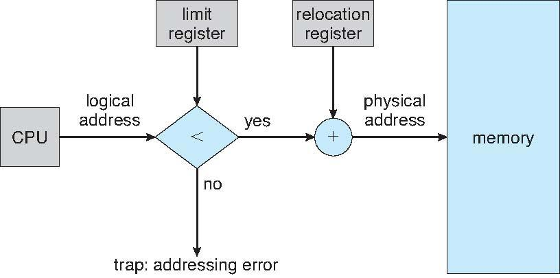

内存保护的核心机制是通过 **地址转换** 和 **边界检查** 实现的。

##### 内存保护的目标

- **隔离性**：防止进程 A 错误（或恶意）访问进程 B 的内存空间。
- **安全性**：避免非法访问操作系统内核或其他受保护区域。
- **稳定性**：阻止程序因地址越界导致崩溃或数据损坏。

##### 关键硬件组件

1. 重定位寄存器（Relocation Register）
   - 存储进程的 **物理内存基址**（起始地址）。
   - 例如：进程的内存区域物理基址为 `0x1000`。
2. 限制寄存器（Limit Register）
   - 存储进程的 **最大逻辑地址范围**（内存段长度）。
   - 例如：进程的逻辑地址最大为 `0x500`，超过此值即越界。

##### 内存保护的实现流程

1. CPU 生成逻辑地址：
   - 进程运行时，CPU 发出的地址是 **逻辑地址**（如 `0x300`）。
2. 边界检查（Limit Check）：
   - 比较逻辑地址是否小于限制寄存器的值：
     - **若逻辑地址 ≤ 限制值**：合法，进入下一步。
     - **若逻辑地址 > 限制值**：非法，触发 **陷阱（Trap）**（如“寻址错误”中断）。
3. 地址转换（Address Translation）：
   - 合法逻辑地址 + 重定位寄存器的基址 → **物理地址**。
   - 公式：物理地址 = 逻辑地址+重定位寄存器值
   - 示例：
     - 逻辑地址 `0x300` + 基址 `0x1000` → 物理地址 `0x1300`。
4. 访问物理内存：
   - 转换后的物理地址发送到内存总线，访问实际内存单元。


### 内存分配

**主存** 必须同时支持 **操作系统和用户进程**，作为一种有限资源，必须高效地进行分配。**连续分配** 是一种早期的方法。

- 主存通常由两个分区组成：
  - 常驻 **操作系统** 通常存储在 **低地址内存** 中，包括中断向量。
  - **用户进程** 存储在 **高地址内存** 中
- 每个 **进程** 都存储在 **连续的内存** 部分
- 管理方式：单一连续分配、固定分区分配、动态分区分配

#### 单一分区分配

也称单一连续分配。

在这种分配方式中，内存分为 **系统区和用户区**。系统区给操作系统使用，用户区给一道用户作业使用。

特点：管理简单，只需很少的软硬件支持；但各类资源的利用率不高。

#### 固定分区分配

固定分区存储管理方法将内存空间划分为若干个固定大小的分区，每个分区中可以装入一道程序。**分区的位置及大小在运行期间不能改变**。

为了便于管理内存，系统需要建立一张 **分区使用表**，其中记录系统中的分区数目、分区大小、分区起始地址及状态。

- **分区分配：** 当有用户程序要装入时，由内存分配程序检索分区使用表，从中找出一个能满足要求的空闲分区分配给该程序，然后修改分区说明表中相应表项的状态；若找不到大小足够的分区，则拒绝分配内存。
  - 进程必须被加载到 **大小足够且空闲的固定分区** 中。
  - 进程无法跨越多个分区，也无法动态调整分区大小。
- **分区回收：** 当程序执行完毕不再需要内存资源时，释放程序占用的分区，管理程序只需将对应分区的状态置为未分配即可。
- 特点：最早的 **多道程序** 存储管理方式，不能充分利用内存，**存在内存碎片**。

#### 可变（动态）分区分配

多道程序设计的道数受到分区数量的限制，为了提高效率，可以使用可变大小的分区（根据给定进程的需求进行调整）。**空洞是指可用内存块**，各种大小的空洞 **分散** 在内存中。当一个进程到达时，它会从 **足够大的空洞** 中分配内存以容纳它。进程退出时会释放其分区，相邻的空闲分区会合并。

如何从空闲分区中找到满足申请要求的分区？

对于某一个作业序列来说，若某种分配算法能将该作业序列中 **所有作业安置完毕**，则称该分配算法对这一作业序列合适，否则称为不合适。

|     **算法**     |           分配策略           | 外部碎片 |  大空闲分区保留能力  |
| :--------------: | :--------------------------: | :------: | :------------------: |
|   **首次适应**   | 从链表头部开始找第一个足够块 |   中等   | 较差（切割头部大块） |
| **循环首次适应** | 从上次分配位置开始找第一个块 |   较高   |   最差（分散切割）   |
|   **最佳适应**   |        找最小的足够块        |    高    |  较差（产生极小块）  |
|   **最坏适应**   |        找最大的足够块        |    低    |  较好（保留较大块）  |

##### 首次适应算法 First-Fit

又称最先适应算法，该算法要求空闲分区按地址递增的次序排列。

1. 在进行内存分配时，从空闲分区表（或空闲分区链）首开始 **顺序查找**，直到找到 **第一个能满足其大小要求** 的空闲分区为止。

2. 按照作业大小，从该分区中划出一块内存空间分配给请求者，余下的空闲分区 **仍然留在空闲分区表**（或空闲分区链）中。

**特点：** 优先利用内存低地址端，高地址端有大空闲区。但低地址端有许多小空闲分区时会增加查找开销。

##### 循环首次适应算法 Next-Fit

又称下次适应算法，它是首次适应算法的变形。

1. 该算法在为进程分配内存空间时，**从上次找到的空闲分区的下一个** 空闲分区开始查找，直到找到第一个能满足其大小要求的空闲分区为止。
2. 按照作业大小，从该分区中划出一块内存空间分配给请求者，余下的空闲分区仍然留在空闲分区表（或空闲分区链）中。

特点：使存储空间的利用 **更加均衡**，但会使系统 **缺乏大的空闲分区**。

##### 最佳适应算法 Best-Fit

最佳适应算法要求空闲分区按 **容量大小递增** 的次序排列。

1. 在进行内存分配时，从空闲分区表（或空闲分区链）首开始顺序查找，直到找到第一个能满足其大小要求的空闲分区为止。
2. 如果该空闲分区大于作业的大小，则从该分区中划出一块内存空间分配给请求者，将剩余空闲区仍然留在空闲分区表（或空闲分区链）中。

特点：**保留了大的空闲区**，但分割后的剩余空闲区很小。

##### 最坏适应算法 Worst-Fit

最坏适应算法 要求空闲分区按容量 **大小递减** 的次序排列。

1. 在进行内存分配时，先检查空闲分区表（或空闲分区链）中的第一个空闲分区，若第一个空闲分区小于作业要求的大小，则 **分配失败**；
2. 否则，从该空闲分区中划出与作业大小相等的一块内存空间分配给请求者，余下的空闲分区仍然留在空闲分区表（或空闲分区链）中。

特点：剩下的空闲区比较大，但当大作业到来时，其存储空间的申请 **往往得不到** 满足。

#### 分区回收

回收分区时，应将空闲区插入适当位置，此时有以下四种：

- **回收分区 r 上面邻接一个空闲分区：** 此时应将回收区 r 与上邻接分区 F1 合并成一个连续的空闲区；合并分区的首地址为空闲区 F1 的首地址，其大小为二者之和。
- **回收分区 r 下邻接一个空闲分区：** 此时应将回收区 r 与下邻接分区 F2 合并成一个连续的空闲区；合并分区的首地址为回收分区 r 的首地址，其大小为二者之和。
- **回收分区 r 上下邻接空闲分区**
- **回收分区 r 不与任何空闲分区相邻**


#### 通过紧凑（compaction）解决碎片问题

- 需 **移动内存内容**，使所有空闲内拼成一个大的分区
- 需要 **运行时动态重定位** 的支持
- 若紧凑时进行了 I/O 操作，数据将到达错误的位置
  - 参与 I/O 操作的进程在内存中 **保持锁定** 状态
  - 仅将 I/O 操作执行到 **操作系统缓冲区** 中
- **磁盘** 上的存储具有相同的碎片问题
- 时机：
  - **回收分区时拼接：** 只有一个空闲区，但拼接频率过高增加系统开销。
  - **找不到足够大的空闲区且系统空闲空间总量能满足要求：** 拼接频率小于前者，空闲区管理稍复杂。也可以只拼接部分空闲区。

**可重定位分区分配算法** 与动态分区分配算法基本相同，差别仅在于：在这种分配算法中 **增加了拼接功能**。

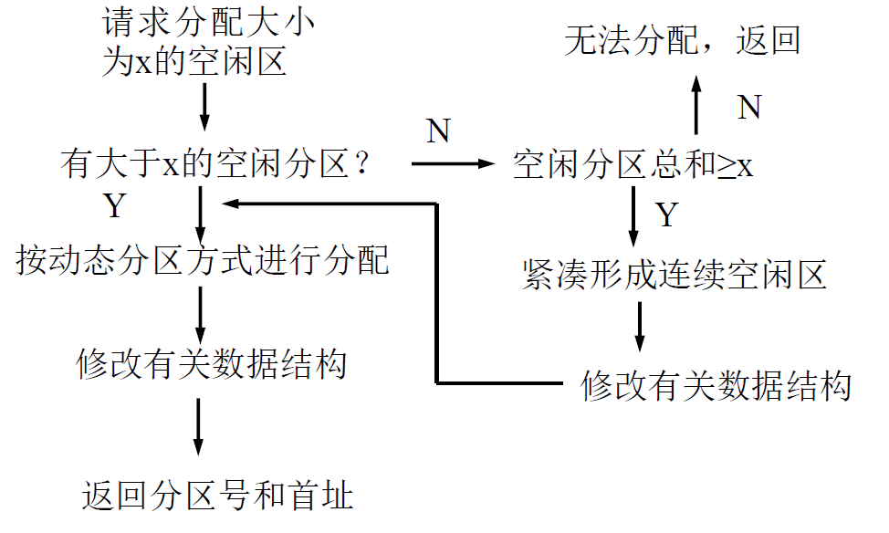

### 伙伴系统(Buddy System)

固定分区存储管理限制了内存中的进程数，动态分区的拼接需要大量时间，而伙伴系统是一种较为实用的 **动态存储管理办法**。

伙伴系统采用 **伙伴算法对空闲内存进行管理**。该方法通过不断对分大的空闲存储块来获得小的空闲存储块。**当内存块释放时，应尽可能合并空闲块**。

如果参与分配的 $2^m$ 个单元从 $a$ 开始，则长度为 $2^K$，开始地址为 $d$ 的块，其伙伴的开始地址为：
$$
Buddy(k, d)=\left\{
	\begin{align}
	&d+2^k,&if(d-a)\%2^{k+1}= 0\\
	&d-2^k,&if(d-a)\%2^{k+1}= 2^k\\
	\end{align}
\right.
$$
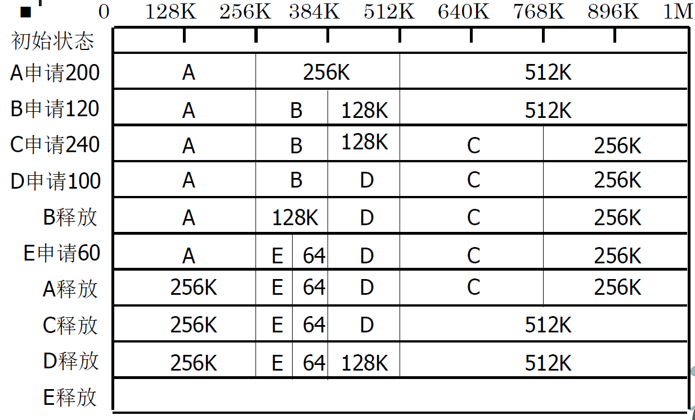

- 分配和回收时需要对伙伴进行分拆及合并
- 存储空间有浪费

|   操作   |                  说明                  |
| :------: | :------------------------------------: |
| **分割** |  将一个大块均分为两个小块（称为伙伴）  |
| **合并** |   两个连续的空闲伙伴块合并为更大的块   |
| **查找** | 根据请求大小找到最小可用块，或向上分割 |


####  数据结构设计

```c
#include <stdio.h>
#include <stdlib.h>
#include <math.h>

#define MAX_ORDER 10   // 最大块级别：2^10 = 1024
#define MIN_SIZE  1    // 最小块大小（例如1KB）

// 内存块结构体
typedef struct block {
    int size;          // 块大小（2^order）
    int is_free;       // 是否空闲（1=空闲，0=占用）
    struct block *prev;// 前驱块
    struct block *next;// 后继块
} Block;

// 伙伴系统管理器
Block *free_lists[MAX_ORDER + 1]; // 空闲链表数组，索引为order
```

- **free_lists 数组**：每个元素指向对应 order 的空闲块链表头。
- **Block 结构体**：维护块的大小、状态和链表指针。

#### 初始化伙伴系统

```c
// 初始化内存池（模拟一块大内存）
void init_buddy_system() {
    // 初始时只有一个最大的块（2^MAX_ORDER）
    Block *initial_block = (Block*)malloc(sizeof(Block));
    initial_block->size = (int)pow(2, MAX_ORDER);
    initial_block->is_free = 1;
    initial_block->prev = NULL;
    initial_block->next = NULL;
    
    // 将最大块加入最高order的链表
    free_lists[MAX_ORDER] = initial_block;
    
    // 其他order链表初始化为空
    for (int i = 0; i < MAX_ORDER; i++) {
        free_lists[i] = NULL;
    }
}
```

#### 分配内存

```c
// 分配内存（返回分配后的块指针）
Block* allocate(int size) {
    // 计算需要的最小order
    int order = 0;
    while ((int)pow(2, order) < size) {
        order++;
    }
    
    // 从当前order向上查找可用块
    int current_order = order;
    while (current_order <= MAX_ORDER && !free_lists[current_order]) {
        current_order++;
    }
    
    if (current_order > MAX_ORDER) {
        return NULL; // 内存不足
    }
    
    // 取出当前块
    Block *block = free_lists[current_order];
    block->is_free = 0;
    
    // 从链表中移除
    if (block->prev) {
        block->prev->next = block->next;
    } else {
        free_lists[current_order] = block->next;
    }
    if (block->next) {
        block->next->prev = block->prev;
    }
    
    // 递归分割直到达到目标order
    while (current_order > order) {
        current_order--;
        int split_size = (int)pow(2, current_order);
        
        // 创建伙伴块
        Block *buddy = (Block*)((char*)block + split_size);
        buddy->size = split_size;
        buddy->is_free = 1;
        buddy->prev = NULL;
        buddy->next = NULL;
        
        // 将分割后的块加入下级链表
        if (free_lists[current_order]) {
            buddy->next = free_lists[current_order];
            free_lists[current_order]->prev = buddy;
        }
        free_lists[current_order] = buddy;
        
        // 更新原块大小
        block->size = split_size;
    }
    
    return block;
}
```

#### 释放内存（合并伙伴）

```c
// 释放内存并合并伙伴
void deallocate(Block *block) {
    block->is_free = 1;
    int current_order = (int)(log(block->size) / log(2));
    
    // 递归合并伙伴
    while (current_order < MAX_ORDER) {
        // 计算伙伴地址
        Block *buddy = (Block*)((size_t)block ^ (1 << current_order));
        
        // 检查伙伴是否空闲且同大小
        if (!buddy->is_free || buddy->size != block->size) {
            break;
        }
        
        // 从链表移除伙伴
        if (buddy->prev) {
            buddy->prev->next = buddy->next;
        } else {
            free_lists[current_order] = buddy->next;
        }
        if (buddy->next) {
            buddy->next->prev = buddy->prev;
        }
        
        // 合并块和伙伴
        if (block > buddy) {
            block = buddy;
        }
        block->size *= 2;
        current_order++;
    }
    
    // 将合并后的块加入链表
    block->prev = NULL;
    block->next = free_lists[current_order];
    if (free_lists[current_order]) {
        free_lists[current_order]->prev = block;
    }
    free_lists[current_order] = block;
}
```

#### 完整代码及测试

```c
#include <stdio.h>
#include <stdlib.h>
#include <math.h>

#define MAX_ORDER 10   // 最大块级别：2^10 = 1024
#define MIN_SIZE  1    // 最小块大小（例如1KB）

typedef struct block {
    int size;
    int is_free;
    struct block *prev;
    struct block *next;
} Block;

Block *free_lists[MAX_ORDER + 1];

void init_buddy_system() { /* 同上 */ }
Block* allocate(int size) { /* 同上 */ }
void deallocate(Block *block) { /* 同上 */ }

// 打印所有空闲链表状态
void print_free_lists() {
    for (int i = 0; i <= MAX_ORDER; i++) {
        printf("Order %d (size %d): ", i, (int)pow(2, i));
        Block *current = free_lists[i];
        while (current) {
            printf("[%p:%d] -> ", (void*)current, current->size);
            current = current->next;
        }
        printf("NULL\n");
    }
    printf("------------------------\n");
}

int main() {
    init_buddy_system();
    print_free_lists();
    
    // 测试分配
    Block *a = allocate(100);  // 需要128 (2^7)
    printf("Allocated block A (size 128)\n");
    print_free_lists();
    
    Block *b = allocate(300);  // 需要512 (2^9)
    printf("Allocated block B (size 512)\n");
    print_free_lists();
    
    // 测试释放与合并
    deallocate(a);
    printf("Deallocated block A\n");
    print_free_lists();
    
    deallocate(b);
    printf("Deallocated block B\n");
    print_free_lists();
    
    return 0;
}
```

#### 代码说明

##### 核心函数

- **`allocate()`**：  
  通过分割大块满足需求，递归调整链表。
- **`deallocate()`**：  
  通过异或运算快速找到伙伴地址，递归合并空闲块。

##### 测试输出示例

```
Order 0 (size 1): NULL
...
Order 10 (size 1024): [0x55a1f12a4260:1024] -> NULL
------------------------
Allocated block A (size 128)
Order 7 (size 128): [0x55a1f12a4360:128] -> [0x55a1f12a42e0:128] -> ... 
------------------------
Deallocated block A
Order 10 (size 1024): [0x55a1f12a4260:1024] -> NULL
------------------------
```

##### 运行方法

```bash
gcc -o buddy_system buddy_system.c -lm
./buddy_system
```

##### 关键点总结

- **伙伴地址计算**：利用异或运算快速定位伙伴块地址。
- **链表管理**：每个 order 级别维护一个双向链表。
- **递归合并**：释放时向上合并，直到无法合并为止。

通过这个实现，可以清晰理解伙伴系统如何高效管理动态内存分配与释放。

### 非连续分配方式

#### 分页(Paging)

分区管理中存在碎片，而紧凑技术开销太大，若能 **取消作业对存储区的连续性** 要求，则能较好地解决碎片问题。分页存储管理就是基于这一思想提出的。

**分页通常为绝大多数操作系统采用**

实现分页的基本方法：将 **物理内存** 分为固定大小的块，称为 **帧**（或称 **物理块**、**页框**、**Page frame**）将 **逻辑内存** 也分成同样大小的块，称为 **页**。

在为 **进程** 分配存储空间时，总是以 **块** 为单位来分配，可以将进程中的某一页存放到主存的某一空闲块中。

##### 分页的逻辑地址结构

分页存储管理系统中逻辑地址由 **页号(Page number)** 和 **页内位移(Page offset )** 组成 。

- 若 $A$ 是逻辑地址，$L$ 是页面大小，则：
  - 页号：$P=\lceil A/L\rceil$
  - 页内位移：$W=A\%L$

##### 页表(page table)

为了在内存中找到进程的每个页面所对应的物理块，系统为每个进程建立一张 **页面映象表**，简称 **页表**。

**页表** 一般存放在 **内存** 中。也可以在页表中设置存取控制字段，以实现存储保护。

1. **实现虚拟地址到物理地址的转换**
   - **核心功能**：将程序使用的虚拟地址（连续逻辑空间）映射到实际物理内存地址（可能离散的物理空间）。
2. **支持内存隔离与保护**
   - **权限控制：** 通过页表项（Page Table Entry, PTE）中的权限位（如读/写/执行），限制进程对内存的非法访问。
     - **示例**：只读页面的写入操作会触发硬件异常（如段错误）。
   - **进程隔离**：每个进程拥有独立页表，确保其内存空间不被其他进程篡改。
3. **实现虚拟内存（按需分页）**
   - **缺页处理**：页表项中的“存在位”（Present Bit）标识页面是否在物理内存中。若访问未加载的页面，触发缺页中断，由操作系统从磁盘加载。
   - **示例**：程序首次访问某代码段时，操作系统将其从磁盘调入内存并更新页表。
4. **支持内存共享**
   - **共享映射**：多个进程的页表可指向同一物理页，实现代码或数据的共享（如动态链接库）。
5. **优化物理内存使用**
   - **页面置换支持**：页表项中的“访问位”（Accessed Bit）和“修改位”（Dirty Bit）为页面置换算法（如 LRU）提供决策依据。
     - **示例**：LRU 算法优先换出长时间未访问的页面。
6. **减少内存碎片**
   - **分页机制**：将内存划分为固定大小的页（如 4KB），消除外部碎片（物理内存以页为单位分配）。
7. **支持多级地址空间**
   - **多级页表**：通过分级页表（如 x86-64 的四级页表）压缩页表内存占用，仅存储实际使用的部分。

页面的大小应适中。若页面太大，以至和一般进程大小相差无几，则页面分配退化为：分区分配，同时页内碎片也较大。若页面 **太小**，虽然可 **减少页内碎片**，但会导致 **页表增长**。

##### 存储分块表

**存储分块表** 用来记录 **内存** 中 **各物理块的使用情况** 及 **未分配物理块** 总数。也称为 **帧表（frame table）**。

- **位示图：** 利用 **二进制** 的一位表示 **一个物理块的状态**，1 表示已分配， 0 表示未分配。**所有物理块状态位的集合构成位示图**。

  > 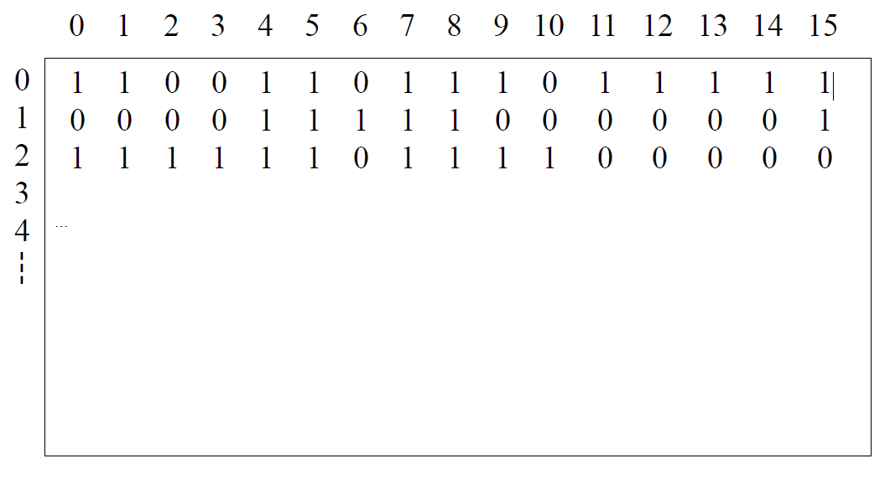
  >
  > 位示图占用的存储空间：`物理块数 /8` （字节)
  >
  > #### 行号与列号的含义
  >
  > - 行号：
  >   - **逻辑意义**：标识物理块的分组。
  >   - **示例**：行号 `0` 表示物理块号 `0-15`，行号 `1` 表示块号 `16-31`。
  > - 列号：
  >   - **逻辑意义**：标识组内具体物理块的位置。
  >   - **示例**：行号 `0` 的列号 `3` 对应物理块号 `3`，行号 `1` 的列号 `5` 对应块号 `21`（`1×16 + 5`）。
  >
  > #### 作用
  >
  > - **快速定位空闲块**：
  >   通过遍历位示图，找到值为 `0` 的位，即可确定对应的空闲物理块号。
  >   **示例**：行 2 列 2（块 34）为 `0`，表示块 34 可用。
  > - **高效管理物理块：**
  >   - 分配时，将 `0` 改为 `1`；释放时，将 `1` 改为 `0`。
  >   - 通过行号和列号直接计算物理块号，时间复杂度为 *O*(1)。

- **空闲存储块链：** 将所有的 **空闲存储块** 用 **链表** 链接起来，利用空闲物理块中的单元存放指向下一个物理块的指针。

  > 
  >
  > ### 分配前的初始状态
  >
  > 1. **空闲帧列表结构：**
  >    - 当前可用帧号序列为：14 → 13 → 18 → 20 → 15（图示采用链表结构）
  >    - 内存区域显示这些帧都处于未分配状态
  > 2. **新进程准备状态：**
  >    - 页表初始为空（未建立映射）
  >    - 进程需要申请 4 个页框（page0-page3）
  >
  > ### 分配过程核心步骤
  >
  > 1. **帧选取机制：**
  >    - 操作系统从空闲帧列表头部顺序取出所需帧
  >    - 按照请求顺序分配：14→13→18→20（前 4 个可用帧）
  > 2. **映射关系建立：**
  >    - page0 → frame14（逻辑页 0 映射到物理帧 14）
  >    - page1 → frame13
  >    - page2 → frame18
  >    - page3 → frame20
  > 3. **数据结构更新：**
  >    - 空闲列表删除已分配的 4 个帧
  >    - 剩余空闲帧仅剩 15 号帧
  >    - 新进程页表完成 4 个有效表项

- **页面分配：** 计算进程 **所需页面数**，然后在 **请求表** 中登记 **进程号**、请求 **页面数** 等。如 **存储分块表** 中有足够的空闲块可供进程使用，则在系统中取得页表始址，并在页表中登记页号及其对应的物理块号，否则无法分配。
- **页面回收：** 将存储分块表中相应的物理块改为 **未分配**，或将回收块加入到空闲存储块链中，并 **释放页表**，修改请求表中的页表始址及状态。

##### 地址变换

**地址变换机构** 的任务是 **实现逻辑地址到物理地址的变换**，即将 **逻辑地址** 中的 **页号** 转换为 **内存** 中的 **物理块号**。

**页表** 通常存放在 **内存** 中，为了实现方便，系统中设置了一个 **页表寄存器** 存放 **页表在内存的起始地址** 和 **页表的长度** 。

进程未执行时，**页表的起始地址和长度存放在 PCB** 中。当进程 **执行** 时，才将页表始址和长度 **存入页表寄存器** 中 。

分页地址变换机构自动地将逻辑地址分为 **页号和页内位移**；将页号与页表长度进行比较，如果 **页号超过了页表长度**，则表示本次所访问的地址已超越进程的地址空间，系统产生 **地址越界中断**；若未出现越界，则由页表始址和页号计算出相应页表项的位置，从中得到该页的物理块号；将 **物理块号与逻辑地址中的页内位移** 拼接在一起，就形成了访问主存的物理地址。

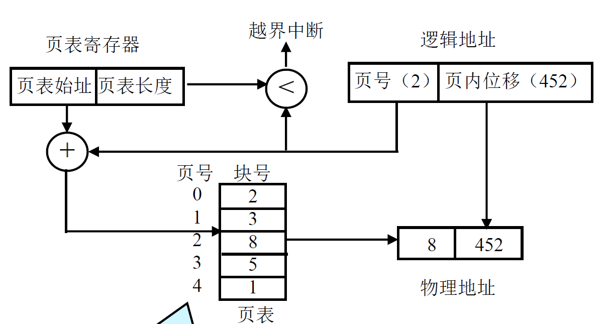

> **案例背景**（基于图示 b 分配后状态）：
>
> 1. 新进程页表已建立（内存起始地址 0x1000）
>    - page0 → frame14
>    - page1 → frame13
>    - page2 → frame18
>    - page3 → frame20
> 2. 页表寄存器当前内容：
>    - 起始地址 = 0x1000（页表在内存的位置）
>    - 长度 = 4（进程有 4 个页）
>
> ---
> **地址转换过程演示**（假设访问逻辑地址 0x0320）：
>
> 1. **分解逻辑地址**
>    - 逻辑地址 = 0x0320（十六进制）
>    - 假设系统页大小 = 1KB（0x400 字节）
>    ```
>    ┌───────────┬────────────┐
>    │ 页号(3位) │ 页内位移(10位) │
>    └───────────┴────────────┘
>    ```
>    - **页号** = 0x0320 >> 10 = **0x0**（即 page0）
>    - **页内位移** = 0x0320 & 0x3FF = **0x320**
>
> 2. **越界检查**
>    - 对比页号 0x0（十进制 0）与页表长度 4
>    - 0 < 4 → 合法访问
>
> 3. **查找页表项**
>    - 页表起始地址 = 0x1000
>    - 页表项大小假设为 4 字节（常见设计）
>    ```
>    页表项地址 = 0x1000 + (0x0 × 4) = 0x1000
>    ```
>    - 从内存 0x1000 处读取页表项 → **物理块号 14**（图示中 page0 对应 frame14）
>
> 4. **拼接物理地址**
>    - 物理块号 14 → 物理地址基址 = 14 × 0x400 = **0x3800**
>    - 页内位移 = 0x320
>    ```
>    ┌───────────────┬────────────┐
>    │ 物理块基址0x3800 │ 位移0x320 │
>    └───────────────┴────────────┘
>    ```
>    - **最终物理地址** = 0x3800 + 0x320 = **0x3B20**
>

##### 具有快表的地址变换机构

为了提高地址变换速度，可在地址变换机构中增设一个具有 **并行查找能力** 的 **高速缓冲存储器**，又称 **联想存储器 (associative memory)** 或 **快表**，用以存放当前访问的那些页表项。

**TLB(translation look-aside buffer)：** 转换后备缓冲区，即快表。

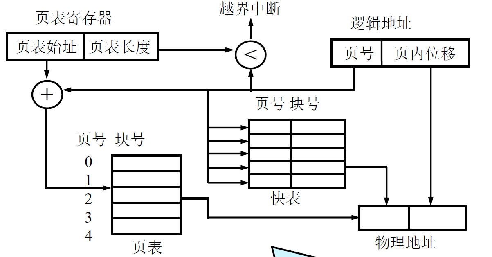

地址变换机构自动将页号与快表中的所有页号进行并行比较，若其中有与此匹配的页号，则取出该页对应的块号，与页内地址拼接形成物理地址。若页号不在快表中，则再到 **主存页表中取出物理块号**，与页内地址拼接形成物理地址。同时还应将这次所查到的页表项存入快表中，若快表已满，则必须 **按某种原则淘汰** 出一个表项以腾出位置。

由于成本关系，快表大小一般由 **64-1024 个表项** 组成。由于 **局部性原理**，联想存储器的命中率可达 80%-90%。假设内存一次存取时间是 m ，联想寄存器的
查找时间是 n ，命中率为 p，则有效存取时间（假定忽略快表更新时间）：
$$
EAT = p*(n+m)+(1-p)(2m+n)
$$

> ### 为什么 TLB 不能完全替代页表？
>
> 1. **容量限制**：
>    - TLB 通常只有 **64-1024 个表项**，无法缓存所有页表项。
>    - 页表可能包含数百万项（例如 4GB 内存，页大小 4KB → 1M 页）。
> 2. **成本与速度的权衡**：
>    - TLB 使用 **高速 SRAM** 制造，成本高昂。
>    - 扩大 TLB 会显著增加芯片面积和功耗。
> 3. **冷启动问题**：
>    - 进程切换后 TLB 需要 **刷新**（或标记为无效）。
>    - 新进程的初始访问必然触发 TLB 未命中。

##### 存储保护

- 分页存储管理采用两种方式保护内存：
  - **地址越界保护：** 页表长度与逻辑地址中的页号比较
  - **存取控制保护：** 在页表中增加 **保护位**

|   **特性**   |       Valid-Invalid 位       |         存取控制保护位         |
| :----------: | :--------------------------: | :----------------------------: |
| **核心功能** | 管理页的存在性（是否在内存） | 控制页的访问权限（读/写/执行） |
| **触发事件** |    缺页中断（Page Fault）    |  保护错误（Protection Fault）  |
| **硬件支持** |  由 MMU（内存管理单元）检测  |          由 MMU 检测           |
| **软件处理** |  操作系统加载页面或调整内存  |   操作系统终止进程或处理异常   |
| **典型场景** |   虚拟内存的动态分配与换页   |     内存隔离、防止越权访问     |

###### Valid-Invalid 位

- **有效性标识：该位用于标记页表项是否有效。**
  - **Valid（有效）**：表示该页当前已加载到物理内存中，进程可以合法访问。
  - **Invalid（无效）**：表示该页不存在于物理内存中（可能被换出到外存，或尚未分配）。
- **触发机制：**
  - 当进程访问标记为 `invalid` 的页时，会触发 **缺页中断**（Page Fault），操作系统需将该页从磁盘调入内存，并更新页表项为 `valid`。
- **示例场景：**
  - 进程首次访问某页时，页表项初始化为 `invalid`，操作系统按需加载该页到内存。
  - 内存不足时，操作系统将某些页换出到磁盘，标记为 `invalid`。

- **按需加载**：支持虚拟内存的动态分配，减少物理内存的浪费。
- **内存管理**：配合缺页中断机制实现页面的换入换出。

###### 存取控制保护位

- **权限控制：保护位用于定义对页的访问权限**，例如：
  - **读（Read）**：允许读取页内容。
  - **写（Write）**：允许修改页内容。
  - **执行（Execute）**：允许将页内容作为代码执行。
- **触发机制：**
  - 当进程试图以非法权限访问页时（如尝试写入只读页），会触发 **保护错误**（Protection Fault），操作系统可能终止进程或抛出异常。
- **示例场景：**
  - 代码段（`.text`）通常标记为 **只读+可执行**，防止程序意外修改自身代码。
  - 只读数据段（`.rodata`）禁止写入，保护常量数据。

- **安全性**：防止进程越权访问内存（如修改其他进程或内核数据）。
- **稳定性**：避免程序错误导致内存损坏（如栈溢出覆盖代码段）。

##### 共享页 Shared Pages

分页的优点之一是可以 **共享公共代码**

- 如果代码是 **可重入代码**，则 **可以共享**
  - 又称为 **纯代码**，是 **不能自我修改** 的代码，它在 **执行期间不会改变**
  - 因此两个或更多的进程可以在 **相同的时间执行相同的代码**
- **信息的共享** 是通过使 **多个进程页表项** 指向 **同一个物理块** 来实现的

##### 分级页表 Hierarchical Paging

现代计算机系统都支持 **非常大的逻辑地址空间**，在此情况下页表很大，显然不可能在内存中连续存放页表。分级页表也称为多级页表，层次页表。

如具有 32 位逻辑地址空间的系统，页面大小 4 KB，则页表可以有 1M 项 若每个页表项占 4 字节，则页表共需要 4 MB 内存空间。

- 用离散方式存储页表
- 仅将当前需要的部分页表项放在 **内存**，其余放在 **磁盘** 上，需要时调入。

下面特别介绍 **两级页表**

> ### 案例背景
> 1. **系统设计**：
>    - 逻辑地址总长度：32 位。
>    - **页大小**：4KB（即页内位移占 **12 位**）。
>    - **两级页表结构**：
>      - 一级页号（Page Directory Index）：**10 位**。
>      - 二级页号（Page Table Index）：**10 位**。
>      - 页内位移（Offset）：**12 位**。
>    - 逻辑地址格式：
>      ```
>      | 10 bits (一级页号) | 10 bits (二级页号) | 12 bits (页内位移) |
>      ```
>
> 2. **物理内存状态**（假设）：
>    - 进程的 **页目录（一级页表）** 起始物理地址：`0x8000`。
>    - 每个页表项（PTE）占 **4 字节**（32 位），用于存储物理页框号或控制位。
>
> 3. **目标逻辑地址**：`0x00401ABC`（十六进制）
>
> ### 步骤 1：拆分逻辑地址
> 将逻辑地址 `0x00401ABC` 转换为二进制（32 位）：
> ```
> 0000 0000 0100 0000 0001 1010 1011 1100
> ```
> 按两级页表结构拆分：
> - **一级页号**（前 10 位）：`0000 0000 01` → **0x001**（十进制 1）
> - **二级页号**（中间 10 位）：`00 0000 0001` → **0x001**（十进制 1）
> - **页内位移**（后 12 位）：`1010 1011 1100` → **0xABC**
>
>
> ### 步骤 2：查询一级页表（页目录）
> 1. **计算一级页表项地址**：
>    - 页目录起始地址：`0x8000`。
>    - 一级页号（0x001） × 页表项大小（4 字节）：
>      ```
>      0x8000 + (0x001 × 4) = 0x8004
>      ```
> 2. **读取一级页表项内容**：
>    - 从物理地址 `0x8004` 读取 4 字节数据 → 假设值为 `0x5000`。
>    - 解析：一级页表项指向 **二级页表的物理起始地址为 `0x5000`**。
>
>
> ### 步骤 3：查询二级页表
> 1. **计算二级页表项地址**：
>    - 二级页表起始地址：`0x5000`。
>    - 二级页号（0x001） × 页表项大小（4 字节）：
>      ```
>      0x5000 + (0x001 × 4) = 0x5004
>      ```
> 2. **读取二级页表项内容**：
>    - 从物理地址 `0x5004` 读取 4 字节数据 → 假设值为 `0x123`（物理页框号）。
>    - 解析：该页对应的物理页框号为 `0x123`（即物理页框起始地址为 `0x123000`，因为页大小为 4KB）。
>
>
> ### 步骤 4：生成物理地址
>
> - **物理页框基址**：`0x123000`（物理页框号 × 页大小）。
> - **页内位移**：`0xABC`。
> - **最终物理地址**：
>   ```
>   0x123000 + 0xABC = 0x123ABC
>   ```
>
> ### 关键机制解析
>
> #### **1. 为什么需要两级页表？**
> - **减少内存占用**：单级页表需要 \($2^{20}$\) 个表项（4MB 内存），而两级页表按需分配二级页表，节省内存。
> - **稀疏地址空间优化**：若进程仅使用部分虚拟地址，只需分配对应的二级页表。
>
> #### **2. 一级页号和二级页号的配合逻辑**
> - **一级页号**：定位到 **页目录项**（Page Directory Entry），找到二级页表的物理地址。
> - **二级页号**：在二级页表中定位到具体的 **页表项**（Page Table Entry），获取物理页框号。
>
> #### **3. 页表项中的控制位**
> - 每个页表项（一级和二级）包含控制位，例如：
>   - **Valid/Invalid**：是否在内存中。
>   - **Read/Write**：权限控制。
>   - **Accessed/Dirty**：用于页面替换算法。
>
> ### 两级页表查询流程图
>
> ```
> +----------------------+
> | 逻辑地址 (0x00401ABC) |
> +----------------------+
>           │
>           ▼
> +-------------------+
> | 拆分：一级页号=0x001 |
> |     二级页号=0x001    |
> |     位移=0xABC      |
> +-------------------+
>           │
>           ▼
> +-------------------+
> | 查询一级页表 (页目录) |
> | 起始地址=0x8000     |
> | 项地址=0x8000+1×4=0x8004 |
> | 读取值=0x5000      → 二级页表起始地址
> +-------------------+
>           │
>           ▼
> +-------------------+
> | 查询二级页表         |
> | 起始地址=0x5000     |
> | 项地址=0x5000+1×4=0x5004 |
> | 读取值=0x123       → 物理页框号
> +-------------------+
>           │
>           ▼
> +-------------------+
> | 生成物理地址         |
> | 0x123000 + 0xABC = 0x123ABC |
> +-------------------+
> ```
>
> ### 对比单级页表与两级页表
>
> | **特性**     | 单级页表                      | 两级页表                             |
> | ------------ | ----------------------------- | ------------------------------------ |
> | **内存占用** | 固定占用 $2^{20}×4B = 4MB$    | 按需分配，仅加载必要的二级页表       |
> | **适用场景** | 小地址空间（如 32 位系统）    | 大地址空间（如 64 位系统）或稀疏空间 |
> | **查询速度** | 1 次内存访问（假设 TLB 命中） | 2 次内存访问（未命中时需查两级页表） |
>
> ### 总结
>
> - **一级页号** 和 **二级页号** 的协作本质上是 **分层索引**：
>   1. 一级页号定位到二级页表的位置（类似书的目录）。
>   2. 二级页号定位到具体的物理页框（类似书的页码）。
> - 这种设计通过 **空间换时间**，大幅减少内存占用，但增加了地址转换的复杂度（需多次访存）。
> - 实际系统中常通过 **TLB（快表）** 缓存最近使用的页表项，显著减少访存次数。

##### 哈希页表 Hashed Page Tables

对于 64 位地址空间不建议使用多级页表，这是因为：

> ### 关键约束条件
> 1. **地址空间**：$2^{64}$（64 位逻辑地址）。
> 2. **页大小**：$4\text{KB} = 2^{12}\text{B}$ → **页内位移占 12 位**。
> 3. **页表项大小**：$8\text{B}$ → **每页可容纳页表项数**：
>    $$
>    \frac{2^{12}}{8} = 2^9 = 512 \text{项/页}
>    $$
> 4. **页号位数分配**：
>    - 总页号位数：$64 - 12 = 52\ \text{位}$。
>    - 每级页号位数：由每页容纳的页表项数决定 → **每级最多用 9 位**（因 $2^9 = 512$）
>
>
> ### 为何必须 6 级？
>
> 1. **覆盖所有页号位**：
>    - 前 5 级共分配 $5 \times 9 = 45 \text{位}$，剩余 $52 - 45 = 7 \text{位}$ 需第 6 级。
>    - 若仅用 5 级，剩余 $52 - 5 \times 9 = 7 \text{位}$ 无法通过单级覆盖（单级最多 9 位）。
>
> 2. **最高层页表必须占一页**：
>    - 若减少级数，最高层页表需覆盖更多页号位，导致页表大小超过一页。
>    - 例如：若用 5 级，最高层需覆盖 $52\ \text{位}$，则页表项数为 $2^{52}$，远超单页容量。
>
> ### 页表层级与地址划分
>
> 最终的 64 位逻辑地址划分如下：
> $$
> \underbrace{\text{9 位 | 9 位 | 9 位 | 9 位 | 9 位 | 7 位}}_{\text{6 级页号}} \quad \underbrace{\text{12 位}}_{\text{页内位移}}
> $$
>
> ### 总结
>
> - **最少需要 6 级页表**：前 5 级各用 9 位，第 6 级用 7 位。
> - **最高层页表占一页**：确保页表管理的可行性（避免无限递归）。
> - **设计权衡**：通过多级页表减少内存占用（仅需加载必要的页表），但代价是地址转换复杂度增加（需多次访存）。实际系统中，通过 **TLB（快表）** 和 **大页机制** 优化性能。

处理超过 **32 位地址空间** 的常用方法是使用 **哈希页表**。

虚拟页号被散列到一个页表中，页表的每个表项包含散列到相同地址的链指针。

每个元素包含：**虚拟页号、帧号、指针**

算法按如下方式工作：用虚拟地址中的页号转换到哈希表中，用虚拟页号与链表中的每个元素的第一个域比较，如果匹配成功，相应的帧号用来形成物理地址，否则对下一节点进行比较以寻找匹配的页号。

*其实就是一个哈希表，每个表项都是一个数组，所以进行哈希映射后要对该数组进行逐个访问*

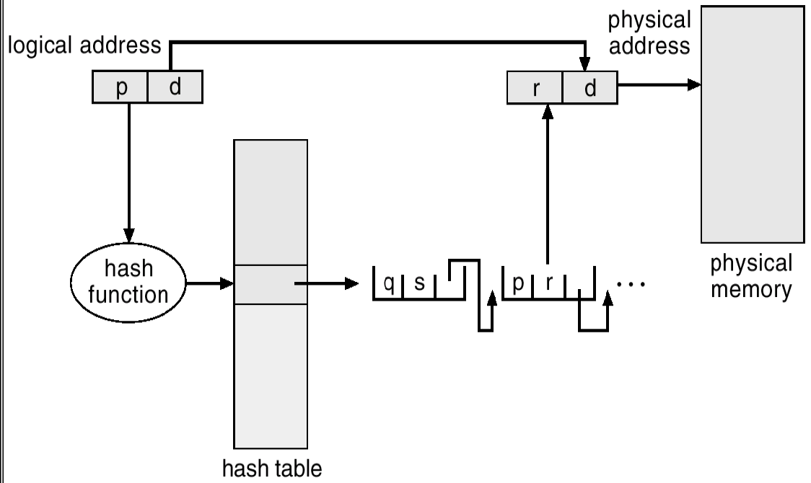


##### 反向页表 Inverted Page Tables(IPT)

现代操作系统一般允许大逻辑地址空间，这使得页表太大，为解决**页表占用大量存储空间**的问题，引入了反向页表。反向页表为每个物理块设置一个页表项，并将它们**按物理块号大小排序**，表项内容为**页号及其隶属进程的标识号**。

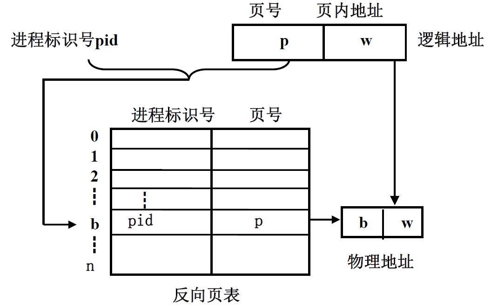

利用**进程标识号及页号**检索反向页表，若找到相应的页表项，则将其物理块号与页内地址拼接；否则请求调入该进程相应页，**在无调页功能的系统中则出错**。必须为每个进程建立一张**传统页表并存放在外存**中，当所访问页不在内存时使用这张页表。页表中包含各页在外存的地址。

**反向页表（Inverted Page Table）** 与传统页表的本质区别在于：

- **传统页表**：每个进程一个，映射 **虚拟页号 → 物理帧号**。
- **反向页表**：整个系统一个，映射 **物理帧号 → (进程ID, 虚拟页号)**。

**设计动机**：

- **减少内存占用**：对于物理内存较大的系统，反向页表条目数仅等于物理帧数（例如 1GB 内存仅需 256K 项），而传统页表需要覆盖所有虚拟地址空间（如 64 位系统需要 252 项）。
- **适用于共享内存**：直接记录物理帧的使用情况，便于跨进程管理。

> ### 反向页表的工作流程
>
> 假设进程 **PID=123** 访问虚拟地址 **0xABCDE000**，页大小为 **4KB**：
>
> #### **步骤 1：地址分解**
>
> - **虚拟页号（VPN）**：`0xABCDE`（高 20 位）。
> - **页内位移（Offset）**：`0x000`（低 12 位）。
>
> #### **步骤 2：反向页表查询**
>
> - **输入参数**：`(PID=123, VPN=0xABCDE)`。
>
> - 遍历反向页表，查找满足以下条件的条目：
>
>   ```markdown
>   存在条目 Entry，使得 Entry.PID == 123 且 Entry.VPN == 0xABCDE
>   ```
>
> - 结果：
>
>   - **命中** → 得到物理帧号（PFN），拼接物理地址：`PFN << 12 | Offset`。
>   - **未命中** → 触发缺页中断（Page Fault）。
>
> #### **步骤 3：缺页处理（依赖传统页表）**
>
> 1. **查询传统页表**：
>
>    - 根据当前进程 PID=123，从外存加载其传统页表。
>    - 找到虚拟页 `0xABCDE` 对应的外存位置（如磁盘扇区 `Sector 0x1000`）。
>
> 2. **分配物理帧**：
>
>    - 选择空闲物理帧（如 PFN=0x123）。
>    - 将外存数据加载到 PFN=0x123。
>
> 3. **更新反向页表**：
>
>    ```plaintext
>    | PFN  | PID  | VPN     |
>    |------|------|---------|
>    |0x123 | 123  |0xABCDE  |
>    ```
>
> 4. **完成地址转换**：
>
>    - 物理地址 = `0x123 << 12 | 0x000 = 0x123000`。

|   **指标**   |             反向页表优势             |             反向页表劣势             |
| :----------: | :----------------------------------: | :----------------------------------: |
| **内存占用** | 仅需物理帧数的条目（远小于传统页表） | 查询复杂度高（需遍历或哈希冲突处理） |
| **缺页处理** |          物理帧分配直接可见          |    依赖外存传统页表，增加缺页延迟    |
| **适用场景** |   物理内存远小于虚拟地址空间的系统   |  频繁缺页或进程数极多的系统性能下降  |

解决办法：

- 将常用页表项存入快表

- 用散列函数存放反向页表

#### 覆盖与交换技术

覆盖与交换技术是在**多道程序环境**下用来扩充内存的方法 。

|  **区别点**  |                      **覆盖技术**                      |                 **交换技术**                 |
| :----------: | :----------------------------------------------------: | :------------------------------------------: |
| **用户参与** | 需要程序员手动划分作业的覆盖结构，依赖系统存储结构知识 |       由操作系统自动完成，无需用户干预       |
| **作用范围** |        在**同一作业内部**进行不同模块的覆盖替换        | 在**不同作业（或进程）之间**进行内存数据交换 |
| **应用时期** |       早期操作系统（如单道批处理系统）的典型技术       |   现代操作系统仍广泛使用（如虚拟内存管理）   |

##### 覆盖技术

所谓覆盖技术就是把一个**大程序划分为一系列覆盖**，**每个覆盖是一个相对独立的程序单位**；把程序执行时**不要求同时**装入内存的覆盖组成一组，称为**覆盖段**；将一个覆盖段分配到**同一个存储区**中，这个存储区称为**覆盖区**。覆盖区的大小由**覆盖段中最大的覆盖**来确定。

> ### 结合图示的树状结构解析（逐层拆解覆盖技术设计逻辑）
>
> #### 树状结构的核心含义
>
> 树状结构表示 **程序的模块调用关系** 和 **覆盖段划分策略**。每个节点代表一个程序模块，层级关系指示 **模块的依赖性和执行顺序**。
>
> - **树状层级的本质是内存分配规则**
>
>   - **覆盖段划分原则**：将**不会同时执行的模块**归入同一覆盖段，共享同一内存区域。
>
>   - **层级关系的实际含义**：表示**模块间的可能调用路径**，但**不强制要求调用顺序**。
>
> ### 步骤1：理解树状结构的组成
>
> ```
>           A（20KB）
>          /      \
>        B（50KB） C（30KB）
>         |        /     \
>         F（30KB）D（20KB） E（40KB）
> ```
> - **根节点A**：主控模块（必须常驻内存）。
> - **一级子节点B、C**：主功能模块，属于同一覆盖段（不能同时运行）。
> - **二级子节点F、D、E**：细分功能模块，属于另一覆盖段。
>
> ### 步骤2：树状结构与内存覆盖区的映射
>
> 根据右侧内存分区图：
> ```
> 内存布局：
> +------------------+
> | 常驻区（20KB）   | → A
> +------------------+
> | 覆盖区0（50KB）  | → B或C（同一覆盖段）
> +------------------+
> | 覆盖区1（40KB）  | → D、E或F（同一覆盖段）
> +------------------+
> 总内存：110KB
> ```
> - **覆盖段划分规则**：
>   - **覆盖段1**：B和C → 最大模块50KB（B），故覆盖区0需50KB。
>   - **覆盖段2**：D、E、F → 最大模块40KB（E），故覆盖区1需40KB。
>
> ### 步骤3：执行流程与覆盖区加载示例
>
> 1. **场景1：执行模块B的流程**：
>    - **覆盖区0**加载B（50KB） → 覆盖区1加载F（30KB）。
>    - **内存占用**：20KB（A） + 50KB + 30KB = **100KB**。
>    - **树状路径**：`A → B → F`（需同时占用覆盖区0和覆盖区1）。
>
> 2. **场景2：执行模块C的流程**：
>    - **覆盖区0**加载C（30KB） → 覆盖区1加载E（40KB）。
>    - **内存占用**：20KB（A） + 30KB + 40KB = **90KB**。
>    - **树状路径**：`A → C → E`。
>
> ### 关键设计逻辑
>
> #### **1. 树状层级决定覆盖段划分**
> - **同级节点互斥**：B和C在同一层级且属于同一覆盖段 → 执行时二选一。
> - **跨层级调用需占用不同覆盖区**：B调用F时，B在覆盖区0，F在覆盖区1。
>
> #### **2. 覆盖区大小由最大模块决定**
> | 覆盖段           | 模块及大小                | 覆盖区大小 |
> | ---------------- | ------------------------- | ---------- |
> | 覆盖段1（B,C）   | B(50KB)、C(30KB)          | 50KB       |
> | 覆盖段2（D,E,F） | D(20KB)、E(40KB)、F(30KB) | 40KB       |
>
> ```markdown
> 覆盖段重组：
> - 覆盖段1：B、D、E → 最大模块B(50KB) → 覆盖区0=50KB。
> - 覆盖段2：F、C → 最大模块C(30KB) → 覆盖区1=30KB。
> ```
>
> - **总内存**：20+50+30=100KB（节省10KB）。


##### 交换技术

在多道程序环境下，一方面内存中**存在一些阻塞进程占据大量的存储空间**；另一方面外存上有许多作业**因无空闲内存而不能进入内存运行**。为此引入了交换。

交换是指将**内存中暂时不用的程序及数据换出到外存中**，以腾出足够的内存空间，**再将已具备运行条件的进程或进程所需的程序或数据从外存换入内存**中。

例如，低优先级的进程被换出，这样高优先级的进程可以被装入和执行。这种交换有时称为**滚出、滚入**。

交换空间设置在**外存交换区**中，交换空间管理的主要目标是**提高进程换入、换出速度。**交换空间采用**连续分配方式**，使用与动态分区分配类似的数据结构和分配回收算法。

- **进程的换出：**先选择换出进程（阻塞、优先级低、驻留时间长），再申请对换空间，然后启动磁盘写，若成功则可释放其内存空间并修改数据结构。
- **进程换入：**先选择换入进程（就绪、换出时间长），再申请内存空间，然后启动磁盘读。


#### 分段 Segmentation

由于分页按物理单位进行，没有考虑**程序段的逻辑完整性**，给程序段的共享和保护带来不便，另外**动态链接及段的动态增长也要求以逻辑上完整的程序段**为单位管理。

在分段存储管理系统中，作业的地址空间由若干个逻辑分段组成，每个分段是**一组逻辑意义相对完整的信息集合**，每个分段都有自己的名字，每个分段都从 0 开始编址并采用一段连续的地址空间。

在进行存储分配时，以段为单位分配内存，**每段分配一个连续的内存区**，但**各段之间不要求连续**

**作业的地址空间是二维的**，作业的地址空间分为多段 每段都从 0 开始编址，故地址是二维的。

最多能够分多少段，每段最大长度是多少，是靠分段系统的逻辑地址结构中，段号和段内位移占的位数来决定的。

|     **区别点**     |                         **分页管理**                         |                         **分段管理**                         |
| :----------------: | :----------------------------------------------------------: | :----------------------------------------------------------: |
|    **管理目标**    | **物理单位**，减少内存碎片、提高内存利用率，服务于系统管理需求 | **逻辑单位**，包含一组意义完整的信息，服务于用户需求（如模块化、共享、保护） |
| **单位大小及划分** | 页大小**固定**，由系统（硬件）决定；逻辑地址划分为**页号+页内地址** | 段长度**不固定**，由用户程序逻辑决定，编译时根据信息性质（如代码、数据）划分 |
|    **地址结构**    |           **一维地址空间**（仅需单一地址即可定位）           | **二维地址空间**（需提供**段名+段内偏移**，体现逻辑独立性）  |
|     **灵活性**     |         页面对用户透明，系统自动划分，对程序员不可见         |      段显式暴露给用户，程序员可感知并控制段的划分与访问      |
|    **用户参与**    |          无需用户参与，由操作系统和硬件完成地址转换          |         需要用户（或编译器）在程序中定义逻辑段的划分         |

- **分页管理**以物理效率为核心，通过固定大小的页实现内存高效利用，但割裂了程序的逻辑结构；
- **分段管理**以用户需求为核心，通过逻辑段反映程序结构（如代码、数据、堆栈），更贴近程序设计思维，但易产生外部碎片。
- **地址维度差异**是重要标志：分页地址只需单一线性的地址值，而分段地址需通过段名（或段号）与段内偏移共同定位。

**分段保护**的方法有：

- **地址越界保护：**段号与段表长度的比较，段内位移与段长的比较
- **存取控制保护：**设置存取权限，访问段时判断访问类型与存取权限是否相符

> 分段系统的内存管理主要通过以下方法实现，核心目标是**管理逻辑段的内存分配与回收，并解决碎片问题**
>
> ### 动态分区分配
>
> - **按需分配**：根据每个段的实际长度（逻辑单元大小）动态分配内存空间。
> - **分配方式：**
>   - **首次适应（First Fit）**：从空闲分区链中找到第一个满足段长度的分区。
>   - **最佳适应（Best Fit）**：找到与段长度最接近的空闲分区，减少浪费。
>   - **最差适应（Worst Fit）**：选择最大的空闲分区分配给段，避免产生过多小碎片。
> - **特点：**
>   - 每个段占用**连续内存空间**，但不同段可分布在内存的不同区域。
>   - 产生**外部碎片**（段之间的空闲内存无法被利用）。
>
> ### 段表与地址转换
>
> - **段表（Segment Table）：**记录每个段的基址（内存起始地址）和段长。
>   - 逻辑地址由**段号（Segment ID）+ 段内偏移（Offset）**组成。
>   - 通过段号查找段表，验证偏移是否超过段长（越界保护），再计算物理地址。
> - **硬件支持**：需要**段基址寄存器**和**段长寄存器**实现快速地址转换与保护。
>
> ### 碎片处理技术
>
> - **紧缩（Compaction）：**
>   - 移动内存中的段，合并外部碎片，形成连续大块空闲内存。
>   - 需暂停进程运行，且地址重定位开销较大。
> - **结合分页（段页式管理）：**
>   - 现代系统常将分段与分页结合（如Linux的段页式管理）。
>   - 先分段（逻辑划分），再将每段分页（物理划分），避免外部碎片。
>
> ### 共享与保护机制
>
> - **共享段：**
>   - 多个进程的段表可指向同一段基址（如共享代码库）。
> - **保护机制：**
>   - 通过段长限制偏移范围（防止越界访问）。
>   - 设置段权限位（如只读、可执行等）。
>
> ### 分段管理的优缺点
>
> | **优点**                               | **缺点**                               |
> | -------------------------------------- | -------------------------------------- |
> | 逻辑结构清晰，便于模块化编程和共享保护 | 外部碎片严重，需频繁紧缩或结合分页     |
> | 支持动态扩展段（如堆栈、数据段）       | 内存分配算法复杂（需遍历空闲分区链）   |
> | 二维地址空间符合程序员的直观思维       | 硬件支持成本较高（段表、地址转换逻辑） |
>
>
>  分段系统的内存管理以**动态分区分配为核心**，通过段表实现地址转换与保护，依赖紧缩或段页式结合解决碎片问题，兼顾逻辑灵活性与物理效率的平衡。

在分段存储管理系统中，信息的共享是通过使**多个进程的段表项指向同一内存区域**实现的。

#### 段页式存储管理

在段页式存储管理系统中，作业的地址空间**首先被分成若干个逻辑分段**，然后再将**每一段分成若干个大小固定的页面**。将**主存空间**分成若干个和页面大小相同的物理块，对主存的分配以物理块为单位 。

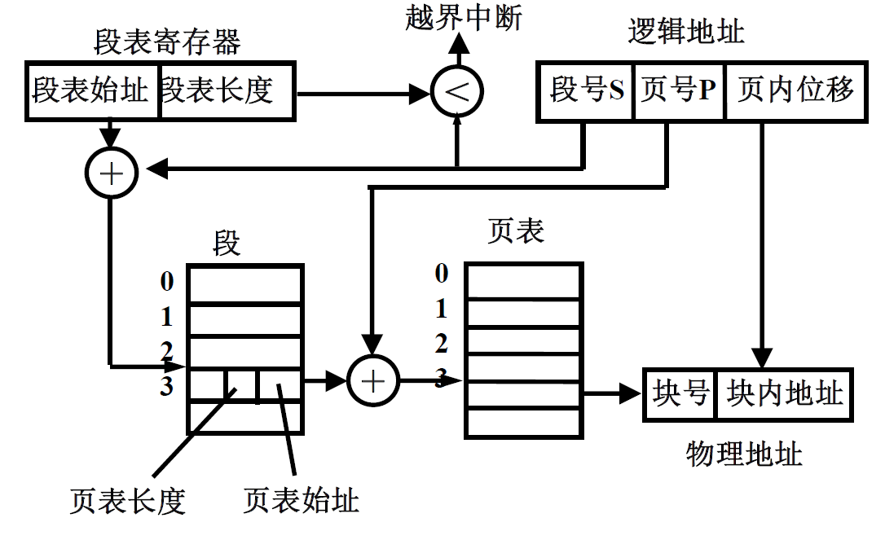

在段页式系统中 要想存取访问信息 需要三次访问内存：

1. 第一次访问**段表**

2. 第二次访问**页表**

3. 第三次访问**信息**

为了提高访问主存的速度 应考虑使用**联想寄存器**。

### 虚拟内存技术

常规存储器管理方式要求作业运行前全部装入内存，作业装入内存后一直驻留内存直至运行结束。**虚拟内存技术**允许执行进程**不必完全在内存中**。

- **虚拟内存 ：**将用户**逻辑内存**与**物理内存分开**，虚拟存储器的理论基础是程序执行时的局部性原理。**局部性原理**是指程序在执行过程中一个较短时间内，程序所执行的指令地址和操作数地址分别局限于一定区域内。**虚拟存储器**是指具有请求调入和置换功能，能从逻辑上对内存容量加以扩充的一种存储器系统。只有部分运行的程序需要在内存中。虚拟存储器是一种**以时间换空间**的技术。
  - 逻辑地址空间能够比物理地址空间大
  - 允许若干个进程共享地址空间
  - 允许更多有效进程创建

1. **部分加载**
   - **程序启动前**：仅将当前执行所需的代码和数据（如入口函数、初始变量）载入内存，其余部分保留在外存。
   - **优势**：减少程序启动时的内存占用，支持运行比物理内存更大的程序。
2. **按需调页/段**
   - 执行过程中：
     - 当程序访问的指令或数据**不在内存**时，触发**缺页/段中断**。
     - 操作系统响应中断，将所需内容从外存**调入内存**，更新页表/段表，随后程序继续执行。
3. **页面/段置换**
   - **内存不足时**：操作系统根据**置换算法**（如LRU、FIFO）选择内存中**暂时不用的页面/段**，将其写回外存以腾出空间，再载入新内容。
   - **目标**：保持内存中活跃数据的驻留，平衡效率与容量。

虚拟存储器的本质是将程序的访问地址和内存的可用地址分离，为用户提供一个大于实际主存的虚拟存储器。虚拟存储器的容量受限于：地址结构、外存容量。

- **离散性：** 不连续内存分配
- **多次性：** 一个作业分多次装入内存
- **对换性：** 允许运行中换进换出
- **虚拟性：** 逻辑上扩充内存

#### 请求分页存储管理 Demand paging

请求分页存储管理方法是在分页存储管理的基础上增加了**请求调页**和**页面置换功能**。主要支持机构有：页表、缺页中断机构、地址变换机构、请求调页和页面置换软件。

##### 页表

`|页号|物理块号|存在位|访问字段|修改位|外存地址|`

- **页号和物理块号：**其定义同分页存储管理。
- **状态位：**用于表示该页是否在**主存**中。
- **访问字段：**用于记录本页在一段时间内被访问的次数，或最近已有多长时间未被访问。
- **修改位：**用于表示该页调入内存后是否被修改过。
- **外存地址：**用于指出该页在外存上的地址。

##### 有效-无效位 Valid-Invalid Bit

可以使用有效-无效位来区分哪些页是在**内存**，哪些页在**磁盘**上。

##### Page Fault

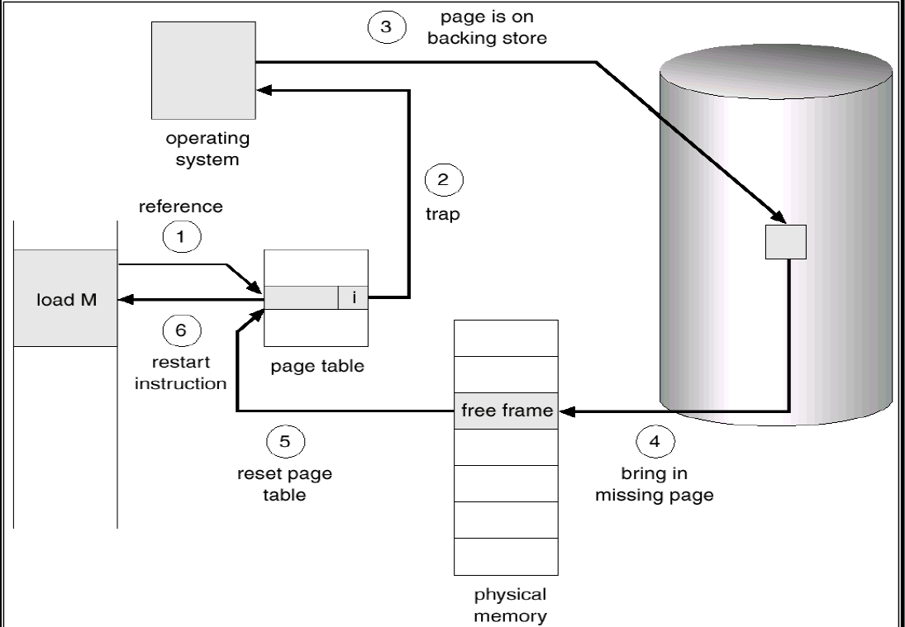

1. **触发条件**：当程序试图访问**标记为无效的页面**（即页表项中设置了无效标志位）时，硬件会检测到该页**未驻留内存**。（如果引用非法则会终止，只有引用有效但是不在内存中才会调用）
2. **硬件响应**：内存管理单元（MMU）在地址转换过程中，发现该页表项的无效标志位被置位，立即**向操作系统发起异常请求**（即缺页中断）。
3. **操作系统介入**：系统通过缺页中断机制，要求操作系统**将该缺失页面从外存（如磁盘）调入物理内存**，并更新页表项状态为有效。
4. **恢复执行**：页面调入完成后，程序从触发异常的指令处**继续执行**，此时内存访问可正常完成。

|  **对比维度**  |                         **缺页中断**                         |                         **一般中断**                         |
| :------------: | :----------------------------------------------------------: | :----------------------------------------------------------: |
|  **触发原因**  | 由CPU执行指令时检测到**页面未驻留内存**（页表项标记为无效）  | 由**外部设备或定时器**触发（如I/O完成、时钟中断、硬件故障等） |
|  **产生时机**  | 在**指令执行过程中**发生（如访问内存阶段），中断当前执行流程 | 在**指令执行间隙**（CPU检查中断标志的固定时间点），不打断单条指令执行 |
|  **中断类型**  |         属于**异常（Exception）**，由CPU自身逻辑触发         |        属于**硬件中断（Interrupt）**，由外部信号触发         |
|  **可重复性**  | 一条指令可能引发**多次缺页中断**（如`COPY A→B`需访问A和B的多个未驻留页） | 一条指令执行期间最多响应**一次中断**（中断响应后屏蔽后续信号直到处理完成） |
| **返回执行点** | 中断处理后**重新执行原指令**（需再次访问原内存地址，此时页面已调入） | 中断处理后**执行下一条指令**（原指令已完成或中断前已保存完整上下文） |
| **处理紧迫性** |            **必须立即处理**，否则程序无法继续执行            |             可延迟处理（如中断嵌套时优先级较低）             |

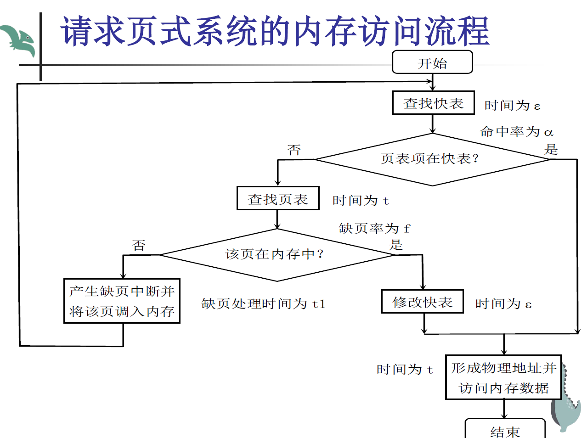

1. **页在主存且页表项在快表中** 
   - 查快表时间：$\varepsilon$  
   - 访问内存时间：$t$  
   - **总计**：$\varepsilon + t$  
   
2. **页在主存且页表项不在快表中** 
   - 查快表时间：$\varepsilon$  
   - 查页表时间：$t$  
   - 修改快表时间：$\varepsilon$  
   - 访问内存时间：$t$  
   - **总计**：$\varepsilon + t + \varepsilon + t = 2(\varepsilon + t)$  
   
3. **页不在主存（需处理缺页中断）** 
   - 查快表时间：$\varepsilon$  
   - 查页表时间：$t$  
   - 处理缺页中断时间：$t_1$  
   - 查快表时间（更新后）：$\varepsilon$  
   - 访问内存时间：$t$  
   - **总计**：$\varepsilon + t + t_1 + \varepsilon + t = t_1 + 2(\varepsilon + t)$  

**符号说明**：  

- $\varepsilon$：查快表时间  
- $t$：访问内存时间（或查页表时间，假设两者耗时相同）  
- $t_1$：处理缺页中断的总时间（含I/O操作、页表更新、快表更新等）  

#### 请求分段存储管理 Demand segmentation


#### 请求调页的段页式存储管理

