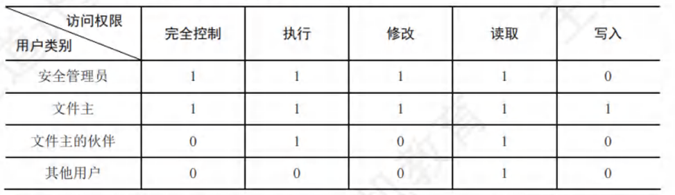
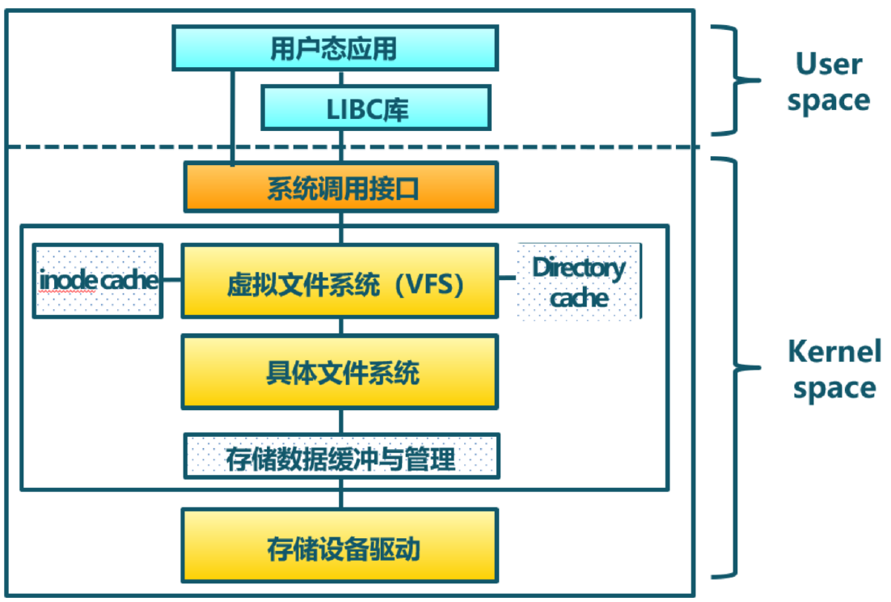
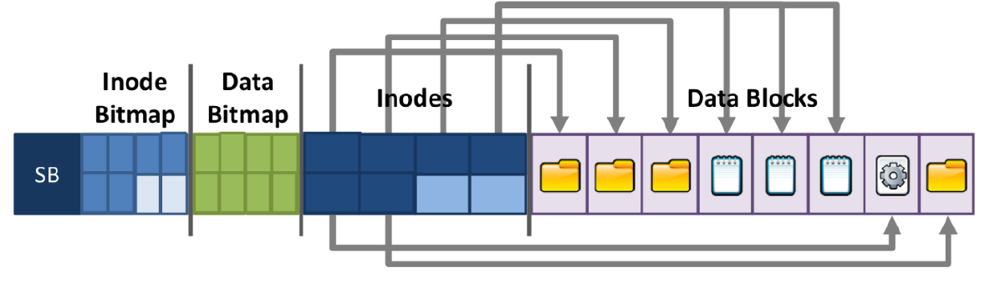
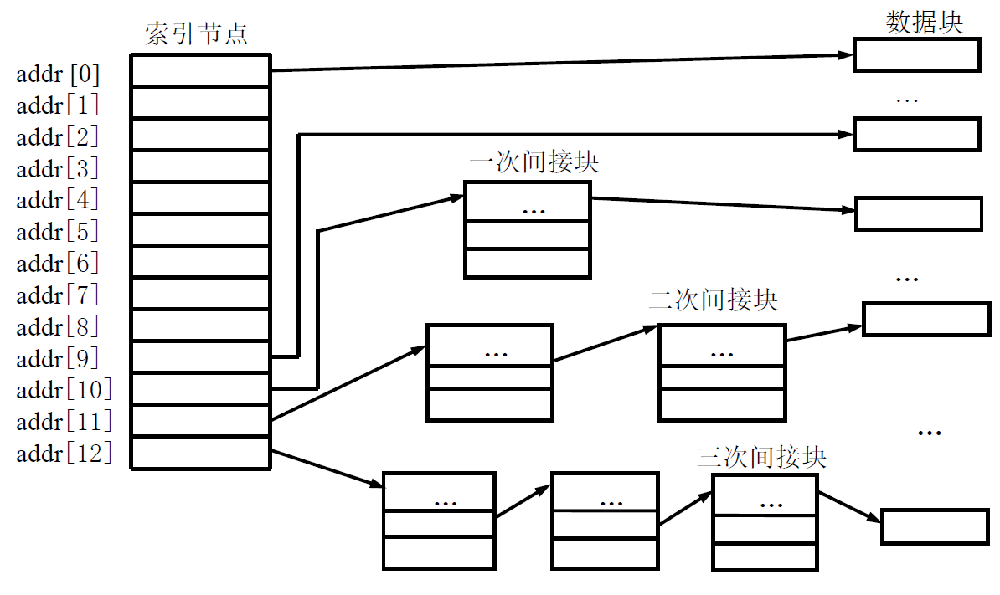
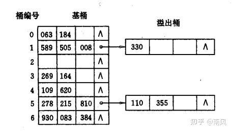
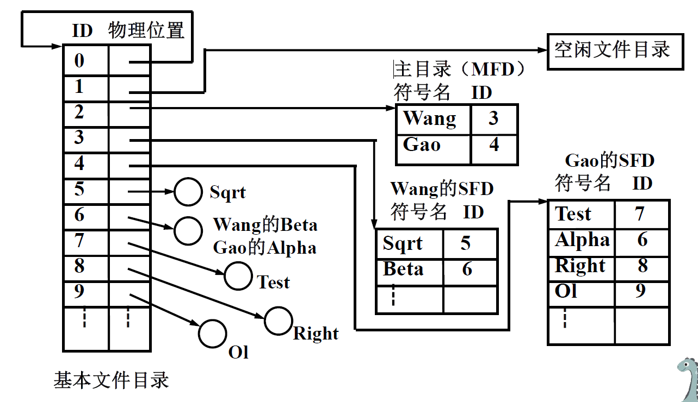

## CHAPTER8 文件系统

[TOC]

文件系统是操作系统中负责文件命名、存储和检索的子系统，由管理文件所需的数据结构、相应的管理软件和被管理的文件构成。文件系统负责管理外存上的文件，并为用户提供对文件进行存取、共享及保护的手段。

文件系统的主要功能为：实现文件的按名存取、为用户提供接口、实施对文件和目录的管理、文件存储空间的分配及回收、文件的共享及保护。

**文件**是具有文件名的一组相关信息的集合，文件存放在**外存**上，由若干记录组成。**记录**是一些相关数据项的集合。**数据项**是数据组织中可以命名的**最小逻辑单位**。

> 在系统运行时，计算机以**进程**为基本单位进行**资源调度和分配**；而在**用户**进行的输入、输出中。则以**文件**为基本单位。

文件属性通常包含：名称、标识符（在文件系统内唯一标志文件的标签）、类型、位置（指向设备上的文件）、大小、保护（谁拥有读写执行的权限）、时间、日期、用户标识。所有文件的属性信息都保存在目录结构中。

文件元数据是描述文件的各种信息的数据，存储在文件系统的inode表中，每个文件都有一个inode表项存储它的各种元数据信息，**元数据和文件内容是分开管理的**

> 
>
> #### (1) 目录项（浅绿色表格）
>
> - **作用**：记录文件的逻辑路径和名称映射。
> - **示例内容：**
>   - `父目录`：如`/home`，表示当前目录的上级路径。
>   - `子目录/文件列表`：如`file1`、`file2`，是当前目录下的条目。
>   - **索引节点指针**：指向文件的元数据（inode），而非文件内容本身。
>
> #### (2) 索引节点区（浅黄色表格）
>
> - **作用**：存储文件的**元数据**（如权限、大小、时间戳、数据块指针等）。
> - **关键点：**
>   - 每个文件/目录有唯一的inode编号（如`索引节点1`）。
>   - **不包含文件名**（文件名在目录项中），实现硬链接（多个文件名指向同一inode）。
>
> #### (3) 数据块区（浅蓝色表格）
>
> - **作用**：存储文件的**实际内容**（文本、图片等二进制数据）。
> - **关联方式**：inode通过指针（如直接/间接块指针）定位数据块位置。

```c
struct inode {
    int inode_number;   // 文件inode编号
    
    /* 文件类型（可用枚举或宏定义）：
     * 普通文件、目录、符号链接、设备文件等
     */
    unsigned short file_type;
    
    /* 文件权限（如0755）：
     * 包含读(r)、写(w)、执行(x)权限位
     */
    mode_t permissions;
    
    uid_t owner;        // 文件所有者UID
    gid_t group;        // 文件所属组GID
    
    /* 时间戳 */
    time_t atime;       // 最后访问时间
    time_t mtime;       // 最后修改时间
    time_t ctime;       // 最后状态改变时间
    
    off_t size;         // 文件大小（字节数）
    nlink_t link_count; // 硬链接数量
    
    /* 数据块指针数组：
     * NUM-1个直接块指针 + 1个间接块指针是经典设计
     */
    int blocks[NUM];    
};
```

### 文件操作

#### 创建文件

1. 在文件系统中为文件分配必要空间
2. 在目录中为新文件建立一个目录项，在目录项中记录新文件的文件名及其在外存的地址等属性

`int open(const char *pathname, int flags, mode_t mode);`：

- 创建新文件或打开已有的文件
- `flags`用于指定打开的方式
- `mode`用于指定新打开创建文件的权限模式

创建步骤：

1. **分配inode节点**：
   **`open()`触发条件**：当`flags`包含`O_CREAT`且文件不存在时

   **内核操作**：

   - 在文件系统的**inode区**分配一个空闲inode（如ext4通过位图查找空闲inode）。

   - 初始化inode元数据：(存储的是**元数据**（如权限、时间戳），**不包含文件名**)

     ```c
     struct inode *new_inode = alloc_inode();
     new_inode->mode = mode;      // 设置权限（0644）
     new_inode->uid = current_uid; // 当前用户UID
     new_inode->size = 0;         // 初始大小为0
     ```

2. **分配数据块**

   - 延迟分配：

     - 文件创建时通常**不立即分配数据块**（除非预分配，如数据库文件）。

     - 首次写入（`write()`调用）时才会分配数据块，通过inode的**块指针**关联。

   - 例外情况:

     - 某些文件系统（如XFS）支持预分配，此时会直接分配物理块。

3. **更新inode表**

   - **目录项（dentry）绑定**：
     - 在父目录的**数据块**中新增一条目录项，记录文件名和inode号
   - 更新父目录的`mtime`（修改时间）

4. **返回文件描述符**
   内核为进程创建一个**文件描述符表项**，指向内核的**文件对象**（包含当前偏移量、访问模式等）。文件对象再关联到inode，形成完整访问链

文件系统在创建一个文件时，为它建立一个**文件目录项**，包括：文件名、文件大小、创建/修改时间、文件类型、存储位置（物理地址）等信息。

- 这里不是**目录文件**，**目录文件**是由多个文件目录项组成的文件，用于存储和管理多个文件的目录信息。创建单个文件时，系统不会直接建立一个完整的目录文件，而是会在现有的目录文件中**新增一个文件目录项**。
- 也不是**逻辑空间**，因为这是存储设备（如硬盘）被文件系统划分后的抽象空间概念，例如分区、卷等。创建文件时，系统会在逻辑空间中分配存储块，但“逻辑空间”本身并不是创建文件时建立的具体对象。

#### 打开文件

访问数据前必须先**打开**文件，获得**文件描述符**。将待访问文件的目录信息读入内存打开文件表中，建立起用户进程和文件之间的联系。

`fd = open(name, flag);`

- **功能**：打开指定文件并建立进程与文件的连接

- **参数说明**：
  - `name`：要打开的文件路径（如"./data.txt"）
  - `flag`：打开方式标志（如`O_RDONLY`只读，`O_WRONLY`只写）
  
- **返回值**：
  - `fd`（文件描述符）：非负整数，代表内核中打开文件的引用标识（索引值，指向内核为每一个进程锁维护的该进程打开文件的记录表）
  
- **底层操作**：
  1. 在内存打开文件表中创建新条目
  2. 将**文件目录信息**加载到内存
  3. 建立进程与文件的关联关系
  
  > 特别注意这里是目录信息，只有在进程需要文件内容时，才会把文件内部数据加载到内存中。

##### 打开文件表


- **三级表结构**：
  1. 进程级文件描述符表
     - 每个进程独立维护
     - 存储文件描述符与控制标志
  2. 系统级打开文件表
     - 全局唯一，内核维护
     - 关键字段：
       - 文件偏移量（最近读写位置）
       - 状态标志（O_APPEND等）
       - i-node指针
       - 引用计数
  3. 系统级i-node表
     - 存储物理文件元数据：
       - 文件类型
       - 磁盘位置
       - 文件锁


- **多进程共享文件**：
  - 进程A/B通过不同fd→指向同一系统级表项→相同i-node
  
  - 但是注意，用户进程的打开文件表关于同一个文件不一定相同，例如当前读写位置指针和访问权限都不一定相同。
  
  - 共享条件：
    ```c
    // 进程A
    fd1 = open("file.txt", O_RDWR);
    // 进程B（通过fork继承或独立open）
    fd2 = open("file.txt", O_RDWR); 
    ```
- **引用计数管理**：
  - 系统级表项记录被引用的次数
  - 关闭文件时：
    ```text
    close(fd) → 计数-- → 计数=0时移除表项
    ```

`open()`调用的参数含有文件名(或者说文件的路径名)，它会在进程的用户打开文件表中增加一个对应的表目，并返回该表目的索引号(文件描述符或句柄)。系统打开文件表**只有在文件实体第一次被打开时才增加**一个表目，也才会通过**文件I/O将对应的索引节点**从**磁盘读入内存**。当`open()`调用的不同文件互为硬链接时，所打开的文件实体是一样的。

> ### 文件读取的内存访问机制
>
> 1. **首次打开文件时**
>    - 内核通过`open()`系统调用解析路径名，在**系统打开文件表**中新建表目
>    - 从磁盘读取该文件的**索引节点（inode）**到内存（触发磁盘I/O）
>    - 索引节点包含文件的物理存储位置、权限等元数据
>    - 在**进程的打开文件表**中创建条目，返回文件描述符给用户态
> 2. **非首次打开时（包括硬链接）**
>    - 内核直接复用内存中已加载的索引节点
>    - 仅需在**进程打开文件表**中新增条目（无磁盘I/O）
>    - 所有硬链接指向同一个inode，因此访问的是同一文件实体
> 3. **读取文件数据时**
>    - 通过文件描述符→进程打开文件表→系统打开文件表→内存inode的链条
>    - 根据inode记录的物理地址访问文件数据块
>    - 若数据块未缓存，则触发磁盘I/O；已缓存则直接读内存
>
> ### 关键优势
>
> - **内核级效率**：系统打开文件表和inode常驻内存，避免重复磁盘访问
> - **共享性**：多进程/硬链接通过同一inode访问文件，保证数据一致性
> - **无感切换**：用户态通过文件描述符操作，完全屏蔽底层存储细节

#### 关闭文件

`close(fd);`

撤消主存中有关该文件的目录信息，切断用户进程与该文件的联系；若在文件打开期间，该文件作过某种修改，则应将其写回辅存。

关闭文件操作的主要工作是：**将文件当前的控制信息从内存写回磁盘**。而对于**文件数据**写回磁盘，应该在写文件操作中才是（不考虑延迟写）。

- **数据写入由 `write()` 负责**：
  文件数据通常在 `write()` 调用时就已经写入（除非使用**延迟写**机制）。
  `close()` 的主要职责是**确保文件状态一致**，而不是数据持久化。
- **性能优化**：
  如果每次 `close()` 都强制写回数据，会导致频繁磁盘 I/O，降低性能。
- 延迟写是一种**性能优化策略**，文件系统不会立即将数据写入磁盘，而是先缓存到内存，后续再异步写入。

#### 删除文件

1. 在目录中搜索给定名称的文件
2. 释放文件占用的所有存储空间
3. 删除相应目录项

#### 读文件

`ssize_t read(int fd, void *buf, size_t count);`

- `fd`指明文件描述符（`open`系统调用打开文件，而`read`只需要使用`open`返回的文件描述符，并不是使用文件名作为参数）
- `buf`指明要读入文件块的内存位置


1. 按文件描述符在打开文件表中找到该文件的目录项；
2. 按存取控制说明检查访问的合法性；
3. 根据目录项中该文件的逻辑和物理组织形式，将逻辑记录号转换成物理块号；
4. 向设备驱动程序发出I/O请求，完成数据交换工作。

若所读文件的数据**不在内存时**，会产生中断（缺页中断），原进程进入阻塞态，直到所需数据从外存调入内存后，才将该进程唤醒。


#### 写文件

`ssize_t write(int fd, const void *buf, size_t count)`

1. 通过文件名，系统在目录树中查找对应的目录项
2. 目录项包含`inode`号，定位到对应的`inode`结点
3. `inode`结点记录文件长度和数据块地址信息
4. 系统根据写位置，判断需要写入的块是否已经在内存缓冲区中
5. 如果块不在缓冲区，需要从磁盘读入块到缓冲区
6. 在内存缓冲区中写入数据
7. 根据写入量，可能需要分配新的块并更新`inode`结点
8. 操作结束后，将脏块从缓冲区写入磁盘，更新文件内容

#### 截断文件

`int truncate(const char *path, off_t length);`

- `path`: 指定要截断的文件路径
- `length`:指定文件应该被截断的大小

#### 删除文件

会根据文件控制块回收相应的磁盘空间，将文件控制块回收，并删除目录中对应的目录项。

### 文件结构

- **逻辑结构**：又称文件组织 是从用户观点出发所看到的文件组织形式 。
  - **记录式文件**：是一种有结构文件，由一组相关记录组成，又分为
    - 等长记录文件：又称定长记录文件，是指文件中所有记录的长度相等
    - 变长记录文件：是指文件中各记录长度不相等
  - **流式文件**：是一种无结构文件，由字符序列构成
- **物理结构**：又称文件的存储结构，是文件在外存上的存储组织形式。 它与存储设备特性、外存分配方式有关。
  - 顺序结构
    - 将一个在逻辑上连续的信息存放在外存连续的物理块中，存取速度较快，对等长记录文件支持随机访问，因要求连续存放，会产生碎片（本来连续存储的多个文件，删除了存在中间的文件，就产生了碎片），也不利于文件的动态扩容。
  - 链接结构
    - 又称串联结构，将一个逻辑文件的信息存放在外存不连续的物理块中，且每个物理块中设置一个指向下一个物理块的指针。
    - 采用链接结构存放的文件称为**链接文件**或**串联文件**
    - 可解决碎片问题，便于文件动态增长，只能顺序访问，但查找效率较低，指针占用存储空间。（如果查询的是靠后的块，则需要多次访问外存）
  - 索引结构
    - 将一个逻辑文件的信息存放于外存的若干物理块中，并为每个文件建立一个索引表，其中的每个表目存放文件信息所在等待逻辑块号和与之对应的物理块号。
    - 采用索引结构存放的文件称为索引文件。
    - 既可以顺序访问，也可以随机访问，但增加了存储空间开销，且要两次访问外存。

#### 目录结构

- 目录是一类特殊的文件，目录的内容是文件索引表<文件名，指向文件的指针>，目录结构和文件都驻留在磁盘上。分为：单级目录结构，二级目录结构，多级目录结构，图形目录结构。
- 文件控制块就是文件目录项，由文件的基本信息，存取控制信息和使用信息组成。

 **磁盘 I/O 的基本单位是块（Block）**

- 文件系统以固定大小的块（通常 4KB）读写磁盘。
- 无论读取1字节还是4KB，硬件均需读取整个块。

- **传统目录项**：
  每个目录项存储文件名 + inode 号 + 部分元数据（如 ext4 的 `file_type`），导致单个目录项较大。
  - **示例**：若目录项大小为 64 字节，而文件名仅占 16 字节，剩余 48 字节为冗余信息。
  - **问题**：读取目录时需加载更多无用数据，浪费 I/O 带宽。
- **分离式目录项**：
  目录项仅存储 ​**文件名 + inode 号**​（如 XFS 的 B+ 树目录），单目录项可压缩至 16 字节。
  - **优势**：单次 I/O 可加载更多目录项，提升目录遍历速度。

> ### 题目内容（FCB分解法问题）
>
> #### 前提条件
> 1. 文件系统采用“FCB分解法”加速目录检索。
> 2. 目录文件存储在磁盘上，每个盘块大小为512B。
> 3. 每个FCB（文件控制块）占64B，其中：
>    - 文件名占8B。
>    - 分解后的FCB分为两部分：
>      - 第一部分：10B（包含文件名和文件内部号）。
>      - 第二部分：56B（包含文件内部号和其他描述信息）。
>
> #### 问题1
> **条件**：某目录文件共有254个FCB。  
> **要求**：分别计算采用分解法前和分解法后，查找该目录中某个FCB的平均访问磁盘次数（假设访问每个文件的概率相同）。
>
> #### 问题2
> **条件**：一般情况，目录文件分解前占用n个盘块，分解后占用m个盘块存放文件名和文件内部号（假设m和n个盘块都正好装满）。  
> **要求**：给出访问磁盘次数减少的条件。
>
> ### 详细问题描述
> 1. 分解前FCB占64B，每个盘块512B可存储$\lfloor 512 / 64 \rfloor = 8$个FCB。 
>    目录有254个FCB，需$\lceil 254 / 8 \rceil = 32$个盘块。 前31块每块放了8个，最后一块放了6个，所以平均次数是$\frac{8\times(1+2+...+31)+6\times32}{254}=16.38$
>    
> 2. 分解后FCB第一部分占10B，每个盘块可存储$\lfloor 512 / 10 \rfloor = 51$个条目。 
>    254个FCB需$\lceil 254 / 51 \rceil = 5$个盘块。 $\frac{51\times(2+3+4+5)+50\times6}{254}=3.99$
>    
>    注意这里从2开始加的
>    
>    - **最小访问次数为2**：
>      即使目标FCB在第一个索引块中，仍需：
>    
>    1. 1次访问读取索引块。
>    2. 1次访问读取完整FCB。
>       → ​**总次数=2**​（即序列的起始值）。
>
> #### 问题2的数学条件
> 1. **分解法前**：
>    - 平均访问磁盘次数 = $\frac{1+2+3+\cdots+n}{n} = \frac{n+1}{2}$ 次
>
> 2. **分解法后**：
>    - 平均访问磁盘次数 = $\frac{2+3+4+\cdots+(m+1)}{m} = \frac{m+3}{2}$ 次
>
> #### 优化条件
> 要使访问磁盘次数减少，需满足：
> $$
> \frac{m+3}{2} < \frac{n+1}{2}
> $$
> 化简得到：
> $$
> m < n - 2
> $$
> 即分解后的盘块数$m$必须比分解前的盘块数$n$至少小3，才能实现访问次数的减少。
>
> #### 1. FCB分解法的存储机制
> 在FCB分解法中：
> - **第一部分（10B）**：包含文件名和文件内部号，存储在**目录文件的索引块**中。
> - **第二部分（56B）**：包含文件内部号和其他完整描述信息，存储在**独立的FCB数据区**（磁盘上的固定位置）。
> 
> #### 2. 多出来的数据存储在哪里？
> - **额外数据（56B部分）**：
>   - 存储在磁盘的**专用FCB区域**（如文件系统的元数据区），与文件数据块分开管理。
>   - 通过文件内部号（类似inode号）直接定位，无需依赖目录结构。
> 
> #### 3. 为什么需要两次读取？
> - **第一次读取**：访问目录索引块（10B部分），获取文件内部号。
> - **第二次读取**：根据文件内部号，从FCB数据区加载完整的56B信息。
> - **设计目的**：牺牲部分I/O次数换取目录检索效率（减少索引块大小）。
> 
> #### 4. 与inode设计的异同
> - **相似性**：类似Unix的inode分离思想（目录项只存文件名+inode号）。
> - **差异**：FCB分解法是针对目录检索的优化，而inode是全局元数据管理。


##### 二级目录结构

其实是分用户进行存储

- **主文件目录**：记录用户名及相应用户文件目录所在的存储位置。
- **用户文件目录**：记录该用户文件的有关信息

可以解决文件重名问题，并可获得较高的查找速度；但缺乏灵活性，特别是无法反映真实世界复杂的文件组织形式

##### 树型目录结构

路径名是一个字符串，该字符串从根目录出发到所找文件的通路上，所有各级子目录名和该文件名用分隔符连接起来构成。

（太熟了，不记了）

##### 无环图目录

允许目录含有共享子目录和文件。

不同文件名可能表示统一文件，对于统计文件数量和遍历文件系统会带来一定问题；还会有删除问题，分配给共享文件的空间何时删除重利用，像极了c++里对浅拷贝的回收。

##### 通用图目录


当对已存在的树状结构目录增加链接时，树状结构就被破坏了，产生了简单的图结构。这在遍历文件系统时，很可能会陷入无限循环。

#### 文件保护

**文件保护**是指避免文件拥有者或其他用户因有意或无意的错误操作使文件受到破坏；

**文件保密**是指文件本身不得被未授权的用户访问。

这都是对文件的**存取控制**问题。

|     **字段**      |                    **作用**                    |            **示例值**            |
| :---------------: | :--------------------------------------------: | :------------------------------: |
|     `f_mode`      |          文件的访问模式（读/写/执行）          |    `FMODE_READ | FMODE_WRITE`    |
|     `f_flags`     |   打开文件时的标志位（如阻塞、追加、同步等）   |       `O_RDWR | O_APPEND`        |
|      `f_pos`      |           当前读写偏移量（指针位置）           | `1024`（表示已读取到第1024字节） |
|     `f_count`     |   引用计数（多个进程共享同一打开文件时使用）   |     `2`（两个进程共享该FCB）     |
| `f_uid` / `f_gid` |      打开文件的用户/组ID（用于权限检查）       |      `1000`（普通用户UID）       |
|     `f_inode`     |  指向文件的 inode（包含磁盘上的持久化元数据）  |     `struct inode*` 内存地址     |
|      `f_op`       | 文件操作函数集（如 `read`/`write` 的具体实现） |      `ext4_file_operations`      |

文件的访问，常由**文件属性**和**用户访问权限**共同控制。

##### 存取控制矩阵

是一个二维矩阵，其中一维列出使用该文件系统的全部用户，另一维列出存入系统中的全部文件。列表中的每个元素用来表示**某个用户对某个文件的存取权限**，权限可分为读、写、执行和他们的任意组合。

优点是简单、清晰，缺点是不够经济，不适用于用户和文件较多的情况，无法得到普遍应用。

##### 存取控制表

按用户对文件的存取权限将用户分成若干组，同时规定每一组用户对文件的存取权限，所有用户组存取权限的集合称为**该文件的存取控制表**。

##### 用户权限表

将一个用户或用户组所要存取的文件集中存放在一个表中，其中每个表项指明该用户对相应文件的存取权限。

某文件系统中，针对每个文件，用户类别分为4类：安全管理员、文件主、文件主的伙伴、其他用户；访问权限分为5种：完全控制、执行、修改、读取、写入。若文件控制块中用二进制位串表示文件权限，为表示不同类别用户对一个文件的访问权限，则描述文件权限的位数至少应为多少：20位。例如以下分配方式：



##### 口令

口令是一种简单的文件保护方法，文件主为自己的每个文件规定一个口令，一方面进行**口令登记**，另一方面把口令告诉允许访问该文件的用户。当用户请求访问某文件时，首先要提供该文件的口令，经证实后再进行相应的访问。

简单且易于实现，但保密性不强，不易更改存取权限，常用于识别用户。

##### 密码

对需要保护的文件进行加密，写入时进行编码，读出时进行译码，要求发出存取请求的用户提供一个代码键。

一种简单的编码方式是利用代码键作为生成一串随机数的起始码，编码程序把这些随机数加到被编码文件的字节中去；译码时，用和编码时相同的代码键启动随机数发生器并从存入文件的各字节中依次减去所产生的随机数。

密码技术具有保密性强、节省存储空间的优点，但编码和译码要花费一定的时间。

#### 内存映射文件

内存映射文件通过将磁盘块映射到内存中的一页，允许文件 I/O 被处理为常规内存访问，开始的文件读使用请求调页。一页大小的部分文件从文件系统读入一物理页。随后文件读 / 写就按普通存储器访问来处理。

- **虚拟地址映射**：调用`mmap`时，操作系统仅在进程的虚拟地址空间中建立一段虚拟内存区域，并将其与磁盘文件关联（通过页表记录映射关系）。此时物理内存中并无文件数据，仅标记了“这段虚拟地址对应某文件的某部分”
- **按需加载（缺页中断）**：当用户首次访问映射区域的某个地址时，CPU发现该虚拟页无对应的物理页，触发**缺页中断**。内核此时才会将文件对应部分从磁盘加载到物理内存（页缓存），并更新页表.

1. 直接修改内存：用户通过指针操作映射区域,此时：
   - 若该页未加载，先触发缺页中断加载数据到页缓存；
   - 修改页缓存中的数据，内核将其标记为脏页（Dirty Page）。
2. 同步到磁盘：
   - **自动同步**：内核定期或内存不足时将脏页写回磁盘；
   - **手动同步**：调用`msync()`强制立即写回

虽然两者(传统IO和mmap模式)最终都需要将数据从磁盘加载到内核页缓存并写回磁盘（DMA 拷贝不可避免），但 mmap 通过**消除用户态与内核态之间的冗余拷贝**和**减少系统调用**实现性能提升。

传统 I/O 需要将内核页缓存（Page Cache）拷贝到用户缓冲区，主要原因涉及**安全隔离**和**设计约束**两方面。

- **内核空间特权**：操作系统内核拥有直接访问硬件（如磁盘、网卡）的权限，而用户程序运行在受限制的用户空间，无法直接操作硬件。
- **防止越权访问**：若用户程序直接操作内核页缓存，可能篡改其他进程或系统关键数据，引发安全问题（如缓冲区溢出攻击）

### 文件系统实现



#### 虚拟文件系统 VFS, Virtual File System

- 目的：对所有不同文件系统的抽象。

- 功能：

  - 提供相同的文件和文件系统接口
  - 管理所有文件和文件系统关联的数据结构
  - 高效查询例程：遍历文件系统
  - 与特定文件系统模块的交互

  

##### 抽象对象模型

VFS定义了四种核心数据结构作为统一接口的基石：

- **超级块（super_block）**：存储文件系统的元信息（如块大小、文件系统类型）。
- **inode**：表示文件或目录的唯一标识，包含权限、大小、数据块位置等元数据。
- **目录项（dentry）**：缓存目录结构，加速路径解析（如`/home/user`）。
- **文件对象（file）**：描述进程打开文件时的状态（如读写位置、操作权限）。

在总长为64字节的目录项中，索引节点占4字节，即32位。不同目录下的文件的文件名可以相同，所以在考虑系统创建最多文件数量时，只需考虑索引节点的个数，即创建文件数量上限=索引节点数量上限。整个系统中最多存储$2^{32}$个索引节点，因此整个系统最多可以表示$2^{32}$个文件。

**示例**：
无论底层是ext4还是NTFS，`open("/data/file.txt")`都会生成相同的`file`对象，应用无需关心磁盘实际如何存储。

> ### 文件系统如何区分同一目录下的不同文件？
>
> #### 1. 目录的本质：文件名到inode的映射表
>
> - **目录不是“容器”**，而是一个**特殊文件**，其数据块中存储的是该目录下所有文件的**目录项（Directory Entry）**。
> - 每个目录项包含两部分：
>   - **文件名**（例如`a.txt`）
>   - **对应的inode号**（例如`100`）
>
> #### 2. 查找同一目录下文件的流程
>
> 1. 用户访问路径`/home/user/a.txt`
>
>    - 文件系统从根目录开始，逐级解析路径：
>      - 先找到`home`目录的inode → 读取其数据块 → 查找`user`目录的inode → 最终定位到`a.txt`的inode。
>
> 2. 定位到目标目录
>
>    （如`/home/user`）：
>
>    - 读取该目录的数据块，遍历其中的目录项列表，检查是否存在同名文件。
>    - **关键点**：目录项中的`文件名`是唯一标识，同一目录下不允许重复（即使inode不同）。
>
> #### 3. 为什么同一目录下不允许同名文件？
>
> - 目录项设计原则：
>   - 文件系统通过**文件名**在目录中唯一标识文件。若允许同名，系统无法区分用户要操作哪个文件。
>   - 冲突处理：
>     - 若尝试创建同名文件，系统会直接拒绝（返回错误）或覆盖原有目录项（取决于操作模式）。
>
> #### 4. 不同目录下允许同名文件的原理
>
> - 路径隔离：
>   - 文件系统通过**完整路径**（如`/dir1/a.txt`和`/dir2/a.txt`）区分文件，即使文件名相同，路径不同则视为独立文件。
>   - 底层实现：
>     - 两个`a.txt`的目录项存储在不同的目录数据块中，且指向不同的inode（例如`100`和`200`）。
>
> #### 5. 结合图片中的关键信息
>
> - 目录项结构（64字节）：
>   - 4字节inode号 + 60字节文件名 → 每个目录项明确绑定文件名与inode。
> - 系统限制：
>   - inode号占32位 → 最多2322^{32}232个唯一文件，但同一目录下的文件数量还受目录数据块大小限制（例如一个4KB数据块可存储64个目录项）。
>
> #### 6. 用户问题的直接答案
>
> **文件系统通过目录数据块中的目录项列表判断同一目录下的文件是否重复**：
>
> 1. 当用户尝试在目录`/home`下创建`a.txt`时，系统会：
>    - 读取`/home`目录的数据块，检查是否已存在`a.txt`的目录项。
>    - 若存在，则拒绝创建；若不存在，则新增一条目录项（如`[a.txt, inode=100]`）。
> 2. 最终结论：
>    - 同一目录下，文件名必须唯一；不同目录下，文件名可重复（因路径不同）。
>
> #### 总结
>
> - **目录是映射表**：通过存储`文件名→inode号`的目录项，实现文件定位。
> - **唯一性检查**：添加文件时，系统遍历目录数据块中的目录项，确保无冲突。
> - **路径隔离**：不同目录的同名文件因路径不同，被系统视为独立实体。
>
> 这种设计既保证了文件操作的明确性，又支持灵活的目录层级结构。

##### 统一操作接口

VFS为每种对象定义标准操作函数集（函数指针表），具体文件系统需实现这些接口：

- **文件操作（file_operations）**：包含`read()`、`write()`、`mmap()`等方法。
- **inode操作（inode_operations）**：如`create()`、`link()`、`lookup()`。
- **超级块操作（super_operations）**：`sync_fs()`、`statfs()`等。

**动态绑定**：
当挂载ext4时，VFS会将其实现的`ext4_file_operations`挂载到通用接口上，对应用透明。

##### 文件系统的数据结构

|   类型    |  典型系统   |                           特点                           |
| :-------: | :---------: | :------------------------------------------------------: |
| **ext4**  |    Linux    |    日志功能、最大支持1EB文件，广泛用于现代Linux系统。    |
| **NTFS**  |   Windows   |      支持ACL权限、加密、压缩，Windows默认文件系统。      |
| **APFS**  |    macOS    |       针对SSD优化，支持快照和克隆，苹果生态专用。        |
| **FAT32** | 通用（U盘） | 兼容性强（Win/Mac/Linux），但单文件最大4GB，无权限控制。 |

文件卷控制块，文件控制块，目录项，数据块。



1. **超级块（SB, Super Block）文件卷控制块**

   - 存储文件系统全局信息（如inode总数、块大小、空闲块数量）。

   - **作用**：系统挂载时读取SB以识别文件系统类型和状态。

     ```c
     let sb = SuperBlock {
         magic: 0x1234, // 自定义魔数
         total_blocks: 1024,
         inode_bitmap_blocks: 1,
         inode_area_blocks: 8,
         data_bitmap_blocks: 2,
         data_area_blocks: 1000,
     };
     ```

   | `magic`                   | 未公开 | 文件系统“魔数”，用于校验文件系统类型（如ext4的`0xEF53`）。   |
   | ------------------------- | ------ | ------------------------------------------------------------ |
   | `pub total_blocks`        | 公开   | 文件系统总块数（磁盘总容量）。                               |
   | `pub inode_bitmap_blocks` | 公开   | inode位图占用的块数，管理inode分配状态（哪些inode已被使用）。 |
   | `pub inode_area_blocks`   | 公开   | inode表区域占用的块数，存储所有inode的元数据（权限、大小等）。 |
   | `pub data_bitmap_blocks`  | 公开   | 数据块位图占用的块数，管理数据块分配状态（哪些块存了数据）。 |
   | `pub data_area_blocks`    | 公开   | 数据块区域占用的块数，存储实际文件内容。                     |

2. **位图（Bitmaps）**

   - **inode位图**：标记哪些inode已被占用
   - **数据块位图**：标记数据块使用情况。
   - **作用**：快速分配/回收资源，避免遍历整个磁盘。

3. **inode区域**

   - 每个inode条目对应一个文件/目录，存储：
     - 元数据（权限、所有者、大小、时间信息等）。
     - **直接/间接指针**：指向实际数据块。
     - 文件名存放在目录的`datablock`中

4. **数据块区域**(dnode)

   - 存储文件实际内容（如`initrd.img`的二进制数据）或目录的子项列表（如`/bin`下的`ls`、`cat`等文件名）。
   - `inode`一般128B，`datablock`一般4KB

```rust
pub struct DiskInode {
    /// 文件大小（字节数），使用 32 位无符号整数
    /// 对应图片中的「文件的字节数」
    pub size: u32,

    /// 直接数据块索引数组（固定大小）
    /// - 直接指向存储文件内容的数据块，访问速度快
    pub direct: [u32; INODE_DIRECT_COUNT],

    /// 一级间接块索引
    /// - 指向一个存储额外块索引的数据块（间接寻址）
    /// - 当文件超过直接块容量时使用
    pub indirect1: u32,

    /// 二级间接块索引
    /// - 通过两级块索引扩展大文件支持
    /// - 用于存储超大文件（比一级间接更大）
    pub indirect2: u32,

    /// inode 类型（文件/目录/符号链接等）
    /// - 使用自定义枚举类型 `DiskInodeType` 区分
    /// - 注意：字段名为 `type_`（避免与 Rust 关键字冲突）
    type_: DiskInodeType,
}
```

文件描述符是一个**非负整数**（如 `0`、`1`、`2` 分别对应 stdin/stdout/stderr），是进程内部访问文件的**句柄**。用户程序通过该数字间接操作文件，无需关心磁盘位置、缓存等底层细节（类似餐厅的取餐号）。

- **抽象隔离**：
  用户程序只能看到整数描述符，无法直接操作内核数据结构（保障安全）。
- **资源共享**：
  多个进程可通过不同描述符访问同一文件（如图中两个进程的箭头指向同一系统表条目）。
- **状态管理**：
  系统表中的读写偏移（`offset`）实现多进程/线程的并发访问控制。

##### 文件锁

用于协调多进程的文件访问。

- **强制锁**：根据锁保持情况和访问需求确定是否拒绝访问，需绝对防止数据破坏（如金融系统）。
- **劝告锁**：进程可以查找锁的状态来决定怎么做，进程可控且协作良好的场景（如脚本工具）

#### 文件分配

|        概念        |                             说明                             |
| :----------------: | :----------------------------------------------------------: |
| **扇区（Sector）** |  磁盘硬件的物理最小单位（通常512B），由磁盘控制器直接读写。  |
| **簇（Cluster）**  |   FAT文件系统中的术语，等同于“盘块”，可能由多个扇区组成。    |
|   **页（Page）**   | 内存管理的最小单位（通常4KB），与盘块大小对齐以提高内存-磁盘交换效率。 |

为了改善磁盘的效率，操作系统将多个相邻的扇区组合成**簇**，对文件存储空间的分配以簇为单位。

##### 连续分配

当用磁带作为存储设备时，只能进行连续分配。但如果考虑磁带的来回倒带操作，可能会有其他组织形式。

文件目录只需其起始位置（块号）及长度，支持顺序及随机访问，但有外部碎片。

- 顺序访问容易且速度快，目录中文件存储位置信息简单。
- 容易产生碎片，需要定期对磁盘空间进行整理。
- 但是为新文件找空间比较困难，文件很难增长

为支持 CD-ROM 中视频文件的快速随机播放，播放性能最好的文件数据块组织方式是**连续结构**。

##### 链接分配

创建、增大、缩小很容易；几乎没有碎片；随机访问效率低，可靠性差；破坏一个链，后面的数据块就丢了。

- **显式链接**：块链接信息显式放到文件分配表中(FAT)
  
  - 以区段（或簇）为单位分配：是连续分配和非连续分配的结合，现在广为使用。区段由若干个连续扇区组成，文件所属各区段可以用链接指针，索引表等方法来管理。
  - **簇的定义与优势**
    - 连续扇区组合：一个簇包含多个连续扇区（如4KB），作为分配的最小单位
    - 减少管理开销：
      - FAT表项数量大幅减少（例如1TB硬盘，512B扇区时需约200万表项；按4KB簇分配则仅需25万表项）
      
        > 对于大小为 1KB 的磁盘块，540MB的硬盘，其文件分配表(FAT)最少占用多少存储空间？
        >
        > $540MB/1KB=540KB$, 所以FAT的每个表目用20位，占$2.5B$, 总共占用$2.5B\times540K=1350KB$
      - 降低外部碎片（碎片仅在簇内部产生）
  - 对辅存的管理效率更高，减少了文件访问的查询时间。
  - 步骤示例：（在 FAT 上顺序遍历，而不是实际物理空间中）
    1. 从文件目录项获取起始块号（如块`2`）；
    2. 查内存中的FAT表，定位块`2`的表项，获取下一块号（如块`5`）；
    3. 继续查表直至目标块或文件尾
  - **随机访问支持**：直接通过FAT表跳转到任意逻辑块对应的物理块，无需顺序遍历（隐式链接的缺陷）
- **隐式链接：**每个块保存了指向下一块的指针
  - 简单，只需要起始位置，文件创建与增长容易
  - 不能随机访问，块与块之间的链接指针需要占用空间，存在可靠性问题（如指针损坏）

设有一个记录文件，采用隐式链接分配方式，逻辑记录的固定长度为100B，在磁盘上存储时采用记录成组分解技术。盘块长度为512B。若该文件的目录项已经读入内存，则对第22个逻辑记录完成修改后，共启动了磁盘几次？

|  **操作类型**  | 磁盘启动次数 |              原因说明              |
| :------------: | :----------: | :--------------------------------: |
|  **查找记录**  |     5次      |     需沿指针链依次读第1→第5块      |
| **修改后写回** |     1次      | 直接使用已知地址写入，无需重新寻址 |

文件分配表 FAT 是以链接方式存储文件的系统中记录磁盘分配和跟踪空白盘块的数据结构。该表整个文件系统仅1张，每个表项的内容为存放文件数据的下一个盘块号。

|                           **优势**                           |                           **劣势**                           |
| :----------------------------------------------------------: | :----------------------------------------------------------: |
|            **无外部碎片**：离散分配充分利用空闲簇            | **内存占用**：大容量磁盘下FAT表体积庞大（如FAT32管理2TB需约400万表项） |
|          **动态扩展便捷**：新增簇仅需修改FAT表项链           |     **碎片问题**：文件频繁修改导致簇链分散，降低读写速度     |
| **随机访问支持**：内存FAT表实现快速簇号跳转（这里指的是只一次IO） |           **安全缺陷**：无权限控制，易被未授权访问           |
|       **广泛兼容性**：支持Windows、Linux、嵌入式设备等       |         **小文件浪费**：1字节文件也占用整簇（如4KB）         |

假定磁盘块的大小为 1 KB 对于 1.2 MB 的软盘其文件分配表 FAT 需要占用多少存储空间；若硬盘容量为 200 MB 时 FAT 需要占用多少空间；

- 磁盘总容量 = 1.2 MB
- 磁盘块大小 = 1 KB
- FAT表项需按半字节对齐

计算过程：
1. 计算盘块数量：
   盘块数 = 总容量 / 块大小 
          = 1.2 MB / 1 KB 
          = 1.2 × 1024 KB / 1 KB 
          = 1228.8 → 向上取整为1229个块

2. 确定表项大小：
   - 1229个块需11位二进制表示（2^11=2048 > 1229）
   - 实际按半字节对齐 → 12位（1.5字节）

3. 计算FAT表空间：
   FAT大小 = 盘块数 × 表项大小 
           = 1229 × 1.5 B 
           = 1843.5 B 
           ≈ 1.80 KB

答案：FAT表占用约1.80 KB


1. 计算盘块数量：
   盘块数 = 200 MB / 1 KB 
          = 200 × 1024 
          = 204,800个块

2. 确定表项大小：
   - 204,800个块需18位表示（2^18=262,144 > 204,800）
   - 实际按字节对齐优化 → 20位（2.5字节）

3. 计算FAT表空间：
   FAT大小 = 204,800 × 2.5 B 
           = 512,000 B 
           = 500 KB

答案：FAT表占用500 KB

> ### 题目描述
>
> 某磁盘文件系统使用链接分配方式组织文件，簇大小为4KB。目录文件的每个目录项包括文件名和文件的第一个簇号，其他簇号存放在文件分配表FAT中。
>
> #### 1) 目录结构
>
> 目录树结构及各文件占用的簇号如下表所示：
>
> | 文件名 | 簇号          |
> | ------ | ------------- |
> | dir    | 1             |
> | dir1   | 48            |
> | file1  | 100、106、108 |
> | file2  | 200、201、202 |
>
> #### 2) 目录文件内容
>
> 两个目录文件dir和dir1的内容如下：
>
> ##### dir目录文件
>
> | 文件名 | 簇号 |
> | ------ | ---- |
> | dir1   | 48   |
>
> ##### dir1目录文件
>
> | 文件名 | 簇号 |
> | ------ | ---- |
> | file1  | 100  |
> | file2  | 200  |
>
> ### 问题与解答
>
> #### 问题1：给出所有目录文件的内容
>
> 答案已在上面表格中给出。
>
> #### 问题2：FAT的最大长度和文件最大长度
>
> - FAT每个表项占2B（16位）
> - 最大表项数量：$2^{16}=65536$个
> - FAT最大长度：$2^{16} \times 2B = 128KB$
> - 文件最大长度：$2^{16} \times 4KB = 256MB$
>
> #### 问题3：file1的106、108簇号存放位置
>
> - 簇号106存放在FAT的100号表项中
> - 簇号108存放在FAT的106号表项中
>
> #### 问题4：读取dir/dir1/file1的第5000字节的访问过程
>
> 1. 在dir目录文件中找到dir1的簇号48
> 2. 读取48号簇，得到dir1目录文件
> 3. 在dir1目录文件中找到file1的第一个簇号100
> 4. 在FAT中查找：
>    - 100号表项指向106
>    - 106号表项指向108
> 5. 计算字节位置：
>    - 5000字节位于第2个簇（4000-8000字节范围）
>    - 因此需要访问106号簇
>
> 最终需要访问的簇：
> - dir1目录文件所在的48号簇
> - file1的106号簇
>
> ### 关键点总结
>
> 1. 文件系统采用链接分配方式，使用FAT表管理文件簇链
> 2. 目录项只存储文件名和首簇号
> 3. 簇号16位表示，限制文件系统最大容量
> 4. 文件访问需要通过目录和FAT表两级查找

##### 索引分配

链接分配不支持随机存取（不含显式），链接指针要占用一定数量的磁盘空间。

系统为每个文件分配一个索引块，索引块中存放索引表，索引表中的每个表项对应分配给文件的一个物理块。文件目录包含索引块地址。

索引分配支持**直接访问**，不会产生外部碎片，会占用存储空间，存取文件需要**两次**访问外存。

有一个顺序文件含有10000条记录，平均查找记录为5000个，采用索引顺序文件结构，最好平均只需查找100次。这个会分为100组，每组100个，先顺序查找索引，再在组内进行顺序查找，所以约查找100次。

> - 每个盘块大小 = 1KB (1024字节)
> - 每个盘块号占4字节
> - 每个索引块占用**1个物理盘块**
>- 单个索引块可存储的盘块号数量 = 1KB / 4B = 256个
> 
>1. 一级索引块存储256个二级索引块的指针
> 2. 每个二级索引块存储256个数据块的指针
> 3. 总数据块数 = 256 × 256 = 65,536 (64K)个
> 4. 最大文件长度 = 64K × 1KB = 64MB
> 
>最大文件长度 = $(1KB/4B)^2 × 1KB = 256² × 1KB = 64MB$
> 
>对于n级索引分配：
> $$最大文件长度 = (单个索引块容量)^n × 盘块大小$$
>其中，$单个索引块容量 = 盘块大小 / 每个指针大小$
> 
> | 索引级别 | 最大数据块数 | 最大文件长度 |
> | -------- | ------------ | ------------ |
>| 两级索引 | 256² = 64K   | 64MB         |
> | 三级索引 | 256³ = 16M   | 16GB         |

##### 混合索引分配



**直接地址：**为了提高对文件的检索速度，在索引节点中建立了10个直接地址项，每个地址项中存放相应文件所在的盘块号。假定一个盘块的大小为4 KB当文件长度不大于 40 KB 时 可以直接从索引节点中得到文件存储的所有盘块号。

|  **理解方式**  |       **错误理解（10个文件）**       |      **正确理解（1个文件）**      |
| :------------: | :----------------------------------: | :-------------------------------: |
| **地址项用途** |      每个地址项独立管理1个文件       | 所有地址项共同管理1个文件的多个块 |
|  **文件数量**  |     最多10个独立文件（每个≤4KB）     | 仅1个文件（最多占用10个块=40KB）  |
|  **实际场景**  | 违反文件系统设计（文件需完整元数据） | 符合文件系统单文件连续存储的需求  |

如果盘块号占4字节，那么一次间接地址项寻址范围是$4MB$，二次的是$4GB$，三次的是$4TB$

对于空闲存储空间，有空闲文件目录、空闲块链、位示图等方法管理。

##### 盘块管理

**空闲链表法**适用于**离散**分配，比较难得到连续空间。**空闲表法**适用于**连续分配**，容易得到连续空间。**位示图法**适用于**连续分配和离散分配**，容易找到连续的空闲块。**成组链接法**是将**连续分配和离散分配**相结合的方法，也能方便找到连续的空闲块。

在位示图方法中，盘块分配分为3步：

1. 系统顺序扫描位示图，从中找出一个（组）值为 0 的二进制位。
2. 计算盘块号：$盘块号=行号*每行二进制位数+列号$
3. 将相应位置1

盘块回收分2步：

1. 将回收的盘块号转变成行列号：一个取商，一个取余
2. 相应位置零

特点：因位示图比较小，可以保存在**主存**中，因此空间的分配与回收较快；但需要进行位示图中二进制所在位置与盘块号之间的转换。

空闲块链实现简单但工作效率低，增改都需要进行链表操作，可以对空闲块进行分组链接，以此加快速度。

**成组链接法**：将若干个空闲盘块划归一组，将每组中的所有盘块号存放在其前一组的第一个空闲盘块号指示的盘块中，而将第一组中的所有空闲盘块号放入超级块的空闲盘块号表中。

> ### **成组链接法如何利用空闲盘块号栈？**
>
> 成组链接法（**Group Linking**）是一种高效管理磁盘空闲块的方法，它通过**分组+链式索引**的方式减少空闲块管理的开销，并利用**超级块中的空闲盘块号栈**来加速分配和回收操作。以下是其核心机制：
>
> ------
>
> ### 1. 空闲盘块的组织结构
>
> - **分组存储**：将空闲盘块分成若干组，每组包含一定数量的空闲块（例如，每组100个块）。
> - **链式索引**：每一组的第一个空闲块（称为**索引块**）中存储下一组的所有空闲块号，形成链式结构。
> - **超级块（Superblock）**：存储当前可用的空闲块信息，包括：
>   - **空闲盘块号栈**：存放当前组的所有空闲块号（例如，最多100个块号）。
>   - **栈顶指针**：指示当前栈中有效块的数量（如`top = 50`表示栈中有50个空闲块号）。
>
> ### 2. 空闲盘块号栈的作用
>
> #### （1）分配空闲块（`alloc_block()`）
>
> 1. 检查超级块栈：
>
>    - 如果栈非空（`top > 0`），直接从栈顶弹出一个空闲块号（`block = stack[--top]`）。
>
>    - 如果栈空（
>
>      ```
>      top == 0
>      ```
>
>      ），说明当前组已用完，需要加载下一组：
>
>      - 读取当前索引块（即栈底块`stack[0]`），它存储了下一组的空闲块号。
>      - 将这些块号复制到超级块栈，并更新栈顶指针（`top = 100`）。
>      - 释放原索引块（因为它已被使用，不再是空闲块）。
>
> 2. **返回分配的空闲块**。
>
> **示例**：
>
> - 初始时，超级块栈存储`[101, 102, ..., 200]`，`top = 100`。
> - 分配100次后，栈空（`top = 0`），此时读取栈底块`101`，发现它存储下一组块号`[201, 202, ..., 300]`，并更新栈。
>
> #### （2）回收空闲块（`free_block(block)`）
>
> 1. 检查超级块栈：
>    - 如果栈未满（`top < 100`），直接将回收的块号压入栈（`stack[top++] = block`）。
>    - 如果栈满说明当前组已满，需要换出：
>      - 将当前栈的所有块号写入回收的块`block`，使其成为新的索引块。
>      - 更新超级块栈，仅保留`block`（`stack[0] = block`，`top = 1`）。
> 2. **完成回收**。
>
> ### 3. 空闲盘块号栈的优势
>
> 1. 减少磁盘I/O：
>    - 分配/回收大多数情况下只需访问超级块（内存中），仅当栈空/满时才需读写磁盘。
> 2. 高效管理大容量磁盘：
>    - 链式结构支持任意数量的空闲块，不受内存限制。
> 3. 避免碎片化：
>    - 成组分配有利于局部性，减少磁盘寻道时间。
>
> ### 4. 对比其他方法
>
> | **方法**       | **优点**          | **缺点**                   |
> | -------------- | ----------------- | -------------------------- |
> | **空闲表法**   | 简单直观          | 大磁盘时表过大，I/O开销高  |
> | **空闲链表法** | 动态扩展          | 每次分配需读磁盘，性能差   |
> | **位图法**     | 空间紧凑          | 大磁盘时位图过大，缓存困难 |
> | **成组链接法** | I/O少，适合大磁盘 | 实现稍复杂                 |
>
> ### 总结
>
> - **空闲盘块号栈**是超级块中的关键数据结构，用于缓存当前可用的空闲块号。
> - **分配时**优先从栈中取，栈空时加载下一组；**回收时**优先压入栈，栈满时换出成索引块。
> - 通过栈的缓冲，**成组链接法**在保证管理能力的同时，极大减少了磁盘I/O次数，是UNIX/Linux文件系统的经典实现方式。

将第一组空闲盘块号放入超级块（在内存中），本质上是**以少量内存空间换取性能优化**同时解决链式结构的初始化依赖问题。

**空闲文件目录**方法为所有空闲文件建立一个目录，每个空闲文件在该目录中占一个表目，其中至少包括：空闲区序号、第一个空闲块块号、空闲块数目等信息。

特点：仅当文件存储空间中只有少量空闲文件时该方法有比较好的效果，否则空闲目录变大导致其效率下降。该方法仅适用于连续文件。

##### 散列文件

直接存取文件指的是利用杂凑(Hash)法进行组织的文件。它类似于哈希表,即根据文件中关键字的特点设计一种哈希函数和处理冲突的方法将记录散列到存储设备上,故又称散列文件。

与哈希表不同的是,对于文件来说,磁盘上的文件记录通常是成组存放的。若干个记录组成一个存储单位,在散列文件中,这个存储单位叫做**桶(Bucket)**。假若一个桶能存放m个记录,这就是说,m个同义词的记录可以存放在同一地址的桶中,而当第m+1个同义词出现时才发生“**溢出**”。处理溢出也可采用哈希表中处理冲突的各种方法,但对散列文件,主要采用**链地址法**。

当发生“溢出”时,需要将第m＋1个同义词存放到另一个桶中,通常称此桶为“溢出桶”;相对地,称前m个同义词存放的桶为“基桶”。溢出桶和基桶大小相同,相互之间用指针相链接。当在基桶中没有找到待查记录时,就顺指针所指到溢出桶中进行查找。因此,希望同一散列地址的溢出桶和基桶在磁盘上的物理位置不要相距太远﹐最好在同一柱面上。例如,某一文件有18个记录,其关键字分别为278,109,063,930,589,184,505,269,008,083,164,215,330,810,620,110,384,355。桶的容量m=3,桶数b=7。用除留余数法作哈希函数H(key)=key MOD7。



#### 文件恢复

**一致性检查**：比较目录结构中的数据和磁盘块中的数据，尝试着去修正不一致。

备份方法有两种：全量转储、增量转储，两种方法需要配合使用。

##### 全量转储

定期将文件存储器中的所有文件备份转储到某存储介质上，一旦系统出现故障破坏了文件信息，便可以将最近一次转储的内容复制到文件系统中去，使系统恢复到上次转储时的状态。

全量转储的不足：转储期间应停止对文件系统进行其他操作，转储时间长

##### 增量转储

将上次转储以来修改过的文件和新增加的文件转储到某存储介质上。增量转储能使系统遭到破坏后，恢复到数小时前文件系统的状态，从而使得所造成的损失减到最小。

|           **结构**            |                           **功能**                           |
| :---------------------------: | :----------------------------------------------------------: |
|   **超级块（Superblock）**    | 存储文件系统全局信息（如块大小、总块数），**部分块组中备份** |
|    **块组描述符表（GDT）**    |        记录本块组的详细元数据（如空闲块数、Inode数）         |
| **数据块位图（Data Bitmap）** |        标记本块组中哪些数据块已被占用（1）或空闲（0）        |
| **Inode位图（Inode Bitmap）** |             标记本块组中哪些Inode已被占用或空闲              |
|  **Inode表（Inode Table）**   |    存储本块组中所有Inode（每个Inode描述一个文件的元数据）    |
|   **数据块（Data Blocks）**   |                   实际存储文件内容的磁盘块                   |

#### 文件共享

**文件共享**是指不同用户可以共同使用某文件。

用户合作、减少磁盘空间的开销、减少文件的不一致性。

一致性语义：描述多用户同时访问共享文件时的语义。

##### UNIX语义（强一致性）

- **规则：**
  - 写操作**立即生效**，后续所有读操作（无论来自哪个进程）必须看到最新数据。
  - 文件偏移量（读写位置）**共享**：进程A写入后，进程B的读操作从A写入结束处继续。
- **实现方式**：
  通过**同步写入磁盘**或**全局内存缓存**保证实时一致性。

##### 会话语义（Session Semantics）

- **规则：**
  - 修改仅在**文件关闭时**对其他进程可见（之前仅对当前进程可见）。
  - 适用于网络文件系统（如NFS早期版本）。

##### 不可变文件语义（Immutable Files）

- **规则：**
  - 文件一旦创建**不可修改**，任何更新操作会生成新版本文件。
  - 旧版本文件可被其他进程继续读取，直到显式删除。
- **应用场景**：
  分布式系统（如HDFS）、版本控制系统（如Git）。

##### 不可修改共享文件语义

- **规则：**
  - 一旦一个文件被其创建者声明为共享，他就不能被修改。
  - 不可修改共享文件的重要特征：文件名不能重用、文件内容不可修改

##### 绕道法

绕道法要求每个用户在当前目录下工作，用户对所有文件的访问都相对于当前目录进行。用户使用相对路径访问文件。当访问文件不在当前目录下时，用户应从当前目录出发向上返回到与所要共享文件所在路径的交叉点，再顺序向下访问到共享文件。

因绕道法要绕弯路访问多级目录，从而其**搜索效率不高**。

##### 链接法

链接法将一个目录中的链指针直接指向被共享文件所在的目录。采用链接法实现文件共享时 应在文件说明中增加**连访属性**和**用户计数**两项 。前者说明文件物理地址是指向**文件**还是指向**共享文件**的目录，后者说明共享文件的用户数目。

##### 基本文件目录表

基本文件目录表法 把所有文件目录的内容分成两部分：、

- 基本文件目录表(BFD)：由文件的属性信息及内部标识符组成。
- 符号文件目录表(SFD)：由文件符号名和内部标识符组成。

0：基本文件目录标识符

1：空闲文件目录标识符

2：主目录标识符



用户 Wang 和 Gao 共享标识符为 6 的文件，对于系统来说，标识符 6 指向同一个文件；而对 Wang 和 Gao 两个用户来说，则对应于不同的文件名 Beta 和 Alpha 。

为了解决共享文件的读写问题，将文件说明中的文件名和文件属性信息分开，文件目录项仅由文件名和索引节点号构成，引入索引节点后可以减少查找文件的时间开销。

磁盘索引节点包含：文件主标识，文件类型，文件存取权限，文件物理地址，文件长度，文件链接计数，文件存取时间。

文件打开时，要将磁盘索引节点拷贝到内存，内存索引节点除包含磁盘索引节点内容外，还有：索引节点号，状态（索引节点是否上锁，修改），访问计数，文件所属系统的逻辑设备号，链表指针。

##### 硬链接与软链接

基于索引节点的文件共享方式是通过在不同目录项中**设置相同索引节点号**来实现的。这种文件的链接方式称为**硬链接**，硬链接的不足是无法跨越文件系统。**不同进程的文件描述符是独立的，但内存索引节点是一样的**。

> 文件F1的引用计数值为1，F2是F1的硬链接文件，进程P1,P2分别打开了F1和F2，那么这两次打开操作只涉及一次**文件索引节点**的磁盘读取操作。当F1被打开时，磁盘上的索引节点会读入内存，之后再打开的F2文件会共享已经读入内存的索引节点。

利用符号链接也可以实现文件共享，新文件中只包含被链接文件的路径名，称这种链接方式为**符号链接**。也称为**软链接**。

快捷方式就属于软连接。

符号链接的不足是**需要额外的开销**，根据文件路径名逐个分量进行查找，需要多次访问磁盘。另外，符号链接需要配置索引节点以及一个磁盘块用于存储路径，这也要消耗一些磁盘空间。

符号链接的优点是只要提供一个机器的网络地址以及文件在该机器上的驻留路径，就可以链接全球任何地方的机器上的文件，即可以跨越文件系统。

**符号链接文件**的引用计数值不受被链接文件的影响，始终是1；而被链接文件的引用计数值会随**硬链接**的数量而增多。

- 文件的引用计数（通过`ls -l`或`stat`命令查看）记录的是指向该文件的**硬链接（hard links）数量**。
- 只有硬链接会直接增加引用计数，因为硬链接与目标文件共享相同的inode（文件系统内的唯一标识符）。
- 符号链接是一个独立的文件，它有自己的inode和数据块（其中存储了目标文件的路径字符串）。
- **符号链接的创建不会影响目标文件的引用计数**，因为它只是通过路径名间接引用目标文件，而非直接关联到目标文件的inode。
- 符号链接只是存储了目标文件的**路径字符串**，不参与目标文件的引用计数。
- 如果目标文件被删除（引用计数降为0），所有指向它的符号链接会变成**“悬空链接”（dangling link）**：
- **符号链接失效是正常行为**，因其设计初衷就是“软性引用”（不保护目标文件的生命周期）。
- 如果需要确保文件存在，应结合硬链接或通过程序主动管理文件生命周期（如锁机制）。

### 一些结论

UNIX操作系统中，所有设备都被视为特殊的文件，因为UNIX操作系统控制和访问外部设备的方式和访问一个文件的方式是相同的。

文件大小与对目录进行检索无关。**目录项数量**越多，检索目录时的平均比较次数就越多，**目录项大小**越大，占用的盘块就越多，IO时间就越长，目录项在目录中的**位置**不同，会有不同的访问路径，都会影响到性能。

> 假设一个盘组共有100个柱面，每个柱面有16个磁道，每个磁道分成4个扇区。
>
> 1. 整个磁盘空间共有多少个存储块
> 2. 若用字长32位的单元来构造位示图，共需要多少个字
> 3. 位示图中第18个字的第16位对应的块号是多少？
>
> 1. $4*16*100=6400$个
> 2. $6400/32=200$个字
> 3. $32*(18-1)+16=560$

