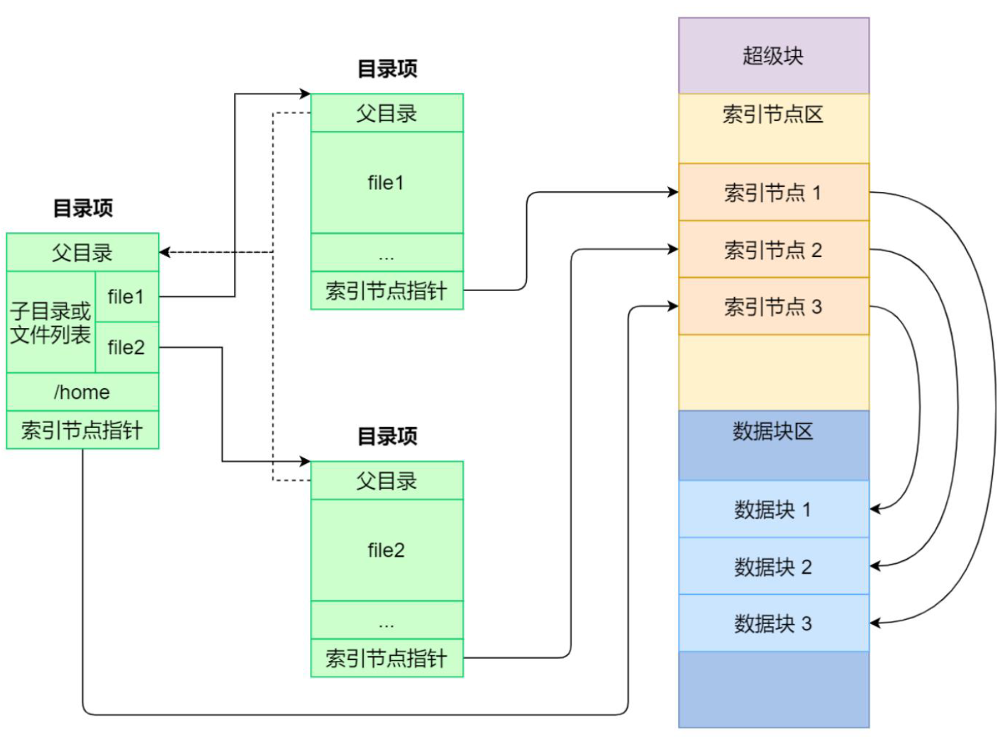
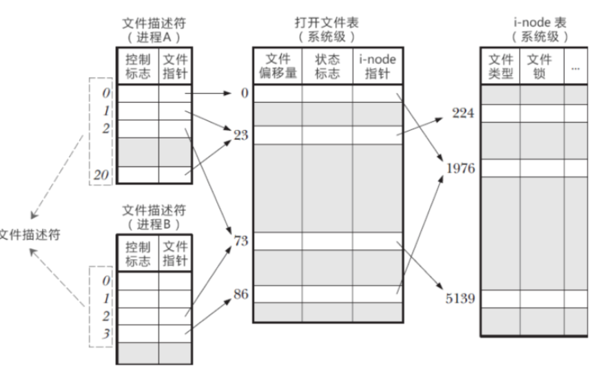
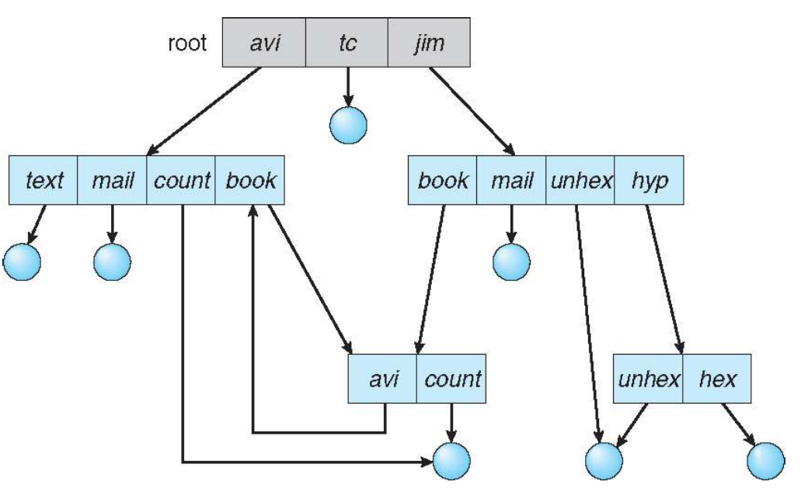

## CHAPTER8 文件系统

[TOC]

文件系统是操作系统中负责文件命名、存储和检索的子系统，由管理文件所需的数据结构、相应的管理软件和被管理的文件构成。文件系统负责管理外存上的文件，并为用户提供对文件进行存取、共享及保护的手段。

文件系统的主要功能为：实现文件的按名存取、为用户提供接口、实施对文件和目录的管理、文件存储空间的分配及回收、文件的共享及保护。

**文件**是具有文件名的一组相关信息的集合，文件存放在**外存**上，由若干记录组成。**记录**是一些相关数据项的集合。**数据项**是数据组织中可以命名的**最小逻辑单位**。

文件属性通常包含：名称、标识符（在文件系统内唯一标志文件的标签）、类型、位置（指向设备上的文件）、大小、保护（谁拥有读写执行的权限）、时间、日期、用户标识。所有文件的属性信息都保存在目录结构中。

文件元数据是描述文件的各种信息的数据，存储在文件系统的inode表中，每个文件都有一个inode表项存储它的各种元数据信息，**元数据和文件内容是分开管理的**

> 
>
> #### (1) 目录项（浅绿色表格）
>
> - **作用**：记录文件的逻辑路径和名称映射。
> - **示例内容：**
>   - `父目录`：如`/home`，表示当前目录的上级路径。
>   - `子目录/文件列表`：如`file1`、`file2`，是当前目录下的条目。
>   - **索引节点指针**：指向文件的元数据（inode），而非文件内容本身。
>
> #### (2) 索引节点区（浅黄色表格）
>
> - **作用**：存储文件的**元数据**（如权限、大小、时间戳、数据块指针等）。
> - **关键点：**
>   - 每个文件/目录有唯一的inode编号（如`索引节点1`）。
>   - **不包含文件名**（文件名在目录项中），实现硬链接（多个文件名指向同一inode）。
>
> #### (3) 数据块区（浅蓝色表格）
>
> - **作用**：存储文件的**实际内容**（文本、图片等二进制数据）。
> - **关联方式**：inode通过指针（如直接/间接块指针）定位数据块位置。

```c
struct inode {
    int inode_number;   // 文件inode编号
    
    /* 文件类型（可用枚举或宏定义）：
     * 普通文件、目录、符号链接、设备文件等
     */
    unsigned short file_type;
    
    /* 文件权限（如0755）：
     * 包含读(r)、写(w)、执行(x)权限位
     */
    mode_t permissions;
    
    uid_t owner;        // 文件所有者UID
    gid_t group;        // 文件所属组GID
    
    /* 时间戳 */
    time_t atime;       // 最后访问时间
    time_t mtime;       // 最后修改时间
    time_t ctime;       // 最后状态改变时间
    
    off_t size;         // 文件大小（字节数）
    nlink_t link_count; // 硬链接数量
    
    /* 数据块指针数组：
     * NUM-1个直接块指针 + 1个间接块指针是经典设计
     */
    int blocks[NUM];    
};
```

### 文件操作

#### 创建文件

1. 在文件系统中为文件分配必要空间
2. 在目录中为新文件建立一个目录项，在目录项中记录新文件的文件名及其在外存的地址等属性

`int open(const char *pathname, int flags, mode_t mode);`：

- 创建新文件或打开已有的文件
- `flags`用于指定打开的方式
- `mode`用于指定新打开创建文件的权限模式

创建步骤：

1. **分配inode节点**：
   **`open()`触发条件**：当`flags`包含`O_CREAT`且文件不存在时

   **内核操作**：

   - 在文件系统的**inode区**分配一个空闲inode（如ext4通过位图查找空闲inode）。

   - 初始化inode元数据：(存储的是**元数据**（如权限、时间戳），**不包含文件名**)

     ```c
     struct inode *new_inode = alloc_inode();
     new_inode->mode = mode;      // 设置权限（0644）
     new_inode->uid = current_uid; // 当前用户UID
     new_inode->size = 0;         // 初始大小为0
     ```

2. **分配数据块**

   - 延迟分配：

     - 文件创建时通常**不立即分配数据块**（除非预分配，如数据库文件）。

     - 首次写入（`write()`调用）时才会分配数据块，通过inode的**块指针**关联。

   - 例外情况:

     - 某些文件系统（如XFS）支持预分配，此时会直接分配物理块。

3. **更新inode表**

   - **目录项（dentry）绑定**：
     - 在父目录的**数据块**中新增一条目录项，记录文件名和inode号
   - 更新父目录的`mtime`（修改时间）

4. **返回文件描述符**
   内核为进程创建一个**文件描述符表项**，指向内核的**文件对象**（包含当前偏移量、访问模式等）。文件对象再关联到inode，形成完整访问链

#### 打开文件

访问数据前必须先**打开**文件，获得**文件描述符**。将待访问文件的目录信息读入内存打开文件表中，建立起用户进程和文件之间的联系。

`fd = open(name, flag);`

- **功能**：打开指定文件并建立进程与文件的连接
- **参数说明**：
  - `name`：要打开的文件路径（如"./data.txt"）
  - `flag`：打开方式标志（如`O_RDONLY`只读，`O_WRONLY`只写）
- **返回值**：
  - `fd`（文件描述符）：非负整数，代表内核中打开文件的引用标识（索引值，指向内核为每一个进程锁维护的该进程打开文件的记录表）
- **底层操作**：
  1. 在内存打开文件表中创建新条目
  2. 将文件目录信息加载到内存
  3. 建立进程与文件的关联关系

##### 打开文件表




- **三级表结构**：
  1. 进程级文件描述符表
     - 每个进程独立维护
     - 存储文件描述符与控制标志
  2. 系统级打开文件表
     - 全局唯一，内核维护
     - 关键字段：
       - 文件偏移量（最近读写位置）
       - 状态标志（O_APPEND等）
       - i-node指针
       - 引用计数
  3. 系统级i-node表
     - 存储物理文件元数据：
       - 文件类型
       - 磁盘位置
       - 文件锁


- **多进程共享文件**：
  - 进程A/B通过不同fd→指向同一系统级表项→相同i-node
  - 共享条件：
    ```c
    // 进程A
    fd1 = open("file.txt", O_RDWR);
    // 进程B（通过fork继承或独立open）
    fd2 = open("file.txt", O_RDWR); 
    ```
- **引用计数管理**：
  - 系统级表项记录被引用的次数
  - 关闭文件时：
    ```text
    close(fd) → 计数-- → 计数=0时移除表项
    ```

#### 关闭文件

`close(fd);`

撤消主存中有关该文件的目录信息，切断用户进程与该文件的联系；若在文件打开期间，该文件作过某种修改，则应将其写回辅存。

#### 删除文件

1. 在目录中搜索给定名称的文件
2. 释放文件占用的所有存储空间
3. 删除相应目录项

#### 读文件

`ssize_t read(int fd, void *buf, size_t count);`

- `fd`指明文件名
- `buf`指明要读入文件块的内存位置

系统搜索目录找到指定文件的目录项，从目录项中得到被读文件在外存的地址，然后从外存将数据读入内存。

#### 写文件

`ssize_t write(int fd, const void *buf, size_t count)`

1. 通过文件名，系统在目录树中查找对应的目录项
2. 目录项包含`inode`号，定位到对应的`inode`结点
3. `inode`结点记录文件长度和数据块地址信息
4. 系统根据写位置，判断需要写入的块是否已经在内存缓冲区中
5. 如果块不在缓冲区，需要从磁盘读入块到缓冲区
6. 在内存缓冲区中写入数据
7. 根据写入量，可能需要分配新的块并更新`inode`结点
8. 操作结束后，将脏块从缓冲区写入磁盘，更新文件内容

#### 截断文件

`int truncate(const char *path, off_t length);`

- `path`: 指定要截断的文件路径
- `length`:指定文件应该被截断的大小

### 文件结构

- **逻辑结构**：又称文件组织 是从用户观点出发所看到的文件组织形式 。
  - **记录式文件**：是一种有结构文件，由一组相关记录组成，又分为
    - 等长记录文件：又称定长记录文件，是指文件中所有记录的长度相等
    - 变长记录文件：是指文件中各记录长度不相等
  - **流式文件**：是一种无结构文件，由字符序列构成
- **物理结构**：又称文件的存储结构，是文件在外存上的存储组织形式。 它与存储设备特性、外存分配方式有关。
  - 顺序结构
    - 将一个在逻辑上连续的信息存放在外存连续的物理块中，存取速度较快，对等长记录文件支持随机访问，因要求连续存放，会产生碎片（本来连续存储的多个文件，删除了存在中间的文件，就产生了碎片），也不利于文件的动态扩容。
  - 链接结构
    - 又称串联结构，将一个逻辑文件的信息存放在外存不连续的物理块中，且每个物理块中设置一个指向下一个物理块的指针。
    - 采用链接结构存放的文件称为**链接文件**或**串联文件**
    - 可解决碎片问题，便于文件动态增长，只能顺序访问，但查找效率较低，指针占用存储空间。（如果查询的是靠后的块，则需要多次访问外存）
  - 索引结构
    - 将一个逻辑文件的信息存放于外存的若干物理块中，并为每个文件建立一个索引表，其中的每个表目存放文件信息所在等待逻辑块号和与之对应的物理块号。
    - 采用索引结构存放的文件称为索引文件。
    - 既可以顺序访问，也可以随机访问，但增加了存储空间开销，且要两次访问外存。

#### 目录结构

- 目录是一类特殊的文件，目录的内容是文件索引表<文件名，指向文件的指针>，目录结构和文件都驻留在磁盘上。分为：单级目录结构，二级目录结构，多级目录结构，图形目录结构。

##### 二级目录结构

其实是分用户进行存储

- **主文件目录**：记录用户名及相应用户文件目录所在的存储位置。
- **用户文件目录**：记录该用户文件的有关信息

可以解决文件重名问题，并可获得较高的查找速度；但缺乏灵活性，特别是无法反映真实世界复杂的文件组织形式

##### 树型目录结构

路径名是一个字符串，该字符串从根目录出发到所找文件的通路上，所有各级子目录名和该文件名用分隔符连接起来构成。

（太熟了，不记了）

##### 无环图目录

允许目录含有共享子目录和文件。

不同文件名可能表示统一文件，对于统计文件数量和遍历文件系统会带来一定问题；还会有删除问题，分配给共享文件的空间何时删除重利用，像极了c++里对浅拷贝的回收。

##### 通用图目录



当对已存在的树状结构目录增加链接时，树状结构就被破坏了，产生了简单的图结构。这在遍历文件系统时，很可能会陷入无限循环。
